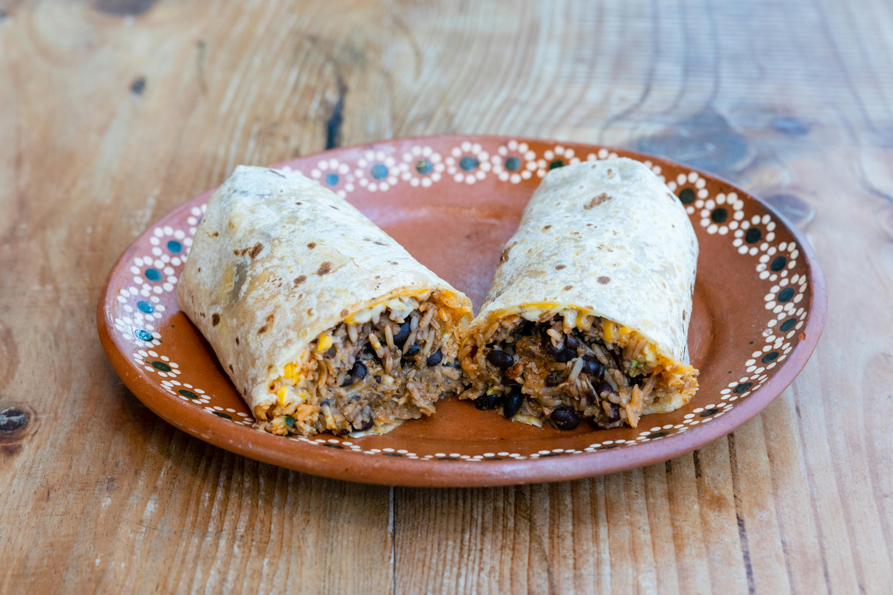

# Bean and Cheese Burrito

*The simplest Northern Mexican burrito: warm refried beans and melted cheese in a thin flour tortilla, the everyday lunchbox staple of generations of ranchers, farmworkers and schoolchildren.*

**Serves:** 4 burritos

**Prep Time:** 10 minutes

**Cook Time:** 15 minutes

## Overview
The bean and cheese burrito is the most stripped-down version of the Northern Mexican classic, two ingredients folded into a thin flour tortilla and eaten with one hand. The beans must be properly refried (twice-cooked with onion and lard until they go dark and spreadable), and the cheese must melt (Chihuahua, Asadero or Oaxaca, never grated cheddar). The wrap is tight, the heat from the beans melts the cheese instantly, and the tortilla holds the lot together as you eat. Forty years before Tex-Mex took over, this is what a burrito was: humble, fast, satisfying.

## Ingredients

- 400 g cooked pinto beans (or 1 tin, drained)
- 1 small onion, finely chopped
- 2 tbsp lard or vegetable oil
- 1 tsp salt
- 200 g Chihuahua or Asadero cheese, grated (mozzarella is the closest substitute)
- 4 large flour tortillas (25-30 cm wide)
- Optional: a few pickled jalapeño rings

## Method

### Stage 1 - Refry the beans
1. Heat the lard or oil in a wide pan over medium heat.
2. Add the chopped onion; cook for 5 minutes until soft and pale gold.
3. Add the cooked pinto beans with a splash of their cooking liquid (or water).
4. Mash with a wooden spoon as you cook, working the beans into a coarse paste; fry for 8-10 minutes until thick and the colour darkens slightly. Salt to taste.

### Stage 2 - Wrap and serve
1. Warm the tortillas one at a time on a dry pan for 20 seconds per side until pliable.
2. Spread a generous spoonful of warm refried beans across the lower third of each tortilla.
3. Scatter a handful of grated cheese over the beans (the heat melts it as you roll).
4. Add a few pickled jalapeño rings if using.
5. Fold the bottom up, fold the sides in, roll up tight.
6. Eat hot, while the cheese still strings.

## Notes
- **The bean texture:** Properly refried beans should be spreadable but textured, not a smooth puree. Leave some bean pieces visible.
- **The cheese choice:** Mexican melting cheeses (Chihuahua, Asadero, Oaxaca) are designed to soften under heat without going greasy. Mozzarella works as a substitute; cheddar will not melt the same way and clashes with the beans.
- **The tortilla:** A thin large Northern Mexican flour tortilla is the right wrap; standard supermarket flour tortillas are thicker but workable.

## Serving
Serve hot with hot sauce or salsa verde on the side. Pickled jalapeños inside or alongside.

## Storage
- The refried beans keep 4 days refrigerated and freeze 2 months
- Assembled burritos eat best fresh; the tortilla softens after an hour
- Reheat refried beans with a splash of water; warm tortillas on a comal
