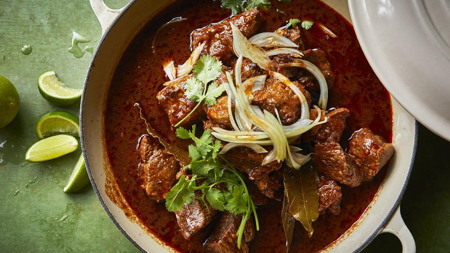

# Birria

*Jalisco's slow-braised beef: shredded chuck in a deep red chile broth scented with cinnamon, oregano and clove. Eaten in its own consomme or as a taco.*

**Serves:** 8

**Prep Time:** 30 minutes

**Cook Time:** 3 hours 30 minutes

## Overview
Birria is a Mexican braise of long, patient ambition. Originally a goat or lamb dish from Jalisco, it has long since adopted beef in much of Mexico and almost entirely in the popular taco version. The flavour comes from a layered chile base: guajillo for fruit and colour, ancho for raisin sweetness, pasilla for earthy depth, and a handful of arbol for a sharper heat. These are simmered with onion, garlic, cinnamon and peppercorns, blended smooth with chipotles in adobo and fire-roasted tomato, then poured over seared chuck and short rib for a long oven braise. Three hours later the meat is meltingly tender, sitting in a rust-red consomme that is the whole point: ladled over the shredded beef in a bowl, scattered with raw onion, cilantro and lime, or used to dip crisp taco shells for the now-iconic quesabirria. The recipe takes time but very little technique; almost everything happens unattended in the oven. Plan ahead and make it a day in advance so the flavours settle and the fat lifts cleanly off the top before you reheat.

## Ingredients

### Beef
- 900 g boneless beef chuck roast, cut into 8 cm chunks
- 900 g bone-in beef short ribs (English cut)
- Kosher salt

### Chiles and aromatics
- 3 dried guajillo chiles, deseeded
- 3 dried ancho chiles, deseeded
- 2 dried pasilla chiles, deseeded
- 4 dried arbol chiles, deseeded
- 1 white onion (large), halved
- 1 Mexican cinnamon stick (canela)
- 6 g black peppercorns
- 6 garlic cloves

### Braising liquid
- 3 chipotle peppers in adobo sauce
- 1 can (410 g) fire-roasted diced tomatoes
- 1 litre beef stock (divided)
- 30-45 ml olive oil
- 30 ml red wine vinegar
- 6 g dried Mexican oregano
- 4 g garlic powder
- 2 g ground cumin
- 1 g dried marjoram
- 1 g ground cloves
- 1 g coriander seeds
- 4 bay leaves

### To serve
- Fresh cilantro, chopped
- White onion, finely diced
- Lime wedges
- Warm corn tortillas (optional)

## Method

### Stage 1 - Season and rest
1. Season the chuck chunks and short ribs generously with kosher salt on all sides.
1. Rest at room temperature for at least 30 minutes.

### Stage 2 - Boil the chiles and aromatics
1. Remove stems and seeds from all the dried chiles.
1. In a large pot, combine the chiles, onion halves, cinnamon stick, peppercorns and garlic cloves.
1. Cover with water and bring to a boil over medium-high heat.
1. Simmer about 30 minutes until the onion is tender and the chiles are soft.
1. Reserve 240 ml of the cooking liquid; discard the rest.

### Stage 3 - Blend the chile base
1. Transfer the softened chiles, onion and garlic to a high-powered blender.
1. Add the chipotles in adobo, the can of fire-roasted tomatoes, the 240 ml reserved cooking liquid and 720 ml of the beef stock.
1. Blend until silky smooth.

### Stage 4 - Brown the beef
1. Preheat the oven to 150C.
1. Heat 30 ml of oil in a large oven-safe Dutch oven over medium-high.
1. Working in batches so the pan never crowds, sear the beef 2-3 minutes per side until deep brown.
1. Transfer browned pieces to a tray; add the remaining oil between batches if needed.

### Stage 5 - Assemble the braise
1. Return all the beef and any juices to the pot.
1. Pour over the blended chile mixture and the remaining 360 ml of beef stock.
1. Add the red wine vinegar, oregano, garlic powder, cumin, marjoram, cloves, coriander seeds and bay leaves.
1. Stir gently to combine.

### Stage 6 - Braise
1. Cover with the lid and transfer to the oven.
1. Braise 3 to 3 and a half hours, until the beef pulls apart at a touch.

### Stage 7 - Shred and serve
1. Lift the beef out with a slotted spoon onto a rimmed tray.
1. Shred with two forks, discarding fat caps and bones.
1. Pluck out the bay leaves from the consomme.
1. Return the shredded beef to the pot and stir through the broth.
1. Serve as a bowl topped with chopped onion, cilantro and lime, or with warm tortillas for tacos.

## Notes
- **All chuck works too:** if you cannot find short ribs, use 1.8 kg total of chuck roast; the dish is slightly leaner but still excellent.
- **Heat level:** the dish lands at a medium heat; reduce the arbol chiles to 2 for milder, or push to 6 for spicier.
- **Make ahead:** cook a day in advance, chill overnight, lift the solid fat from the surface and reheat. The flavour deepens noticeably.
- **For quesabirria:** dip corn tortillas into the surface fat of the consomme, fill with shredded beef and Oaxaca or mozzarella cheese, crisp on a griddle, and serve with a small bowl of warm consomme for dunking.
- **Pressure cooker:** sear in the pot, add all ingredients, cook on high pressure for 50 minutes with a natural release.
- **Slow cooker:** sear separately, transfer everything to the slow cooker, low for 6-7 hours or high for 4-5.

## Storage
- Keeps 4-5 days refrigerated in an airtight container.
- Freezes 2-3 months; thaw overnight in the fridge.
- Reheat gently on the stovetop over low heat with a splash of stock to loosen.
