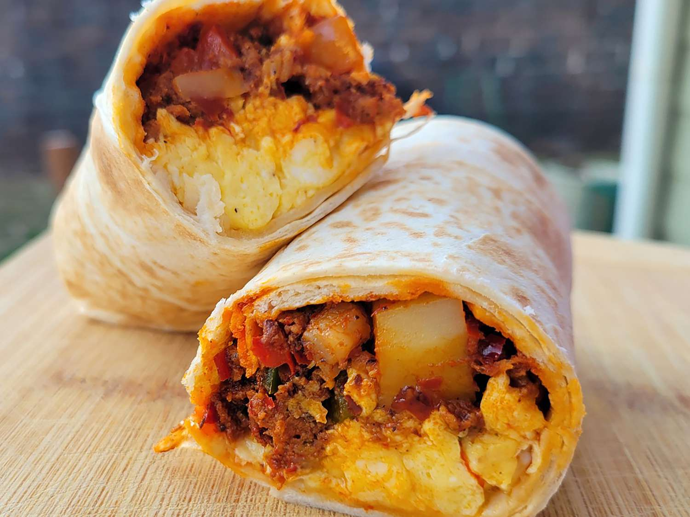

# Breakfast Burritos

*The New Mexican breakfast burrito: scrambled eggs, crumbled chorizo, crispy potatoes and melting cheese wrapped in a warm flour tortilla, the dish that put Albuquerque on the morning food map.*

**Serves:** 4 burritos

**Prep Time:** 15 minutes

**Cook Time:** 30 minutes

## Overview
The breakfast burrito was invented in 1970s Albuquerque, New Mexico, where roadside diners and Hispanic cooks worked out that the burrito's hand-held format could carry a full breakfast as easily as a guisado lunch. The classic build is scrambled eggs, crumbled chorizo, crispy diced potatoes (or hash browns) and a generous handful of melting cheese, all bundled into a warm flour tortilla. The variations are endless: bacon, carne asada, mashed avocado, pickled jalapeños, pico de gallo, hot sauce. The result is breakfast that travels, the original drive-through morning meal.

## Ingredients

### Filling
- 500 g waxy potatoes, cubed small (1 cm dice)
- 200 g Mexican chorizo (raw, not cured Spanish), casings removed
- 6 large eggs, lightly beaten
- 200 g Monterey Jack or Chihuahua cheese, grated
- 1 small onion, finely chopped
- 2 tbsp oil
- Salt and pepper

### To Assemble
- 4 large flour tortillas (30 cm)
- Pickled jalapeños (optional)
- Pico de gallo or salsa roja (optional)
- Hot sauce
- Mashed avocado (optional)
- Crispy cooked bacon (optional)

## Method

### Stage 1 - Crisp the potatoes
1. Heat the oil in a wide pan over medium-high heat.
2. Add the cubed potatoes; cook for 12-15 minutes turning often until deep gold and crispy on all sides.
3. Salt and pepper; lift out to a warm plate.

### Stage 2 - Cook the chorizo and onion
1. In the same pan, add the crumbled chorizo and chopped onion.
2. Cook for 8 minutes, breaking up the chorizo with a spoon, until the meat is browned and the fat has rendered.

### Stage 3 - Scramble the eggs
1. Pour the beaten eggs over the chorizo and onion.
2. Stir gently with a spatula over medium-low heat until just set but still soft, about 2 minutes.
3. Off the heat, stir in half the cheese so it melts into the eggs.
4. Fold in the crispy potatoes.

### Stage 4 - Assemble and serve
1. Warm a tortilla on a dry pan for 20 seconds per side.
2. Spoon a generous portion of the egg-chorizo-potato mixture across the lower third.
3. Top with remaining cheese, pickled jalapeños, pico de gallo, hot sauce or mashed avocado.
4. Fold the bottom up, sides in, roll up tight.
5. Eat hot, immediately.

## Notes
- **Mexican chorizo, not Spanish:** Mexican chorizo is raw, spicy and loose, and renders out fat as it cooks. Spanish chorizo is cured and won't work the same way.
- **The potato dice:** Small cubes (1 cm) crisp better than chunks. Don't shortcut to leftover boiled potato; it goes soggy.
- **Egg timing:** Soft scrambled, not dry. The eggs continue cooking in the residual heat as the burrito sits, so undershoot.

## Variations
**Bacon and egg:** Substitute crispy chopped bacon for the chorizo.
**Carne asada:** Add chopped grilled steak alongside (or instead of) the chorizo.
**Veggie:** Skip the meat, add black beans, roasted peppers and a handful of spinach.

## Serving
Serve hot with hot sauce, salsa, mashed avocado, sour cream and coffee.

## Storage
- The filling keeps 3 days refrigerated; reheat gently in a pan
- Assembled burritos can be wrapped in foil and frozen for 1 month; reheat in the oven at 180°C for 25 minutes
- Best eaten fresh; the eggs lose their texture if reheated multiple times
