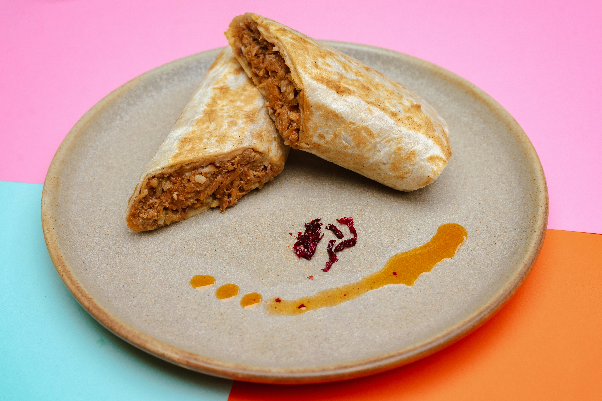

# Burrito with Pineapple, Lime Salsa

*A handheld dinner: beer-deglazed spiced chicken thighs with a sharp pineapple-lime salsa, wrapped in a tortilla with rice, cheese, and the reserved crispy skins.*

**Serves:** 6 burritos

**Prep Time:** 30 minutes

**Cook Time:** 40 minutes

## Overview
A burrito built around the contrast between three distinct textures: spice-rubbed chicken thighs that braise in their own glaze, raw pineapple-lime salsa for cold acidity, and reserved crispy skins for the crunch. The thighs are tenderised flat, fried skin-down to render the fat, then the pan is deglazed with light lager and stock to reduce into a sticky coat. Everything assembles in the tortilla, which is then dry-fried on high heat to seal and melt the cheese.

## Ingredients

### Chicken
- 1 kg chicken thighs (skin-on, bone-in)
- Olive oil for frying

### Spice Mix
- 1 tbsp cumin
- 1 tbsp ground coriander seed
- 1 tbsp paprika
- ½ tbsp dried oregano
- 1-2 tsp chilli flakes (depending on tolerance)
- 2 tsp salt

### Braising Liquid
- 330 ml light lager
- 300 ml chicken or vegetable stock
- 1 tbsp tomato purée

### Salsa
- 3-4 rings fresh pineapple, 1cm thick (roughly chopped)
- 1 red bell pepper (roughly chopped)
- 1 yellow bell pepper (roughly chopped)
- 1 red onion (roughly chopped)
- 1 fresh red chilli (finely chopped)
- 1 fresh green chilli (finely chopped)
- 1-2 spring onions (finely sliced)
- Large handful of baby plum or cherry tomatoes (quartered)
- 1-2 limes (juiced)
- Bunch of fresh coriander (roughly chopped)

### To Assemble
- 6 soft flour tortillas (large)
- ½ head iceberg lettuce (shredded)
- 200-300 g cheddar cheese (grated)
- Pickled jalapeños
- 1 pack microwave rice

### To Serve
- Hot sauce
- Sour cream
- Lime wedges

## Method

### Stage 1 - Prep
1. Shred the iceberg lettuce and grate the cheese; set both aside in the fridge.
2. Chop the salsa vegetables and pineapple, combine in a bowl with the lime juice and chopped coriander, stir well, cover and chill.
3. De-bone the chicken thighs, keeping the skin attached and in one piece per thigh.
4. Lay each thigh flat between two sheets of baking paper and pound with a rolling pin or meat hammer until even in thickness.
5. Combine the spice mix ingredients in a small bowl.
6. Place the thighs in a dish, drizzle with oil to coat, and rub the spice mix in on both sides until every thigh is evenly coated.

### Stage 2 - Cook the Chicken
1. Preheat a large heavy-bottomed sauté pan over medium-high heat.
2. Add a little oil and lay the thighs in skin-side down. Fry until the fat has fully rendered and the skins are crispy and well coloured, about 6-8 minutes.
3. Flip and cook through on the flesh side, 4-5 minutes.
4. Remove the crispy skins to a plate to rest; keep the thigh meat in the pan.
5. Lift the thighs out, leaving the rendered fat behind. Add the tomato purée to the pan and caramelise lightly, about 1 minute.
6. Deglaze with the lager, scraping up any fond, and reduce by half.
7. Add the stock and simmer until the liquid is syrupy.
8. Chop or shred the rested chicken (keep the crispy skins separate). Return the meat to the pan and toss in the glaze until each piece is thickly coated. Transfer to a warm dish.

### Stage 3 - Assemble & Sear
1. Heat a small skillet over medium-high heat and stir-fry the rice, adding a splash of water if it sticks.
2. Warm the tortillas one at a time, either dry-fried in the same pan or briefly in the microwave.
3. Wipe out the large pan and return it to medium-high heat for the final sear.
4. Build each burrito in this order down the centre of the tortilla: lettuce, rice, chicken, salsa, crispy skin, jalapeños, cheese.
5. Fold the sides in and roll tight.
6. Dry-fry the rolled burritos seam-side down first, turning to colour every side until sealed and the cheese inside has melted, about 2 minutes per burrito.
7. Serve with hot sauce, sour cream and lime wedges.

## Notes
- **Crispy skins:** The reserved skins are the textural punch in the assembled burrito. Drain them on paper, don't stack them, or they'll go soggy.
- **Tenderising the thighs:** Pounding the meat flat means it cooks evenly and renders the fat under the skin all at once. Skip this and the skin won't crisp uniformly.
- **Deglazing with lager:** Light lager works better than dark beer here: it deglazes the pan without overpowering the spice mix. Reduce hard before adding stock or the glaze will taste raw.
- **Salsa timing:** The pineapple breaks down quickly once the lime juice hits it. 30 minutes in the fridge brings the flavours together; much longer and the salsa goes mushy.
- **Dry-frying the wrap:** The high-heat seal in the final step both melts the cheese inside and stops the burrito unrolling on the plate. Don't oil the pan: dry contact is what gives the toasted spots.

## Variations
- **Vegetarian:** Replace chicken with 400 g black beans crisped in the spice mix, plus 200 g chestnut mushrooms cooked down with chipotle paste.
- **Spicier:** Dice a fresh jalapeño into the salsa and double the chilli flakes in the spice mix.
- **Steak version:** Swap the chicken for 800 g flank or skirt steak, spice-rubbed and seared rare; rest 5 minutes then slice thin across the grain.

## Serving
- Serve with: Hot sauce, sour cream, lime wedges, and any leftover salsa on the side.
- Optional sides: Refried beans, charred corn, a simple green salad.

## Storage
- Chicken in glaze keeps 3 days refrigerated; reheat gently with a splash of stock
- Salsa is best the same day: the pineapple softens overnight
- Cooked rice keeps 1 day refrigerated; reheat to steaming hot
- Assembled burritos don't store well; build to order
- Freeze the unassembled chicken-and-glaze portion up to 2 months
