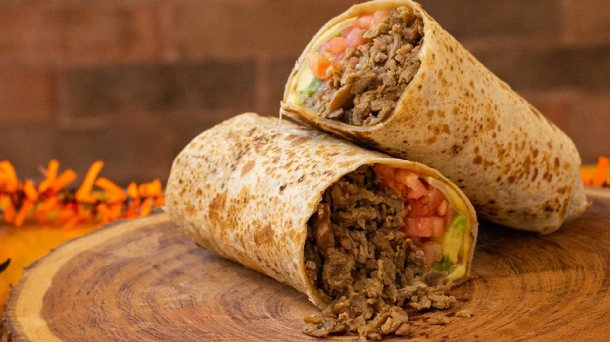

# Burro Percheron

*The Sonoran extra-large burrito: carne asada, melting cheese, tomato, avocado and pepperoni wrapped in a paper-thin tortilla nearly a metre across, the showpiece dish of Hermosillo, Sonora.*

**Serves:** 2 burritos (these are huge)

**Prep Time:** 30 minutes

**Cook Time:** 20 minutes

## Overview
The burro percheron is the giant cousin of the Northern Mexican burrito, named for the Percheron draft horse for its size: a wrap built around a thin Sonoran-style flour tortilla up to 80 cm across, filled with carne asada, melting Mexican cheese, fresh tomato, avocado and slices of pepperoni or chorizo. The dish was popularised by Hermosillo, Sonora restaurants in the 1980s, where a single burro percheron can feed two people. The tortilla itself is the showpiece: hand-stretched, paper-thin, and so large that the rolled burrito looks like a small log. Eat sliced into rounds.

## Ingredients

### Carne Asada
- 500 g flank or skirt steak
- 3 garlic cloves, crushed
- 2 limes, juiced
- 2 tbsp oil
- 1 tsp ground cumin
- 1 tsp salt
- Black pepper

### Tortilla and Fillings
- 2 extra-large Sonoran flour tortillas (50-80 cm; the largest you can find)
- 250 g Chihuahua, Asadero or mozzarella cheese, grated
- 2 ripe tomatoes, sliced
- 2 ripe avocados, sliced
- 100 g pepperoni or sliced chorizo
- 1 small onion, finely chopped
- Fresh coriander
- Pickled jalapeños

## Method

### Stage 1 - Marinate and grill the steak
1. Combine the steak with garlic, lime, oil, cumin, salt and pepper; rest for 30 minutes.
2. Grill or pan-sear hard on each side; rest for 5 minutes; slice thin against the grain; chop into bite-sized pieces.

### Stage 2 - Warm and stretch the tortilla
1. Warm the giant tortilla briefly on a wide comal or large dry pan; it needs to be pliable enough to roll without cracking but not so warm it tears.

### Stage 3 - Assemble
1. Lay the warm tortilla flat on a large clean surface.
2. Across the lower third (the part nearest you), layer: chopped carne asada, grated cheese (the residual heat melts it), sliced tomato, sliced avocado, pepperoni or chorizo slices, chopped onion, coriander, jalapeños.
3. Fold the bottom of the tortilla up over the filling.
4. Fold the sides in tight.
5. Roll forward firmly into a long thick cylinder.
6. Slice into 6 cm rounds across the burrito; this is how a burro percheron is traditionally served.

## Notes
- **The tortilla is the dish:** A proper Sonoran tortilla is hand-stretched to 50-80 cm. If you can't find one, layer two large tortillas with cheese between them; the cheese seals the seam.
- **Pepperoni is the Hermosillo touch:** The pepperoni-and-cheese combination is what separates a burro percheron from a regular carne asada burrito.
- **Don't overstuff:** Even with a giant tortilla, the wrap needs to roll cleanly. Stack the fillings tight along the lower third, not spread across the whole tortilla.

## Variations
- **Without pepperoni:** Stick to carne asada, cheese, tomato and avocado for the simpler Sonoran original.
- **Other meats:** Carnitas, chorizo or grilled chicken work; the tortilla and the giant scale are what matter.

## Serving
- Slice into 6 cm rounds on a long platter; eat with hands; serve with hot sauce, lime wedges and a cold beer.

## Storage
- Carne asada keeps 3 days refrigerated; reheat gently
- Assembled rolls eat best fresh; the avocado browns quickly
- Pre-roll components keep separately 3-4 days
