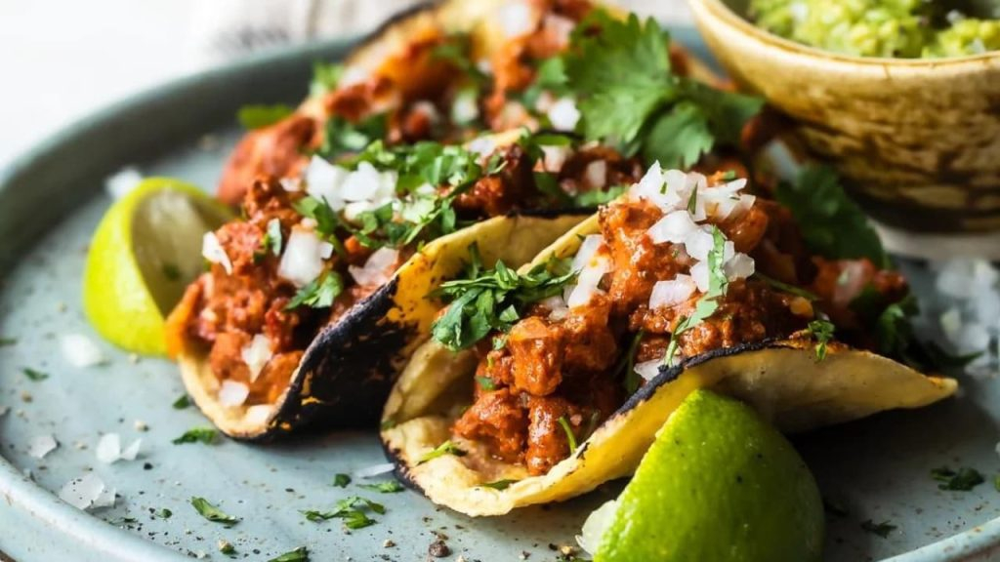

# Cabrito al Pastor

*Northern Mexico's roast goat: young kid goat marinated in dried chillies, garlic, cumin and citrus, then slow-roasted over wood coals till the skin crisps and the meat falls from the bone.*

**Serves:** 8-10

**Prep Time:** 30 minutes (plus 12 hours marinating)

**Cook Time:** 3 hours

## Overview
Cabrito al pastor is the iconic dish of Nuevo León and the city of Monterrey, a cultural touchstone and the centrepiece of every Norteño celebration meal. Young kid goat (cabrito; about 4-6 months, tender and mild, distinct from gamier older goat) is marinated in a paste of rehydrated guajillo and ancho chillies, crushed garlic, cumin, Mexican oregano, orange juice and salt, then slow-roasted on a vertical spit over wood coals: the same al pastor method that lacquers the pork version: till the skin crisps to mahogany and the meat falls from the bone. For home cooks outside Monterrey, the dish adapts to a bone-in leg of goat (or leg of lamb, an entirely acceptable substitute) marinated overnight and roasted low for three to four hours, finished with a brief blast of high heat for the crispy skin. Plated at the centre of the table with flour tortillas (the Northern Mexican preference), pico de gallo, sliced avocado, refried beans, frijoles charros and ample salsa picante.

## Ingredients

### Meat
- 2.5 kg bone-in leg of young goat (cabrito); OR 2.5 kg bone-in leg of lamb

### Marinade
- 4 dried guajillo chillies (Mexican dried red chilli, mild and sweet-tangy; stems and seeds removed)
- 3 dried ancho chillies (stems and seeds removed)
- 2 dried pasilla chillies (stems and seeds removed; optional)
- 500 ml hot water (for soaking chillies)
- 10 garlic cloves (crushed)
- 1 large onion (chopped)
- Juice of 2 oranges (or 1 large grapefruit)
- Juice of 2 limes
- 4 tablespoons olive oil
- 3 tablespoons white vinegar
- 2 tablespoons ground cumin
- 2 tablespoons dried Mexican oregano
- 1 tablespoon ground coriander seed
- 1 tablespoon paprika
- 1 teaspoon ground cinnamon
- 1 teaspoon ground cloves
- 2 tablespoons fine sea salt
- 1 tablespoon ground black pepper

### For roasting
- 1 large onion (sliced)
- 4 bay leaves
- 500 ml hot stock or water
- 200 ml beer (Mexican; Pacifico, Tecate, Modelo)

### To finish
- 1 tablespoon olive oil
- Flaky sea salt

### To serve
- Warm flour tortillas (the traditional Norteño choice)
- Pico de gallo
- Sliced avocado
- Refried beans
- Frijoles charros (cowboy beans)
- Mexican rice
- Salsa picante (Mexican hot sauce)
- Lime wedges
- Sliced raw onion sprinkled with lime
- Fresh coriander
- Mexican crema

## Method

### Stage 1 - Prepare the chillies (the night before)
1. Heat a dry pan over medium heat.
2. Toast all the dried chillies briefly (30 seconds per side; don't burn).
3. Place in a bowl; cover with the hot water.
4. Soak 30 minutes till fully softened.
5. Drain; reserve the soaking liquid.

### Stage 2 - Make the marinade
1. Place the softened chillies in a blender.
2. Add the crushed garlic, chopped onion, orange juice, lime juice, olive oil, vinegar, cumin, oregano, coriander seed, paprika, cinnamon, cloves, salt and pepper.
3. Add 200 ml of the reserved chilli-soaking liquid.
4. Blitz to a smooth thick paste.

### Stage 3 - Marinate the meat (overnight)
1. Pat the goat (or lamb) leg dry.
2. Pierce all over with a sharp knife (helps marinade penetrate).
3. Rub the chilli paste thoroughly all over the meat, into the slits.
4. Place in a large container or zip-lock bag.
5. Cover and refrigerate 12-24 hours.

### Stage 4 - Bring to room temperature
1. Take out 1 hour before cooking; let warm to room temperature.

### Stage 5 - Slow-roast
1. Preheat the oven to 160°C (325°F).
2. Place the sliced onion in the bottom of a heavy roasting tin.
3. Place the marinated meat on top.
4. Pour the stock and beer into the bottom of the tin.
5. Add the bay leaves.
6. Cover loosely with foil.
7. Roast for 2.5 hours; baste every 45 minutes with the pan juices.

### Stage 6 - Crisp the skin
1. Remove the foil.
2. Brush the meat with the olive oil; sprinkle with flaky salt.
3. Turn the oven up to 220°C (425°F).
4. Roast uncovered for 25-30 minutes till the skin is deeply mahogany and crisp.

### Stage 7 - Rest
1. Take out; cover loosely with foil; rest 20 minutes.

### Stage 8 - Pull or slice
1. The meat should pull from the bone with two forks; or slice thickly.
2. Spoon some pan juices over.

### Stage 9 - Serve
1. Place the pulled/sliced meat on a wooden board at the centre of the table.
2. Warm flour tortillas alongside.
3. Pico de gallo, avocado, refried beans, frijoles charros, Mexican rice, salsas, lime, sliced onion, coriander, crema all in small bowls.
4. Diners build their own tacos.

## Notes
- **Young goat or lamb:** the dish requires tender mild meat.
- **Chilli marinade overnight:** essential for proper flavour penetration.
- **Slow-roast at 160°C for 2.5 hours:** essential for tenderness.
- **High-heat finish:** for the crispy skin.
- **Rest before pulling:** 20 minutes.

## Variations
- **Lamb shoulder version:** swap the leg for a bone-in lamb shoulder; cook the same way but increase to 3 hours covered.
- **Slow-cooker version:** marinate as in the recipe; cook in a slow-cooker on low for 8 hours; finish skin under the grill.
- **With achiote:** add 2 tablespoons of achiote paste to the marinade; gives a more orange-red colour, common in Yucatan-influenced Mexican cooking.
- **Spicier:** double the dried chillies and add 2 chipotles in adobo; properly Norteño fierce.

## Serving
- At the centre of a Norteño-Mexican celebration table for family-style taco-building. Drink: cold Mexican beer (Pacifico, Tecate, Modelo), or tequila with lime. As Christmas dinner, New Year's, or any major Northern Mexican family celebration.

## Storage
- Keeps refrigerated 5 days; flavour deepens.
- Reheat covered in a 160°C oven for 25 minutes.
- The shredded leftover meat is the traditional filling for the next day's tacos and burritos.
- Freezes 3 months pulled.
