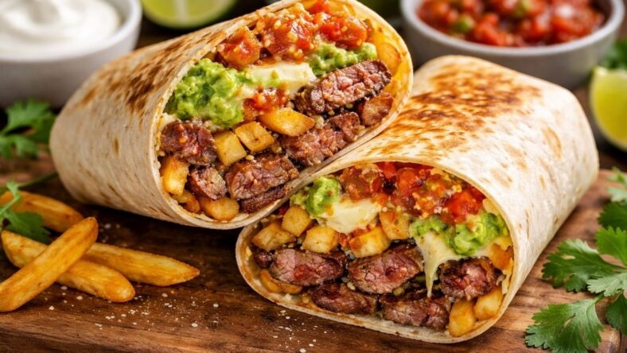

# California Burrito

*The San Diego carne asada burrito with French fries inside: a thick wrap of grilled steak, hot fries, guacamole, pico de gallo and melted cheese, the late-night classic of every San Diego taqueria.*

**Serves:** 4 burritos

**Prep Time:** 30 minutes

**Cook Time:** 30 minutes

## Overview
The California burrito was invented in San Diego in the 1980s, when local taquerias started slipping French fries inside the carne asada burrito to feed late-night surfers and bar crowds with a single hand-held dinner. The fries inside the wrap is the dish-defining move: they soften slightly from the heat of the meat, the cheese melts around them, and the crunch becomes a textural contrast against the soft tortilla. The classic build is carne asada, French fries, guacamole, pico de gallo and a generous handful of grated cheese, wrapped in a large flour tortilla. The dish never crossed the state line in the same way as the Mission burrito, but in San Diego it's the burrito.

## Ingredients

### Carne Asada
- 500 g flank or skirt steak
- 3 garlic cloves, crushed
- 2 limes, juiced
- 2 tbsp oil
- 1 tsp ground cumin
- 1 tsp salt
- Black pepper

### French Fries
- 600 g floury potatoes (Maris Piper or Russet), cut into 1 cm chips
- Vegetable oil for frying
- Salt

### To Assemble
- 4 large flour tortillas (30 cm)
- 200 g Monterey Jack cheese, grated
- 1 ripe avocado, mashed with lime (or 200 g guacamole)
- 200 g pico de gallo
- Sour cream (optional)
- Hot sauce

## Method

### Stage 1 - Marinate and grill the steak
1. Combine the steak with garlic, lime, oil, cumin, salt and pepper; rest for 30 minutes.
2. Grill or pan-sear the steak hard on each side; rest for 5 minutes; slice thin against the grain; chop into bite-sized pieces.

### Stage 2 - Fry the chips
1. Soak the cut potatoes in cold water for 30 minutes; drain and pat dry.
2. Fry in batches at 160°C for 4 minutes (par-fry); drain and rest.
3. Just before assembling, fry again at 180°C for 3 minutes until deep gold and crisp.
4. Drain on a rack; salt immediately.

### Stage 3 - Assemble
1. Warm a tortilla on a dry pan for 20 seconds per side until pliable.
2. Layer across the lower third: a small handful of hot fries, chopped carne asada, grated cheese (so it melts on contact), guacamole, pico de gallo, optional sour cream, hot sauce.
3. Fold the bottom up over the filling, fold the sides in tight, roll forward into a tight cylinder.
4. Optional: sear the rolled burrito on a hot pan for 2 minutes per side to crisp the tortilla and melt the cheese.

## Notes
- **The fries inside:** Don't skip and don't substitute. Fresh-fried fries are what define the dish.
- **Hot fries and melting cheese:** Time the assembly so the fries are still hot when they hit the cheese; that's the melting moment.
- **Carne asada is non-negotiable:** Chicken, pork or beans don't work the same way; the steak's char and the fries are the textural pair.

## Variations
- **Surf and turf:** Add grilled prawns alongside the carne asada.
- **Vegetarian:** Skip the steak, double the cheese, add black beans.
- **Spicy:** Add chopped jalapeños or a generous slug of salsa habanero.

## Serving
- Serve hot, ideally late at night after a beach day. Hot sauce, lime wedges and a Mexican Coke on the side.

## Storage
- Carne asada keeps 3 days refrigerated
- Fries don't reheat well; make fresh per assembly
- Assembled burritos eat best within 30 minutes; the fries go soft after that
