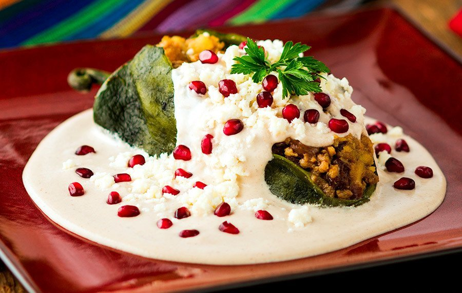

# Chiles en Nogada

*Mexico's patriotic stuffed chillies: poblano peppers stuffed with a pork-and-fruit picadillo, topped with a creamy walnut sauce and a garnish of pomegranate seeds. The Independence-Day dish in the green-white-red of the Mexican flag.*

**Serves:** 6

**Prep Time:** 1 hour 15 minutes

**Cook Time:** 1 hour

## Overview
Chiles en nogada is Mexico's most iconic patriotic dish and the traditional Independence-Day food (15-16 September). Roasted-and-peeled poblano peppers are stuffed with a fragrant pork-and-fruit picadillo: ground pork cooked with onion, garlic, tomato, raisins, almonds, candied citron, fresh apple, pear and peach, with cinnamon, cloves and allspice giving the warm Mexican spice line: then topped with nogada, a creamy walnut sauce of blanched walnuts blended with cream, milk, sugar, sherry and a touch of cinnamon. Pomegranate seeds and parsley sprigs finish the green-white-red of the flag. The dish was supposedly created by Augustinian nuns in Puebla in 1821 to honour the visit of Mexico's first emperor Agustín de Iturbide, using the colours of the new flag. The seasonal pairing matters: Mexican apples, peaches, pears and pomegranates all hit their peak together August-October. Served at room temperature, the cold sauce against the room-temperature stuffed chilli is the traditional experience.

## Ingredients

### Chillies
- 6 large poblano peppers
- 1 tablespoon vegetable oil (for charring)

### Picadillo filling
- 600 g ground pork (or 50/50 pork and beef)
- 3 tablespoons vegetable oil
- 1 large onion (finely chopped)
- 6 garlic cloves (crushed)
- 4 medium ripe tomatoes (chopped)
- 2 tablespoons tomato paste
- 1 medium apple (peeled, cored, finely diced)
- 1 medium pear (peeled, cored, finely diced)
- 1 medium peach (peeled, finely diced; or use canned peaches in syrup, drained)
- 100 g raisins or sultanas
- 60 g blanched slivered almonds
- 60 g candied citron or candied orange peel (or substitute with extra raisins)
- 2 tablespoons fresh parsley (chopped)
- 1 tablespoon ground cinnamon
- 1 teaspoon ground cloves
- 1 teaspoon ground allspice
- 1 teaspoon ground cumin
- 2 tablespoons sherry vinegar (or dry sherry)
- 2 teaspoons fine sea salt
- 1 teaspoon ground black pepper

### Nogada (walnut sauce)
- 200 g shelled walnuts (preferably fresh; blanched in hot water for 5 minutes, drained, peeled if possible)
- 200 ml double cream
- 200 ml whole milk
- 100 g cream cheese (or fresh queso fresco; gives the proper Mexican character)
- 60 ml dry sherry (or sweet sherry; or substitute with milk if avoiding alcohol)
- 50 g caster sugar (or to taste)
- 1 teaspoon ground cinnamon
- ½ teaspoon fine sea salt

### Garnish
- 1 large pomegranate (seeds removed; about 150 g)
- 1 small bunch fresh flat-leaf parsley (small sprigs picked)
- 2 tablespoons pine nuts (toasted)

## Method

### Stage 1 - Char and peel the chillies
1. Preheat the grill (broiler) to high; or use a gas flame.
2. Place the poblano peppers directly over the flame (or under the grill).
3. Char on all sides for 8-10 minutes till the skins are blackened all over.
4. Transfer to a wide bowl; cover with cling film or a tea towel.
5. Let steam 10 minutes.
6. Peel off the charred skin; rinse briefly under cold water.
7. Make a slit lengthwise down one side of each pepper; carefully remove the seeds and ribs (keeping the stem attached).
8. Pat dry.

### Stage 2 - Make the picadillo
1. Heat the oil in a wide pan over medium heat.
2. Add the chopped onion; cook 6 minutes till soft.
3. Add the crushed garlic; cook 30 seconds.
4. Add the pork; cook 8 minutes till browned.
5. Add the tomato paste; cook 2 minutes.
6. Add the chopped tomatoes; cook 5 minutes till they break down.
7. Add the diced apple, pear, peach, raisins, almonds and candied citron.
8. Add the cinnamon, cloves, allspice, cumin, salt and pepper.
9. Add the sherry vinegar.
10. Cook 15 minutes till the fruits are softened and the picadillo is fragrant and thick.
11. Stir in the parsley.
12. Cool slightly.

### Stage 3 - Stuff the chillies
1. Using a spoon, gently fill each pepper with the picadillo through the slit.
2. Don't overfill; just enough so the pepper holds its shape.
3. Set aside at room temperature.

### Stage 4 - Make the nogada
1. Place the blanched walnuts in a blender.
2. Add the cream, milk, cream cheese, sherry, sugar, cinnamon and salt.
3. Blitz till smooth and creamy.
4. Taste; adjust sugar (the sauce should be slightly sweet to balance the savoury picadillo).
5. If too thick, add more milk; if too thin, more walnuts.
6. The sauce should be the consistency of double cream.

### Stage 5 - Plate
1. Place a stuffed pepper on each plate (or all on a wide platter for family-style).
2. Pour the nogada sauce generously over the peppers (covering them completely).
3. Scatter pomegranate seeds over the white sauce.
4. Add small sprigs of fresh parsley.
5. Scatter the toasted pine nuts.

### Stage 6 - Serve
1. Serve at room temperature.
2. Eat with a fork and knife; the fillings are best in combination.

## Notes
- **Peak-season ingredients:** the dish depends on summer-autumn fruits and fresh walnuts. Out of season, the dish loses some of its character.
- **Room temperature, not hot:** traditional.
- **The walnut sauce should be creamy:** if too thin, more walnuts; if too thick, more milk.
- **Patriotic colours:** green poblano, white sauce, red pomegranate. The visual is the point.
- **Make in advance:** the picadillo improves overnight; assemble the next day.

## Variations
**Vegetarian chiles en nogada:** swap the meat for chopped mushrooms + walnuts + lentils; otherwise identical.
**Without walnut sauce (just the chillies):** the picadillo-stuffed peppers alone are excellent.
**Battered version (capeado):** dip the stuffed chillies in egg-white batter and fry briefly before saucing; richer; common Pueblan restaurant version.
**Modern minimalist:** skip the pomegranate; serve with just the white sauce; less traditional but easier.

## Serving
At room temperature on individual plates with the patriotic colour presentation. Drink: fresh lime aguas frescas, white sangria, or a Mexican white wine. As Independence Day dinner (15-16 September), or a special-occasion meal.

## Storage
- Best eaten the day they're made (after the components rest).
- The picadillo keeps refrigerated 4 days; reheat before stuffing.
- The nogada keeps refrigerated 2 days; whisk to recombine before serving.
- Don't freeze the assembled dish; the walnut sauce splits.
