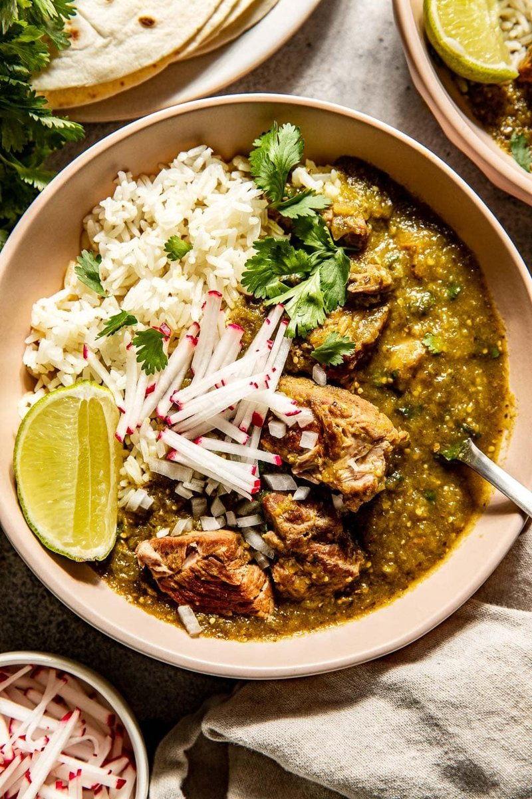

# Chili Verde

*The Mexican-American pork-and-tomatillo stew: shoulder simmered in a roasted tomatillo-poblano-jalapeño salsa till the meat falls apart in a green sauce.*

**Serves:** 6

**Prep Time:** 25 minutes

**Cook Time:** 2 hours 15 minutes

## Overview
Tomatillos, poblanos, jalapeños, garlic and onion roast under the grill until blackened in spots. Blended with coriander and lime to a green salsa. Pork shoulder cubes brown hard in a heavy pot, then simmer for 90 minutes in the green salsa with cumin, oregano and stock until the pork is fork-tender. Eaten with tortillas.

## Ingredients

### Salsa verde
- 1 kg tomatillos (husks removed, rinsed)
- 4 poblano chillies
- 2-3 jalapeños (deseed for milder)
- 6 garlic cloves (peel on)
- 1 white onion (large, quartered)
- 1 large bunch fresh coriander (60 g, stems and leaves)
- Juice of 1 lime
- 2 teaspoons salt

### Pork
- 1 ½ kg pork shoulder (cut into 4 cm cubes)
- 3 tablespoons vegetable oil
- 1 tablespoon ground cumin
- 1 tablespoon dried oregano (Mexican if you can find it)
- 1 teaspoon ground black pepper
- 1 ½ teaspoons salt
- 2 bay leaves
- 600 ml chicken stock
- 1 white onion (chopped)
- 4 garlic cloves (crushed)

### To serve
- 12 warm corn tortillas
- Lime wedges
- Sliced radish
- Crumbled queso fresco or feta
- Diced white onion + coriander
- White rice or pinto beans

## Method

### Stage 1 - Roast salsa vegetables
1. Heat grill to maximum (or use a comal / cast-iron pan over high heat).
1. Place tomatillos, poblanos, jalapeños, garlic (peel on), onion on a foil-lined tray.
1. Grill 12-15 minutes, turning, until blackened in spots and softened.

### Stage 2 - Salsa
1. Peel the garlic. Cool everything briefly.
1. Pulse tomatillos, poblanos, jalapeños, garlic, onion, coriander, lime juice and salt in a blender to a coarse green sauce.
1. Set aside.

### Stage 3 - Brown pork
1. Pat pork dry; toss with cumin, oregano, salt and pepper.
1. Heat oil in a wide heavy pot over medium-high.
1. Brown pork in batches, 5 minutes per side. Set aside.

### Stage 4 - Aromatics
1. Soften the chopped onion 8 minutes in the same pot.
1. Add garlic; cook 30 seconds.

### Stage 5 - Braise
1. Return pork. Pour over the salsa verde and stock.
1. Add bay leaves.
1. Bring to a simmer; cover; cook on low 1 hour 45 minutes to 2 hours, until pork is fork-tender.
1. Uncover for the last 15 minutes if the sauce is too loose; reduce to coat.

### Stage 6 - Adjust
1. Taste; adjust salt and lime.

### Stage 7 - Serve
1. Spoon into wide bowls.
1. Top with diced white onion, coriander, radish and crumbled cheese.
1. Pile warm tortillas on the table for wrapping or scooping.
1. Rice or beans on the side.

## Notes
- **Roast the salsa:** Raw tomatillos give a bright, sharp sauce - too one-dimensional. Roasting gives smoky depth.
- **Pork shoulder:** Lean cuts dry out. Shoulder has the connective tissue that breaks down to silky.
- **Heat dial:** Poblanos give body and mild heat; jalapeños add medium kick. Add a serrano or two for hotter.

## Storage
- Refrigerate 4 days; better day 2.
- Freezes 3 months.
