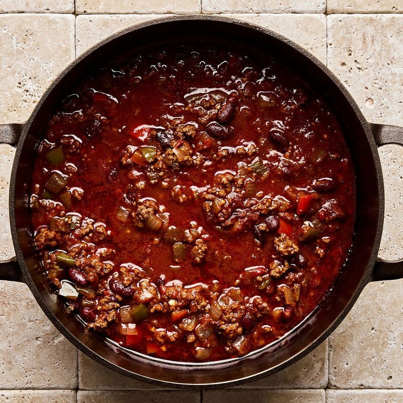

# Mixed Meat and Bean Chilli

*A Tex-Mex chilli con carne: beef and pork slow-cooked with kidney beans, tomato, chipotle and a heavy hand of chilli, cumin and oregano.*

**Serves:** 6
**Prep Time:** 15 minutes
**Cook Time:** 3 hours 15 minutes

## Overview
The British home-cook chilli, the kind of stew that turns up at student houses, family Sunday lunches and weeknight dinners across the UK: beef mince slow-simmered with kidney beans, baked beans, tomato passata and a generous spice mix lifted by marmite, soy sauce and balsamic for umami depth. Not authentic Mexican but a proper comforting crowd-feeder, and better on day two. The single step that separates a good chilli from a flat one is dry-toasting whole cumin seeds and cloves till they smoke and become fragrant, then grinding them fresh into the stock with the marmite, soy, balsamic, chilli powder, ground coriander and tomato paste. Sweated onion, garlic and grated celery and carrot give the soft sweet base; the beef browns hard with them till the meat dries to a deep brown. A star anise dropped into the simmer is the secret round-off. Eat hot with rice, sour cream, grated cheese, diced onion and fresh coriander.

## Ingredients

### Aromatics & Vegetables
- 1 onion (large, chopped)
- 2 garlic cloves (minced)
- 1 celery stick (grated)
- 1 carrot (grated)
- 1 tablespoon oil

### Meat & Beans
- 130g smoked pancetta
- 400g minced beef
- 400g minced pork
- 1 tin (400g) Kidney beans (drained and rinsed)
- 1 tin (400g) [Baked Beans](../american/side-dishes/baked-beans.md)
- 1 tin (400g) Pinto beans (drained and rinsed)
- 2 tablespoons tomato puree

### Spices (Whole & Ground)
- 3 tablespoons whole cumin seeds
- 4 whole cloves
- 2 star anise
- 3 teaspoons ground coriander
- 1 teaspoon chilli powder
- 1 teaspoon hot paprika
- 1 teaspoon smoked paprika
- salt
- pepper

### Sauce & Umami Base
- 125ml beef stock (or vegetable stock)
- 1 teaspoon marmite
- 2 teaspoons soy sauce
- 1 tablespoon balsamic vinegar
- 2 tablespoons tomato paste
- 1 litre passata (Napolina preferred)
- 3 teaspoons dark chocolate (grated)
- 1 shot of espresso
- ½ can dark beer (or ale)

## Method

### Stage 1 - Toast & Prepare Spices
1. Heat a dry, heavy-bottomed frying pan over medium-high heat (no oil).
2. Add the cumin seeds and cloves directly to the hot pan.
3. Toast for 1-2 minutes, stirring constantly, until they begin to smoke and become fragrant.
4. Be careful not to burn them or they will become bitter.
5. Grind the toasted seeds and cloves in a pestle and mortar until finely ground.
6. Pour the stock into a bowl and stir in the ground spices, marmite, soy sauce, balsamic vinegar, chilli powder, coriander powder, and tomato paste until well combined. Set aside.

### Stage 2 - Sweat the Vegetables
1. Preheat a heavy-based pan over low-medium heat.
2. Add the pancetta and render slowly until the fat melts and the pancetta becomes translucent, without taking on colour.
3. Add the carrots, onion, celery, and a pinch of salt.
4. Cook gently for 10 minutes, with the lid on, stirring occasionally, until the vegetables are very soft, pale, and sweet-smelling.
5. Add the garlic for the final 2 minutes, then remove the vegetables from the pan and set aside.

### Stage 3 - Brown the Meat
1. Increase the heat to medium.
2. Add the minced meat
3. Cook for 10 minutes or more minutes, breaking up the meat with a wooden spoon, until completely browned.
4. The meat will be a darker brown, with no visible liquid left
5. If there is still liquid, continue cooking until the meat is dry

### Stage 4 - Add the tomato puree
1. Add the tomato puree and stir
2. increase the heat to medium-high
3. Stir the meat so that the puree is combined
4. continue to stir until the meat becomes dark brown

### Stage 5 - Build the Chilli
1. Return the reserved soffritto vegetables to the pan with the browned meat. Pour in the prepared spice stock mixture.
2. Add the kidney beans, pinto beans and baked beans.
3. Stir in the passata until well combined.
4. Add the star anise.
5. Increase the heat until the mixture comes to a boil, then reduce to low heat.
6. Add the chocolate, coffee and beer
7. simmer on a low heat for 2 hours with the lid on, stirring occasionally
8. Simmer uncovered for 45 minutes to 1 hour, stirring occasionally.
9. The chilli should thicken and darken as it cooks; flavours will deepen and meld.

### Stage 6 - Season & Finish
1. Remove the star anise.
2. Taste and adjust seasoning with salt and black pepper.
3. If the flavour seems flat, add a pinch more marmite or soy sauce.
4. If too bitter, add a touch of sugar.
5. Serve hot.

## Notes
- **Toasting spices:** Toasting cumin and cloves releases essential oils and deepens flavour dramatically, don't skip this step.
- **Umami layering:** Marmite and soy sauce add umami depth without making the dish salty. Start conservatively and taste as you go.
- **Slow cooking:** The long simmer allows flavours to meld and the sauce to thicken naturally without cornflour or thickening agents.
- **Bean choice:** Kidney beans and baked beans provide different textures and flavours; don't substitute one for the other.
- **Make-ahead:** This dish tastes better the next day as flavours develop further. Make it ahead and reheat gently.

## Variations
**Spicier:** Add 2-3 dried chillies (toasted with the cumin) or increase chilli powder to 2 teaspoons
**Extra meaty:** Use 900g beef instead of 680g for a meatier texture
**Vegetarian:** Replace beef with 400g lentils and use vegetable stock instead
**With chocolate:** Add a small square of dark chocolate (70%+) at the end for subtle depth
**Turkey alternative:** Use ground turkey instead of beef for a lighter version

## Serving
Serve with: Cooked rice, cornbread, sour cream, shredded cheese, diced onion, and fresh coriander

## Storage
- Keeps 4 days refrigerated
- Freezes well up to 3 months
- Flavour improves after 24 hours as spices meld
- Reheats gently on the stovetop, adding water if sauce thickens too much
