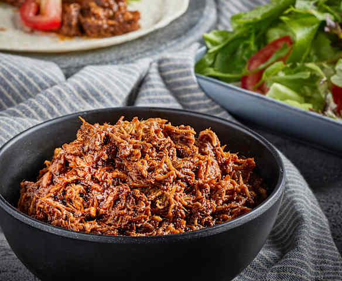

# Chilorio

*Sinaloa's slow-cooked spiced pork: cubes of shoulder simmered with dried ancho and pasilla chillies, garlic, cumin and vinegar till the meat falls apart and the chilli paste forms a thick mahogany coating.*

**Serves:** 6-8

**Prep Time:** 30 minutes (plus 30 minutes chilli soaking)

**Cook Time:** 2 hours 30 minutes

## Overview
Chilorio is the iconic Sinaloan slow-cooked spiced pork and a beloved Northern Mexican breakfast classic. Cubes of pork shoulder cook slow in their own fat (the traditional method) or water (the modern home version) till tender, then get lightly shredded and slow-fried in a thick paste of rehydrated dried ancho and pasilla chillies, crushed garlic, cumin, Mexican oregano, cloves, vinegar and salt till the chilli paste forms a thick coating around the meat and the pork goes deep mahogany. The slow-fry of the paste with the meat is the traditional step: the colour deepens and the flavours meld as the chilli cooks in. Chilorio began as a preservation technique: the cooked pork was packed in jars and sealed under lard where it kept for months without refrigeration; today the fridge does that work. Most often eaten at breakfast as chilorio con huevos with refried beans and warm tortillas, also folded into tacos and quesadillas or plated as a main over rice.

## Ingredients

### Pork
- 1.2 kg pork shoulder (cut into 3 cm cubes)
- 1 ½ teaspoons fine sea salt
- 1 teaspoon ground black pepper

### Dried chillies
- 6 dried ancho chillies (stems and seeds removed)
- 4 dried pasilla chillies (stems and seeds removed)
- 2 dried guajillo chillies (Mexican dried red chilli, mild and sweet-tangy; optional; for extra colour)
- 500 ml hot water (for soaking)

### Cooking
- 4 tablespoons vegetable oil (or lard for traditional)
- 1 large white onion (finely chopped)
- 10 garlic cloves (crushed; yes, that's a lot)
- 3 tablespoons white wine vinegar
- 1 tablespoon ground cumin
- 1 tablespoon dried Mexican oregano
- 1 teaspoon ground cloves
- 1 teaspoon ground cinnamon
- 1 teaspoon ground coriander seed
- 2 bay leaves
- 1 ½ teaspoons fine sea salt
- 1 teaspoon ground black pepper
- 200 ml chicken stock (or water)

### To finish
- 1 tablespoon fresh lime juice (optional)

### To serve
- Warm flour tortillas (Northern Mexican preference)
- Refried beans (frijoles refritos)
- Fried eggs (sunny-side up; for breakfast version)
- Sliced avocado
- Pico de gallo
- Mexican crema or sour cream
- Lime wedges
- Hot sauce

## Method

### Stage 1 - Cook the pork
1. Place the pork cubes in a heavy pot with the salt and pepper.
2. Cover with cold water (about 1.5 litres).
3. Bring to a boil; reduce to a simmer.
4. Cover with the lid slightly ajar; cook 60-75 minutes till the pork is fork-tender.
5. Drain (reserve 500 ml of the cooking liquid).
6. Shred the pork slightly with two forks (just to break up; keep some chunks).

### Stage 2 - Prepare the chillies
1. Heat a dry pan over medium heat.
2. Toast the dried ancho, pasilla and guajillo chillies briefly (30 seconds per side; don't let them burn, they should be slightly puffed and fragrant).
3. Place in a bowl; cover with the 500 ml hot water.
4. Soak 30 minutes till the chillies are fully softened.
5. Drain; reserve the soaking liquid.

### Stage 3 - Blend the chilli paste
1. Place the softened chillies in a blender.
2. Add the chopped onion, crushed garlic, vinegar, cumin, Mexican oregano, cloves, cinnamon, ground coriander seed, salt and pepper.
3. Add about 200 ml of the reserved chilli-soaking liquid.
4. Blitz to a smooth thick paste; add more soaking liquid as needed to reach a thick paste consistency.

### Stage 4 - Fry the chilli paste
1. Heat the oil in a wide heavy pot over medium-high heat.
2. Carefully pour in the chilli paste (it may spit).
3. Cook the paste for 8-10 minutes, stirring frequently, till the colour deepens dramatically and the smell turns from raw-chilli to deeply aromatic.

### Stage 5 - Combine with pork
1. Add the shredded pork to the chilli paste.
2. Add the bay leaves and the reserved pork cooking liquid (about 300 ml).
3. Stir to coat the pork thoroughly.
4. Bring to a simmer; reduce heat to low.
5. Cook 30-45 minutes, stirring occasionally, till the meat has absorbed the flavours and the chilli paste forms a thick coating around the pork.
6. The chilorio should be a deep mahogany-red, with the pork shreds completely coated.

### Stage 6 - Finish
1. Take off the heat; lift out the bay leaves.
2. Squeeze the lime juice over (if using).
3. Taste; adjust salt.

### Stage 7 - Serve
1. For breakfast (chilorio con huevos): spoon a generous portion onto a plate; top with 2 sunny-side eggs; refried beans, avocado, warm flour tortillas alongside.
2. For tacos: warm flour tortillas; fill with chilorio + a spoonful of refried beans + avocado + pico de gallo + crema.
3. For dinner: over rice with refried beans and salad.

## Notes
- **Ancho and pasilla chillies:** the traditional Sinaloan duo. Available dried at Mexican markets and most large supermarkets.
- **Toast the chillies briefly:** brings out flavour without burning.
- **Slow-fry the paste with the pork:** essential for proper integration.
- **Vinegar is traditional:** balances the chilli sweetness.
- **Make ahead:** chilorio is famously better after 24 hours in the fridge; the flavours deepen.

## Variations
- **With chocolate (chilorio mole-leaning):** add 30 g of Mexican chocolate to the paste; gives a richer, mole-leaning version.
- **Spicier:** add 2 chopped chiles de árbol to the paste; properly Sinaloan fierce.
- **Slow-cooker chilorio:** cook the pork in a slow-cooker for 8 hours on low instead of 75 minutes on stovetop.
- **Beef version:** swap the pork for beef chuck; gives a different flavour but the same technique.

## Serving
- For breakfast over warm flour tortillas with fried eggs. As taco or burrito filling. As a dinner over rice. Drink: cold Pacifico, Tecate, or Sinaloan beer. With fresh aguas frescas.

## Storage
- Keeps refrigerated 1 week; flavour deepens significantly.
- Freezes 3 months in portions.
- Day-after chilorio is famously better than fresh.
- For the traditional preservation method: pack hot chilorio into sterilised jars; top with melted lard; refrigerate; keeps 2-3 months.
