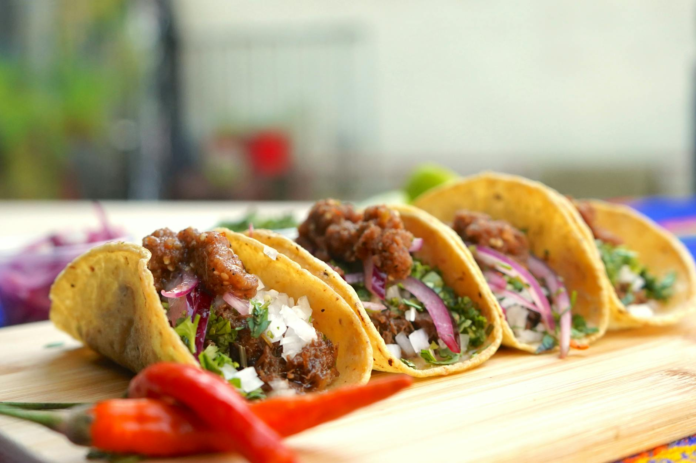

# Cochinita Pibil

*Yucatán's slow-roasted pork: shoulder rubbed with achiote, bitter orange and garlic, wrapped in banana leaf and cooked until the meat falls into shreds. Served with pickled red onion and warm tortillas.*

**Serves:** 6-8

**Prep Time:** 20 minutes (plus 6 hours marinade)

**Cook Time:** 4 hours

## Overview
Pork shoulder is rubbed with a paste of achiote, orange and lime juices, garlic, oregano and warming spices, then left to marinate overnight. The pork is wrapped in banana leaves and roasted low and slow until it shreds with two forks. The pibil sits in its own bright red juices; warm corn tortillas and habanero-bright pickled red onions are the only accompaniments needed.

## Ingredients

### Achiote paste
- 50 g achiote paste
- 4 garlic cloves
- 1 teaspoon ground cumin
- 1 teaspoon dried Mexican oregano
- ½ teaspoon ground cinnamon
- ½ teaspoon ground allspice
- ¼ teaspoon ground cloves
- 1 teaspoon salt
- ½ teaspoon black pepper
- 4 oranges (or 1 cup sour orange juice if available, juice)
- 2 limes (juice)
- 2 tablespoons white vinegar
- 2 tablespoons olive oil

### Pork
- 2 kg pork shoulder (skin off, fat cap on, cut into 8 cm chunks)
- 2-3 banana leaves (passed over a flame to soften, or thawed if frozen)
- 1 onion (sliced)
- 4 bay leaves

### Pickled red onion (to serve)
- 1 red onion (large, thinly sliced)
- 2 limes (juice)
- 2 tablespoons white vinegar
- 1 teaspoon salt
- ½ teaspoon dried oregano
- 1 habanero (thinly sliced, optional)

### To serve
- 24 warm corn tortillas
- Lime wedges
- Coriander leaves

## Method

### Stage 1 - Marinate
1. Blend the achiote paste, garlic, cumin, oregano, cinnamon, allspice, cloves, salt, pepper, orange juice, lime juice, vinegar and olive oil until smooth.
1. Place the pork chunks in a large bowl, pour the marinade over and toss to coat every piece.
1. Cover and refrigerate for at least 6 hours, ideally overnight.

### Stage 2 - Pickle the onions
1. Place the sliced red onion in a bowl and cover with boiling water for 30 seconds; drain.
1. Return to the bowl and add the lime juice, vinegar, salt, oregano and habanero if using.
1. Toss and leave at room temperature for at least 1 hour (or refrigerate up to a week).

### Stage 3 - Prepare the parcel
1. Preheat the oven to 150°C.
1. Line a deep roasting tin with the banana leaves, leaving plenty of overhang to wrap the pork later.
1. Scatter the sliced onion and bay leaves across the leaves.
1. Tip the pork and all its marinade onto the leaves and spread out in a single layer.
1. Fold the banana leaves over the top to enclose the pork completely.
1. Cover the tin tightly with foil.

### Stage 4 - Slow roast
1. Roast for 3 hours 30 minutes to 4 hours, until the pork shreds easily when prodded with a fork.
1. Lift the foil and peel back the banana leaves carefully (the steam is fierce).

### Stage 5 - Shred and serve
1. Use two forks to shred the pork in the tin, mixing it through the bright red cooking juices.
1. Taste and adjust salt.
1. Pile onto warm tortillas and top with pickled red onion, coriander and a squeeze of lime.

## Notes
- **Achiote paste:** Sold in solid red blocks in Latin American grocers. It's the colour, the earthiness and half the flavour, so don't substitute paprika.
- **Banana leaves matter:** They perfume the meat and trap steam. If you genuinely can't find them, cover with parchment then foil; the dish loses a layer but still works.
- **Sour orange substitution:** Traditional cochinita uses naranja agria. The 4 oranges + 2 limes + 2 tablespoons vinegar blend gets close.

## Storage
- Refrigerate the shredded pork in its juices up to 4 days; reheats brilliantly.
- Freezes well for 2 months in its juices.
