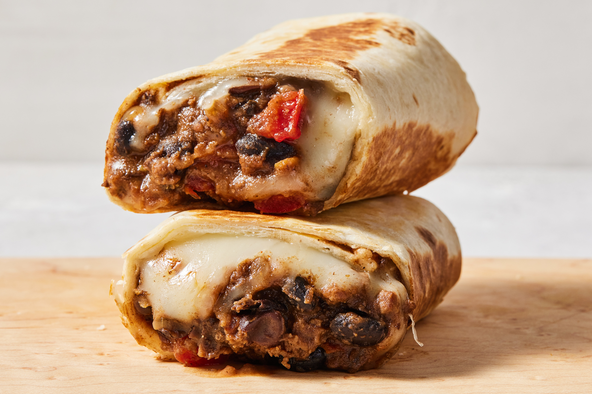

# Corn Tortilla Burrito

*The Atlantic City regional burrito: a Northern Mexican-style filling wrapped in a soft corn tortilla rather than the usual flour, the East Coast variation popularised by the Atlantic City restaurant scene.*

**Serves:** 4 burritos

**Prep Time:** 25 minutes

**Cook Time:** 1 hour 30 minutes

## Overview
The corn tortilla burrito is the Atlantic City regional variant of the dish, where local Mexican-American kitchens substituted the traditional Northern Mexican flour tortilla with a corn tortilla, giving the wrap a closer kinship to the soft taco than to the traditional burrito. The filling stays burrito-style (a guisado, beans, cheese), but the corn wrapper adds a sweet-earthy flavour that flour can't match. The challenge is keeping the corn tortilla flexible enough to roll without cracking: warming it directly over a flame, or steaming it briefly, is the trick. The result is a regional curiosity that's worth the extra step.

## Ingredients

### Guisado
- 500 g chuck beef or pork shoulder, cubed small
- 1 onion, finely chopped
- 3 garlic cloves, crushed
- 2 dried guajillo chiles (Mexican dried red chilli, mild and sweet-tangy), toasted and rehydrated
- 1 dried ancho chile, toasted and rehydrated
- 1 tin (400 g) chopped tomatoes
- 1 tsp ground cumin
- 1 tsp Mexican oregano
- 1 tsp salt
- 400 ml stock
- 2 tbsp oil

### To Assemble
- 8 large corn tortillas (use two per burrito for strength)
- 200 g cooked refried beans, warmed
- 200 g Chihuahua or Monterey Jack cheese, grated
- Salsa verde
- Fresh coriander

## Method

### Stage 1 - Build the guisado
1. Toast and rehydrate the dried chiles for 20 minutes.
2. Blend the chiles with the tomatoes, garlic, cumin and oregano to a smooth paste.
3. Brown the beef hard in oil; lift out.
4. Soften the onion; add the chile paste; cook 5 minutes.
5. Return the beef with stock; cover and braise 90 minutes until tender.
6. Shred the meat; return to the sauce; salt to taste.

### Stage 2 - Soften the corn tortillas
1. Warm each corn tortilla directly over a gas flame for 5 seconds per side (or briefly under a hot grill, or in a dry pan).
2. Stack them between two slightly damp clean tea towels so they stay soft and pliable as you work.

### Stage 3 - Assemble
1. Lay two corn tortillas side-by-side, overlapping by half so they form a larger oval (this is the strength trick for corn tortilla burritos).
2. Spread a layer of warm refried beans across the lower third.
3. Spoon the shredded guisado on top; add grated cheese, salsa verde and coriander.
4. Fold the bottom up over the filling, fold the sides in tight, roll forward firmly.
5. Optional: sear the rolled burrito briefly on a hot dry pan to seal and melt the cheese (the corn tortilla crisps quickly, so 1 minute per side).

## Notes
- **Two tortillas per burrito:** Corn tortillas are smaller and less flexible than flour. Overlapping two gives you the size and the strength to wrap a proper filling.
- **Steam them briefly:** A microwave-steamed stack (wrapped in a damp paper towel for 30 seconds) keeps the corn pliable through the assembly process.
- **Eat fast:** Corn tortillas absorb moisture faster than flour; the burrito softens within 15 minutes of assembly.

## Variations
- **Vegetarian:** Skip the meat, double the beans, add roasted vegetables and queso fresco.
- **Crispy:** Sear all four sides of the rolled burrito on a hot pan with oil; the corn tortilla goes properly crisp in a way flour doesn't.

## Serving
- Serve hot with extra salsa verde, chopped onion and a lime wedge.

## Storage
- The guisado and beans keep 4 days refrigerated
- Assembled corn burritos eat best within 30 minutes of assembly
- Corn tortillas don't reheat as well as flour; make fresh per serving
