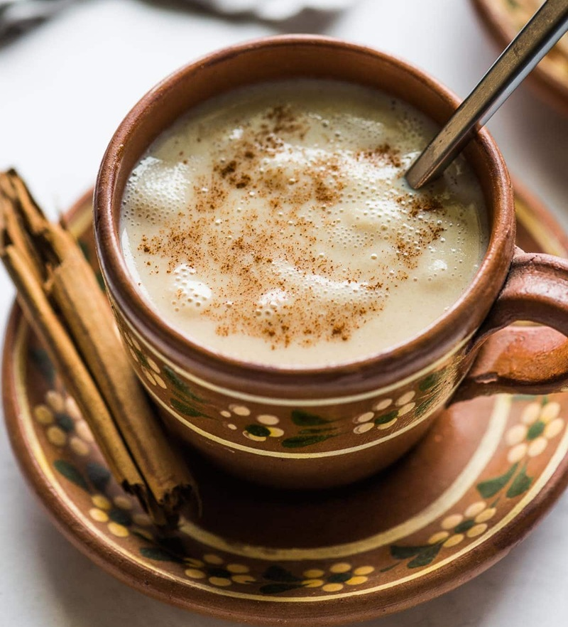

# Atole

*The warm, thick Mexican comfort drink. Masa harina simmered with milk, piloncillo, cinnamon and vanilla until silky and pourable. Drunk in mugs at the breakfast table, beside tamales at dawn, and through long Día de los Muertos vigils.*

**Serves:** 4

**Prep Time:** 5 minutes

**Cook Time:** 20 minutes

## Overview
A pre-Hispanic drink that pre-dates Spanish dairy and chocolate by centuries: masa harina, water, and a sweetener. The modern household version uses milk for richness, piloncillo for the smoky-caramel sweetness, a cinnamon stick for warmth and vanilla for the perfume. Whisked over a low heat until the masa thickens the liquid to the consistency of warm pouring custard. Served in mugs, drunk hot.

## Ingredients

- 60 g masa harina
- 250 ml water (cold)
- 750 ml whole milk
- 80 g piloncillo (or 70 g soft dark brown sugar)
- 1 cinnamon stick (Mexican canela if you have it)
- 1 teaspoon vanilla extract
- A small pinch of fine sea salt

## Method

### Stage 1 - Slake the masa
1. Tip the masa harina into a medium saucepan. Pour in the cold water and whisk to a smooth slurry with no lumps. Doing this off the heat is the easiest way to avoid clumps.

### Stage 2 - Warm and infuse
1. Add the milk, piloncillo, cinnamon stick and salt to the pan. Set over a medium-low heat.
2. Whisk constantly as the mixture warms. The piloncillo will dissolve over 5-7 minutes; nudge any stubborn chunks against the side of the pan with the whisk.

### Stage 3 - Thicken
1. Once the milk is steaming and the sweetener has dissolved, drop to low and continue to whisk for 10-12 minutes. The atole will thicken slowly to the consistency of warm pouring custard. If it threatens to boil, lift off the heat for 30 seconds and keep whisking.
2. The right consistency coats the back of a spoon, with a slow line drawn by a finger holding for a moment before closing. Too thick: thin with a splash of warm milk. Too thin: keep going for 2-3 more minutes.
3. Stir in the vanilla off the heat. Fish out the cinnamon stick.

### Stage 4 - Serve
1. Pour into warmed mugs. The atole keeps thickening as it cools, so serve it fairly soon. If it sits in the pan, a skin will form; whisk back smooth before pouring.

## Notes
- Masa harina is the Mexican lime-treated corn flour used for tortillas; not the same as polenta or cornmeal, both of which will give a sandy texture. Look for Maseca in the Latin aisle.
- Piloncillo (unrefined cane sugar in cone form) has a smoky molasses note that defines the drink. Dark brown sugar is the best substitute; honey or maple are different drinks.
- For a fruit atole, replace 250 ml of the milk with 250 ml of pineapple, guava or strawberry pulp and reduce the piloncillo to 60 g.

## Serving
In mugs, hot, alongside tamales or pan de muerto. On the ofrenda, in a small clay cup beside the photo of the person being honoured.

## Storage
Best fresh. Keeps in the fridge for 2 days; reheat gently with an extra splash of milk, whisking smooth as it warms.
