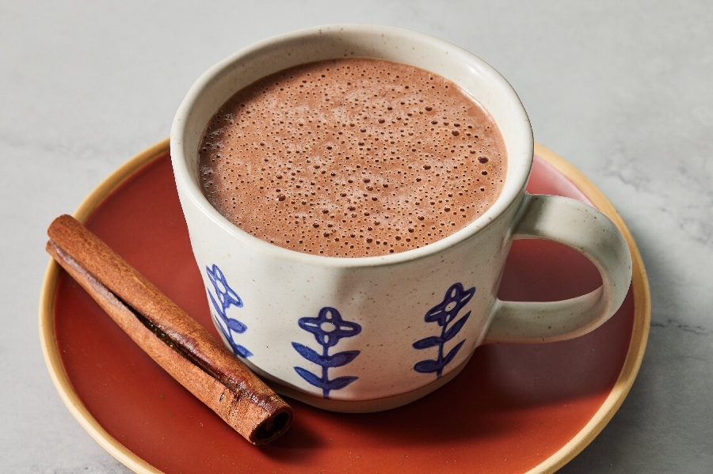

# Champurrado

*The chocolate cousin of atole. Masa harina, milk, piloncillo, cinnamon and a generous bar of Mexican chocolate, whisked over a low heat until thick and silky. The drink of cold mornings, Día de los Muertos vigils, and any night that calls for hot chocolate with a backbone.*

**Serves:** 4

**Prep Time:** 5 minutes

**Cook Time:** 25 minutes

## Overview
Masa harina slaked with water, then simmered into a milk-and-piloncillo base scented with a cinnamon stick. A bar of Mexican chocolate (the rustic, slightly grainy kind, scented with cinnamon and almond) goes in to melt and is whisked through. The result is hot chocolate with body, sweetness layered over a faint roasted-corn note. Pour into mugs and dip a churro or a piece of pan de muerto.

## Ingredients

- 60 g masa harina
- 250 ml water (cold)
- 750 ml whole milk
- 90 g Mexican chocolate (a Abuelita or Ibarra tablet, chopped)
- 60 g piloncillo (or 50 g soft dark brown sugar)
- 1 cinnamon stick (Mexican canela if you have it)
- 1 teaspoon vanilla extract
- A small pinch of fine sea salt

## Method

### Stage 1 - Slake the masa
1. Tip the masa harina into a medium saucepan. Pour in the cold water and whisk smooth, off the heat. The mixture should look like single cream with no lumps.

### Stage 2 - Build the base
1. Add the milk, piloncillo, cinnamon stick and salt. Set over a medium-low heat.
2. Whisk constantly for 6-8 minutes as it warms. The piloncillo will melt and the milk will steam; do not let it boil hard or the milk catches on the bottom.

### Stage 3 - Add the chocolate
1. Drop the chopped Mexican chocolate into the pan. Whisk steadily for 4-5 minutes as it melts into the base. The mixture goes from milky to deep brown.
2. Continue to whisk on low for another 10 minutes. The masa thickens the drink to the consistency of warm pouring custard; the chocolate becomes silky. A traditional cook uses a molinillo (a wooden whisk twirled between the palms) to froth the top; a regular whisk is fine.
3. Stir in the vanilla off the heat. Fish out the cinnamon stick.

### Stage 4 - Serve
1. Pour into warmed mugs while it is properly hot. The drink keeps thickening as it cools.

## Notes
- Mexican chocolate (Ibarra, Abuelita, Taza if you can find it) is dark, grainy with sugar, and scented with cinnamon. Plain dark chocolate plus an extra ½ teaspoon of ground cinnamon and 30 g more sugar is a passable substitute but lacks the characteristic graininess.
- For a thinner drink, use 500 ml milk and 500 ml water and reduce the masa harina to 50 g.
- A shot of brandy or ancho-chilli liqueur stirred into the mug at the end is for adults only.

## Serving
In mugs alongside churros, pan de muerto, or tamales. On the Día de los Muertos altar, in a small cup beside a candle and a marigold.

## Storage
Best fresh. Keeps in the fridge for 2 days; reheat slowly with a splash of milk to loosen.
