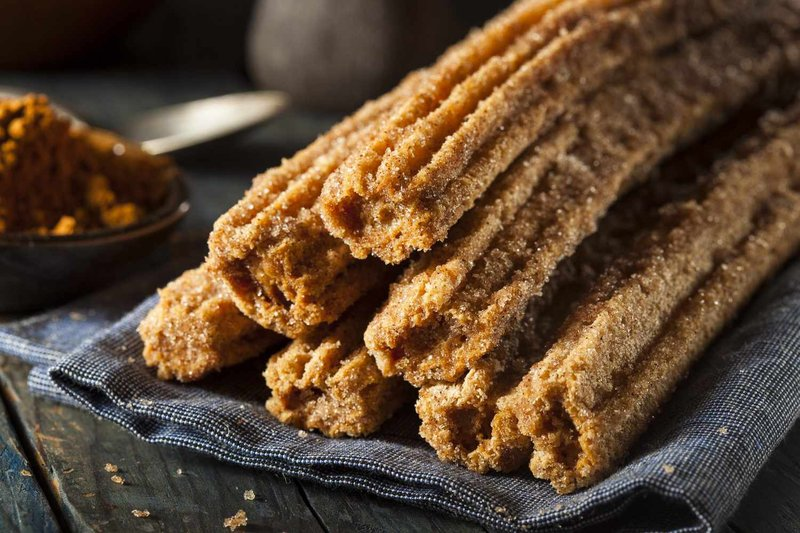

# Churros Mexicanos

*Mexico's fried-dough dessert: ridged choux tubes piped into hot oil, fried crisp, tossed in cinnamon sugar. Dipped in thick chocolate.*

**Serves:** 4 (makes 16 churros)

**Prep Time:** 20 minutes

**Cook Time:** 20 minutes

## Overview
Mexico's fried-dough dessert and the late-night Mexico City pavement classic: ridged choux tubes piped into hot oil, fried crisp, tossed in cinnamon sugar and dipped into thick spiced hot chocolate. The dough is a stovetop choux: water, butter, sugar, salt and vanilla boiled, flour stirred in hard till the dough comes together, then eggs beaten through in thirds to a glossy pipeable consistency. A large closed-star nozzle (14-16 mm) is essential: a small one tears under the stiff dough, and the ridges are what give churros their characteristic crispness. Oil temperature is the other deciding factor: 175 °C is the sweet spot, with a thermometer to keep it there. Piped at a 45° angle straight into the oil, cut to 12-15 cm with kitchen scissors, fried two or three at a time till deep amber. Rolled while still warm and slightly oily in cinnamon sugar so it sticks. Eat with small cups of warm Mexican chocolate sauce for dipping.

## Ingredients

### Dough
- 250 ml water
- 80 g unsalted butter (cubed)
- 1 tablespoon caster sugar
- ½ teaspoon salt
- 1 teaspoon vanilla extract
- 150 g plain flour (sifted)
- 2 eggs (large, room temperature, beaten)

### For frying
- 1 litre vegetable oil (or sunflower oil)

### Cinnamon sugar coating
- 150 g caster sugar
- 2 tablespoons ground cinnamon

### Mexican chocolate sauce
- 200 g dark chocolate (60-70% cocoa, chopped)
- 250 ml whole milk
- 60 ml double cream
- 1 tablespoon caster sugar
- ½ teaspoon ground cinnamon
- A pinch of salt
- 1 teaspoon vanilla extract

## Method

### Stage 1 - Cook the dough
1. In a saucepan, combine water, butter, sugar, salt and vanilla.
1. Bring to a rolling boil over medium-high heat, stirring occasionally to dissolve the sugar and melt the butter.
1. As soon as it boils vigorously, reduce to medium and tip in ALL the flour at once.
1. Stir vigorously with a wooden spoon for 90 seconds - the dough comes together as a smooth ball that pulls cleanly away from the pan walls and base.
1. Tip into a wide bowl; rest 5 minutes to cool slightly (so the eggs don't cook on contact).

### Stage 2 - Add the eggs
1. Add a third of the beaten eggs; stir hard with a wooden spoon (or use a stand mixer paddle on medium speed) until fully absorbed.
1. Continue with the next third; mix to incorporate.
1. Continue with the final third.
1. The dough should be glossy, smooth, thick and pipe-able - it should hold its shape on a spoon but slowly flow.

### Stage 3 - Heat the oil
1. Pour oil into a wide deep heavy pan to a depth of 5 cm.
1. Heat to 175°C. Test with a small piece of dough - it should bubble immediately, rise to the surface, and brown in about 90 seconds.

### Stage 4 - Make the chocolate sauce
1. Combine chopped chocolate, milk, cream, sugar, cinnamon and salt in a saucepan.
1. Heat over low, stirring constantly, until the chocolate has fully melted and the sauce is glossy and thick.
1. Off heat; stir in vanilla.
1. Keep warm (low heat or near the oven).

### Stage 5 - Pipe and fry
1. Transfer the dough to a piping bag fitted with a 1 ½ cm closed-star nozzle (Wilton 1M or similar). A larger nozzle is essential - small nozzles tear under the dough's resistance.
1. Hold the piping bag at a 45° angle just above the hot oil; squeeze gently to pipe a strip of dough directly into the oil.
1. Cut each churro to 12-15 cm length with kitchen scissors (or a knife). Let the cut piece drop into the oil.
1. Fry 2-3 at a time, 90 seconds per side, turning, until deep amber gold.
1. Lift onto a wire rack or kitchen paper.

### Stage 6 - Toss in cinnamon sugar
1. Mix the caster sugar and ground cinnamon in a wide shallow plate.
1. While each churro is still warm and slightly oily, roll it in the cinnamon sugar to coat thoroughly.

### Stage 7 - Serve
1. Pile churros on a plate.
1. Pour the warm chocolate sauce into small cups or mugs (about 80 ml per person - it's rich).
1. Eat by dipping the warm churro into the chocolate.

## Notes
- **A large star nozzle is essential:** The closed-star shape is what gives churros their characteristic ridged surface, which fries crispier than a smooth surface. A small nozzle (10 mm) will tear from the stiff dough; use 14-16 mm.
- **Oil temperature is critical:** Too cold (under 170°C) and the churros absorb oil; too hot (over 190°C) and the outsides brown before the insides cook. Use a thermometer. Adjust between batches.
- **Coat while warm:** Hot churros need the cinnamon sugar to stick to the slight surface oil. Wait too long and the sugar slides off.

## Storage
- Best within 30 minutes of frying.
- Cooked churros refrigerate 1 day; re-crisp at 180°C for 4 minutes (microwave makes them soggy).
- Dough keeps refrigerated 24 hours; bring to room temperature before piping.
- Chocolate sauce refrigerates 5 days; reheat gently.
