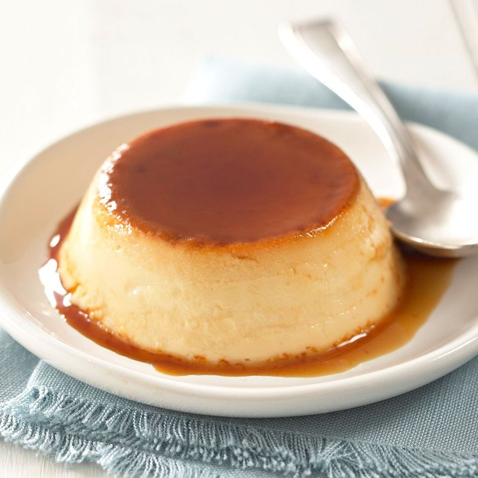

# Flan Mexicano

*Mexico's defining dessert: a silky baked custard sitting in a pool of bittersweet caramel, inverted so the syrup runs down the dome.*

**Serves:** 8

**Prep Time:** 20 minutes (plus 6+ hours setting)

**Cook Time:** 1 hour

## Overview
Caramel cooks dry: sugar melts in a hot pan to a dark amber syrup; poured into a 22 cm round cake tin (or 8 individual ramekins) where it solidifies. Custard: eggs blend with sweetened condensed milk, evaporated milk, whole milk, vanilla and a pinch of salt (no fresh cream, the milk trio is what makes Mexican flan distinct). Strained for smoothness; poured over the set caramel; baked in a water bath at 160°C for 60-75 minutes until just set but with the slightest jiggle in the centre. Cooled fully; refrigerated overnight. Inverted onto a plate the next day; the caramel pools around the dome.

## Ingredients

### Caramel
- 200 g caster sugar
- 3 tablespoons water (helps the start)

### Custard
- 4 eggs (large, room temperature)
- 1 (397 g) tin sweetened condensed milk
- 1 (410 g) tin evaporated milk (NOT condensed; the unsweetened kind)
- 200 ml whole milk
- 2 teaspoons vanilla extract (or use a scraped pod for the seeds)
- A pinch of salt
- 1 tablespoon rum (or brandy, optional, traditional)

### Equipment
- 1 round cake tin (22 cm, NOT springform - needs to be solid-bottomed; ideally 8 cm deep)
- OR 8 ramekins (180 ml each)
- A large roasting tin (to act as a bain-marie)
- Boiling water

## Method

### Stage 1 - Make the caramel
1. Place sugar and water in a heavy saucepan (light-coloured base so you can see the caramel colour).
1. Heat over medium-low until the sugar dissolves; swirl the pan occasionally.
1. Once the syrup is clear, increase heat to medium-high.
1. Cook 5-8 minutes without stirring (swirling occasionally) until the syrup darkens to a deep amber - like a strong espresso. Watch carefully; it goes from amber to burnt-black in 30 seconds.
1. Immediately pour into your cake tin (or distribute among ramekins).
1. Tilt to coat the base and 1 cm up the sides.
1. The caramel sets and hardens within a minute - that's fine.
1. Set aside.

### Stage 2 - Make the custard
1. Heat oven to 160°C (140°C fan).
1. Bring a kettle of water to a boil.
1. In a wide bowl, gently whisk eggs (don't whip - you don't want foam) until just combined.
1. Whisk in the condensed milk, evaporated milk, whole milk, vanilla, salt and rum (if using).
1. Strain the custard through a fine sieve into a measuring jug - twice if you're a perfectionist.
1. Skim any foam from the surface (foam gives a pocked finish on the bottom of the flan when unmoulded).

### Stage 3 - Bain-marie
1. Place the caramel-lined cake tin (or ramekins) in a large roasting tin.
1. Pour the custard into the cake tin over the set caramel.
1. Pour boiling water into the roasting tin around the cake tin to come halfway up its sides.
1. Carefully transfer to the oven on the middle rack.

### Stage 4 - Bake
1. Bake 60-75 minutes (35-40 minutes for ramekins).
1. The flan is done when:
   - The edges are set firm
   - The centre has a slight jiggle when the tin is tapped (but doesn't slosh)
   - A skewer inserted comes out almost clean (a slight wet sheen is fine; the flan firms more as it cools)
1. Lift the cake tin out of the water bath.

### Stage 5 - Cool and chill
1. Cool to room temperature on a rack (1-2 hours).
1. Cover with cling film; refrigerate at least 6 hours, ideally overnight.
1. The flan firms fully and the caramel partially dissolves into a syrup at the base.

### Stage 6 - Unmould
1. Run a thin knife around the edge.
1. Place a large flat serving plate (one with a slight lip is ideal - to catch the caramel) over the cake tin.
1. Invert with confidence - flip it over completely.
1. Gently lift the tin off - the flan slides down onto the plate; the caramel pours over it.

### Stage 7 - Serve
1. Slice into 8 wedges.
1. Spoon caramel from the plate over each slice as you serve.

## Notes
- **Caramel colour matters:** Pale caramel gives sweet syrup without depth; burnt caramel is bitter. Deep amber (espresso-coloured) is the target - bittersweet, deeply caramelised, slight smokiness.
- **The milk trio is the Mexican signature:** Condensed milk (sweetness + body), evaporated milk (richness without sugar), whole milk (lightening). Substituting fresh cream gives a less authentic, richer-but-flatter flan.
- **Bain-marie is non-negotiable:** Direct oven heat overcooks the edges before the centre sets, giving a curdled rubbery flan. The water bath surrounds the tin in gentle moist heat that cooks the custard evenly to a silky texture.

## Storage
- Refrigerated, covered, in its tin (not unmoulded): 4 days.
- Once unmoulded, eat within 2 days.
- Doesn't freeze well - the custard texture separates on thaw.
