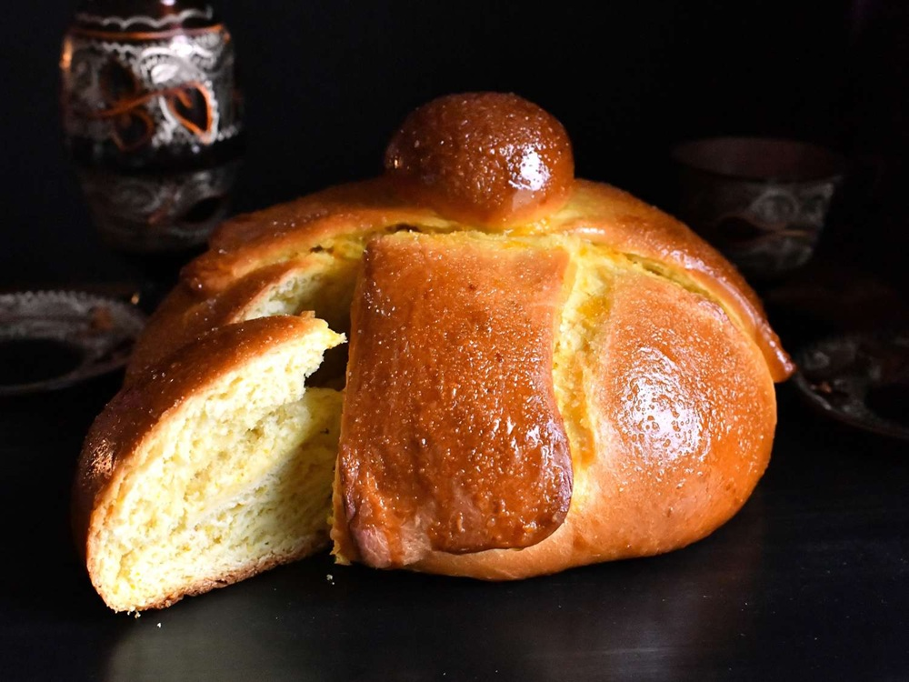

# Pan de Muerto

*The bread of the dead. A soft, faintly sweet brioche-style loaf scented with orange zest and anise, shaped as a round dome with bone-shaped strips crossed over the top and a small ball at the centre. Glazed with butter and dusted with sugar straight from the oven. Made for Día de los Muertos and eaten at the family altar as much as at the table.*

**Serves:** 8 (makes 1 large loaf or 4 small)

**Prep Time:** 30 minutes (plus 2 hours rising)

**Cook Time:** 25 minutes

## Overview
A rich yeasted dough enriched with butter, eggs and sugar, perfumed with orange zest, anise seed and a splash of orange-flower water. The dough is divided: a large ball for the body, four thin strips rolled to look like crossed bones, and a small ball for the centre. After a second rise it goes into a hot oven, then brushed with melted butter and rolled in sugar while still warm. The crust is golden, the crumb is soft and pulls apart in tender threads.

## Ingredients

### The dough
- 500 g strong white bread flour
- 80 g caster sugar
- 1 teaspoon fine sea salt
- 7 g instant yeast (1 sachet)
- 1 tablespoon anise seeds (lightly crushed)
- The zest of 1 large orange
- 4 eggs (lightly beaten)
- 100 ml whole milk (lukewarm)
- 1 tablespoon orange-flower water (optional)
- 150 g unsalted butter (softened, cubed)

### To finish
- 50 g unsalted butter (melted)
- 80 g caster sugar (for rolling)

## Method

### Stage 1 - Mix the dough
1. Combine the flour, sugar, salt, yeast, anise seeds and orange zest in a large bowl. Whisk to distribute the yeast evenly.
2. Make a well, pour in the eggs, milk and orange-flower water if using, and mix with a wooden spoon until shaggy.
3. Turn out onto an unfloured worktop and knead for 5 minutes. The dough will be sticky at this point.
4. Add the softened butter a cube at a time, kneading each piece in before adding the next. This takes 8-10 minutes. The dough will look broken halfway through; keep going and it pulls back together, glossy and elastic.
5. Shape into a ball, place in a lightly oiled bowl, cover, and leave to rise in a warm place for 1 ½ hours, until doubled.

### Stage 2 - Shape the loaf
1. Knock back gently and turn onto a lightly floured surface.
2. Pinch off about 100 g of dough and set aside for the decoration. Shape the rest into a smooth tight ball and place on a baking-paper-lined tray.
3. Divide the reserved dough into 5 pieces: 4 for the bones, 1 for the centre ball.
4. Roll each of the 4 bone pieces into a finger-length strip, then use the side of your hand to pinch three or four indentations along the length so it reads as a knobbly bone.
5. Brush the top of the loaf with a little water, then lay the bones in a cross, tucking the ends under the base. Roll the remaining piece into a small ball and press it gently onto the centre where the bones meet.
6. Cover loosely and leave to rise for another 45 minutes, until puffy but not at full double.

### Stage 3 - Bake and finish
1. Heat the oven to 180°C fan / 200°C / 400°F.
2. Bake for 22-25 minutes, until deep golden and hollow-sounding when tapped underneath. If the top is browning fast, drop the temperature 10°C for the last 5 minutes.
3. While still warm but no longer too hot to handle, brush all over with melted butter.
4. Tip the caster sugar onto a wide plate and roll the buttered loaf in the sugar to coat. The sugar sticks to the butter and forms a soft sweet crust.
5. Cool to barely-warm before slicing.

## Notes
- Orange-flower water gives the bread its characteristic perfume but is optional; the orange zest alone carries the citrus note.
- For individual loaves, divide the dough into 4 before the second shape and scale the bone strips accordingly. Reduce the bake time to 16-18 minutes.
- The bread firms up quickly. Day 1 is the best eating; Day 2 wants toasting.

## Serving
A wedge on a plate with a mug of hot chocolate or champurrado. On the ofrenda, set on its own small plate beside a candle, alongside the favourite foods of the person being honoured.

## Storage
In a paper bag at room temperature for 2 days; in a sealed bag, lightly toasted, for up to 4 days. Do not refrigerate.
