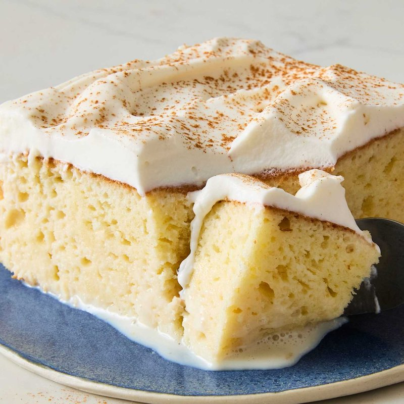

# Tres Leches Cake

*Latin America's celebration cake: an airy sponge soaked in evaporated milk, condensed milk and cream, finished with whipped cream.*

**Serves:** 12 (one 22 x 28 cm tray)

**Prep Time:** 30 minutes

**Cook Time:** 30 minutes

**Total Time:** 4-12 hours (soaking time)

## Overview
A sponge cake separates yolks and whites; the whites whip with sugar to stiff peaks; the yolks fold with sugar, milk, vanilla, flour and baking powder. The two mixtures fold together carefully (don't deflate the whites). Baked at 175°C for 25-30 minutes until golden and just-springy. While still slightly warm, the top is pricked all over with a skewer to make absorption channels. The "tres leches", evaporated milk + condensed milk + double cream whisked together, pours over the warm cake, slowly. The cake drinks the milk; rests in the fridge at least 4 hours (overnight ideal). Topped with whipped cream and a dusting of cinnamon just before serving.

## Ingredients

### Cake
- 5 eggs (large, room temperature, separated)
- 200 g caster sugar (divided: 150 g for the whites, 50 g for the yolks)
- 80 ml whole milk
- 1 teaspoon vanilla extract
- 200 g plain flour
- 1 ½ teaspoons baking powder
- A pinch of salt
- 30 g unsalted butter (melted, for greasing the tin)

### Tres leches soak
- 1 (410 g) tin evaporated milk
- 1 (397 g) tin sweetened condensed milk
- 250 ml double cream
- 1 teaspoon vanilla extract
- 1 tablespoon dark rum (optional, traditional)

### Topping
- 300 ml double cream (cold)
- 2 tablespoons icing sugar
- 1 teaspoon vanilla extract
- 1 teaspoon ground cinnamon (for dusting)
- Fresh strawberries (or other berries to serve, optional)

## Method

### Stage 1 - Prep the tin and oven
1. Heat oven to 175°C (155°C fan).
1. Brush a 22 x 28 cm rectangular tin (or 22 cm square deep tin) with melted butter.
1. Line the base with baking paper.

### Stage 2 - Whisk the egg whites
1. In a clean grease-free bowl, whisk egg whites to soft peaks.
1. Add the 150 g sugar gradually (1 tablespoon at a time), whisking, until you have stiff glossy meringue.

### Stage 3 - Whisk the egg yolks
1. In a separate bowl, whisk yolks with the 50 g sugar until pale and thick (3-4 minutes by hand or 2 minutes with electric beaters).
1. Whisk in the milk and vanilla.

### Stage 4 - Combine
1. Sift the flour, baking powder and salt over the yolk mixture; gently fold in with a spatula - don't overwork.
1. Fold in a third of the meringue to lighten the batter.
1. Fold in the remaining meringue in two additions, using a large spatula in a lifting / cutting motion. The batter should stay airy.

### Stage 5 - Bake
1. Pour into the prepared tin; smooth the top.
1. Bake 25-30 minutes until the top is gold, the edges have pulled slightly from the tin, and a skewer comes out clean.
1. Don't open the oven during the first 20 minutes - it can collapse the sponge.

### Stage 6 - Prep the soak
1. While the cake bakes, whisk the evaporated milk, condensed milk, double cream, vanilla and rum (if using) in a measuring jug.

### Stage 7 - Soak
1. As soon as the cake comes out of the oven (still in the tin), prick the top all over with a skewer or fork - make lots of holes, top to bottom.
1. Slowly pour the milk mixture over the warm cake.
1. The cake drinks the milk in stages; pour about a third at a time, waiting 1 minute between additions, until you've added all of it.
1. Most of the milk will be absorbed; a small puddle at the base is fine.
1. Cool to room temperature, then cover with cling film.
1. Refrigerate at least 4 hours, ideally overnight.

### Stage 8 - Whipped cream topping
1. Whip cold double cream with icing sugar and vanilla to soft-medium peaks (don't over-whip; it'll separate when spread).
1. Spread evenly over the chilled cake.

### Stage 9 - Finish and serve
1. Dust the top with a thin layer of ground cinnamon (a sieve gives an even dusting).
1. If using berries, scatter on top.
1. Slice into 12 rectangles.
1. Serve cold.

## Notes
- **The sponge has to be airy:** A heavy dense sponge won't absorb the soak - it'll just float on top while the milk pools at the bottom. The whipped-egg-whites technique gives the right open structure that drinks the milk.
- **Soak while warm:** A warm cake absorbs the milk far better than a cold cake. Don't wait - pour the soak as soon as the cake comes out of the oven.
- **Overnight rest is best:** Tres leches gets better with time. 4 hours minimum; 12 hours is the target. The cake should be uniformly moist throughout - not wet at the bottom and dry at the top.

## Storage
- Refrigerate 4 days, covered.
- The whipped cream topping is best within 24 hours; if making further ahead, add the cream just before serving.
- Doesn't freeze well - the saturated sponge structure breaks down on thaw.
