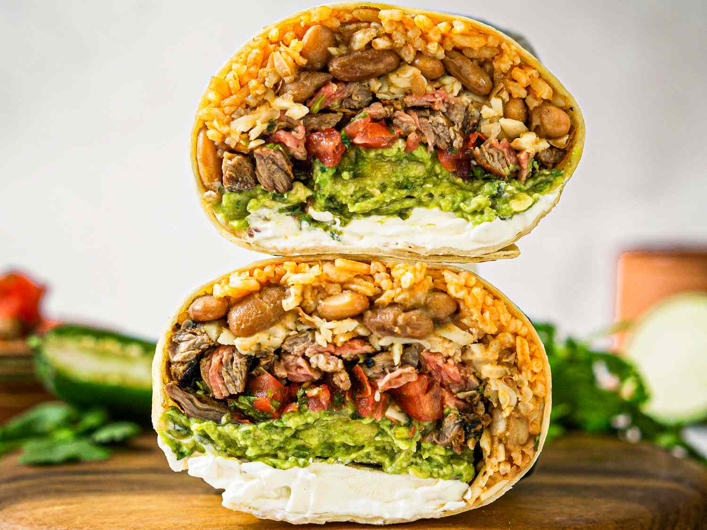

# Dorado-Style Burrito

*The San Francisco crisp-skin burrito: a Mission-style wrap seared hard on a hot oiled plancha until the exterior turns golden, crackling and shatteringly crisp.*

**Serves:** 4 burritos

**Prep Time:** 30 minutes

**Cook Time:** 15 minutes (assuming filling is ready)

## Overview
"Dorado" means golden in Spanish, and a dorado-style burrito is the San Francisco finishing technique that turns a soft Mission burrito into something with a crackling, deep-bronze exterior. The trick is the plancha: a wide flat-top griddle (or a heavy cast-iron pan) heated to smoking, slicked with oil, and the rolled burrito pressed onto it firmly for two or three minutes per side until the tortilla blisters and goes audibly crisp. The fillings inside stay hot and melted; the outside gets that proper crunch. Eat fast, while it's still steaming.

## Ingredients

### Filling (Mission-style; or use your favourite)
- 500 g carne asada, carnitas or grilled chicken, chopped
- 200 g cooked Mexican rice
- 200 g refried beans, warm
- 150 g Monterey Jack cheese, grated
- 1 ripe avocado, sliced or mashed
- 100 g pico de gallo
- 4 tbsp sour cream
- Salsa to taste

### Wrap
- 4 large flour tortillas (30 cm)
- 2 tbsp oil for the plancha

## Method

### Stage 1 - Assemble the burritos
1. Warm a tortilla briefly on a dry pan so it folds without cracking.
2. Layer the lower third: rice, beans, meat, cheese, avocado, pico de gallo, salsa, sour cream.
3. Fold the bottom up over the filling, fold the sides in tight, then roll forward into a tight cylinder.
4. Repeat for all four.

### Stage 2 - Sear on the plancha
1. Heat a heavy cast-iron pan, flat-top griddle or plancha over medium-high heat until very hot.
2. Add a thin slick of oil; place the rolled burritos seam-side down.
3. Press firmly with a spatula for 2-3 minutes until the bottom is deep gold and crisp.
4. Flip and sear the other side for another 2 minutes.
5. Lift onto a board; rest 30 seconds; slice in half on the diagonal so the crisp exterior and melted interior show.

## Notes
- **Wrap tight:** A loose burrito will unroll on the plancha as it sears. Pull it firm as you roll.
- **High heat:** The plancha needs to be properly hot. A medium-heat sear gives you a chewy, oily exterior instead of crisp.
- **Seam down first:** Seam-side down seals as it sears, so the burrito doesn't open mid-cook.

## Variations
- **Cheese exterior:** Sprinkle a layer of cheese on the plancha just before the burrito goes on, so the cheese melts and crisps directly onto the tortilla skin. The Tex-Mex evolution.
- **Veggie:** Use roasted vegetables, beans and rice; the sear works just as well.

## Serving
- Serve halved on the diagonal so the cross-section shows. Salsa verde, hot sauce and a cold beer on the side.

## Storage
- Assembled and seared burritos eat best fresh; the crisp exterior softens within an hour
- Pre-sear assembly keeps 2 days refrigerated; sear at service
- The filling components keep 3 days refrigerated separately
