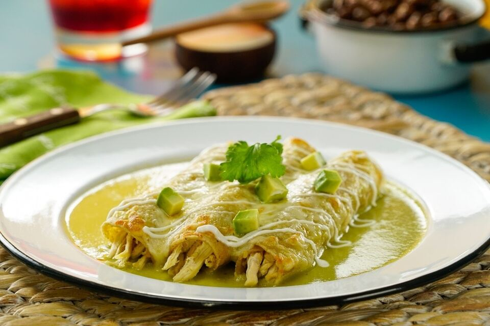

# Enchiladas Suizas

*Mexico's "Swiss-style" enchiladas: corn tortillas filled with shredded chicken, rolled, topped with a creamy tomatillo-jalapeño green sauce mixed with sour cream, smothered in melted Oaxaca cheese and baked till the cheese crusts golden. The Mexico City restaurant classic, the canonical "made-in-Mexico-by-the-Swiss-chefs" dish from the 1950s.*

**Serves:** 4-6

**Prep Time:** 30 minutes

**Cook Time:** 35 minutes

## Overview
Enchiladas Suizas (literally "Swiss enchiladas"; named after the cream-and-cheese addition - a Swiss-influenced touch on traditional Mexican enchiladas) is one of Mexico City's most beloved restaurant classics and a Mexican Sunday-family-lunch staple: corn tortillas are briefly heated in oil till pliable, filled with shredded chicken (or beef), rolled tight, arranged in a baking dish, topped with a creamy green sauce (made by blitzing tomatillos, jalapeños, cilantro, garlic, onion and chicken stock, then enriched with cream or crema), smothered in grated Oaxaca cheese (or substitute with mozzarella + a touch of feta) and baked till the cheese melts into a golden crust. Served with rice, refried beans, sliced avocado, sliced raw onion and lime wedges. The dish was created at Sanborns restaurant in Mexico City in the 1950s where Swiss chefs were experimenting with Mexican classics; the "Suiza" name reflects the Swiss-cheese-and-cream contribution. Three details define proper enchiladas Suizas. First, the green tomatillo sauce. Tomatillos, jalapeños, cilantro and garlic blitzed together, then fried briefly in oil to deepen. Second, the cream. The Swiss touch - adds richness and tempers the chilli heat. Third, the cheese topping. Oaxaca cheese (the Mexican stringy melting cheese; similar to mozzarella but with more body) is canonical; mozzarella is the easy substitute.

## Ingredients

### Chicken filling
- 600 g cooked shredded chicken (poached chicken thigh and breast)
- 1 small white onion (finely chopped)
- 1 teaspoon ground cumin
- 1 teaspoon dried Mexican oregano
- 1 teaspoon fine sea salt
- ½ teaspoon ground black pepper
- 1 tablespoon olive oil

### Green sauce (salsa verde Suiza)
- 600 g tomatillos (husks removed, rinsed); or 2 tins (each 400 g) tomatillos
- 1 medium white onion (chopped)
- 6 garlic cloves
- 3-5 fresh jalapeños or serrano peppers (deseed for milder)
- 1 large bunch fresh coriander (chopped)
- 1 small bunch fresh parsley
- 200 ml chicken stock
- 1 teaspoon ground cumin
- 1 teaspoon dried Mexican oregano
- 1 ½ teaspoons fine sea salt
- 1 teaspoon ground black pepper
- 2 tablespoons vegetable oil

### Cream addition (the Swiss touch)
- 200 ml double cream
- 100 ml Mexican crema (or sour cream)

### Tortillas and cheese
- 12 corn tortillas (the canonical Mexican choice)
- 4 tablespoons vegetable oil (for warming the tortillas)
- 400 g grated Oaxaca cheese (or mozzarella + 50 g grated Parmesan)

### To finish
- 1 small bunch fresh coriander (chopped)
- 100 ml Mexican crema (for drizzling)
- 50 g crumbled queso fresco
- 1 small red onion (thinly sliced)
- 1 fresh red chilli (sliced, optional)

### To serve
- Mexican rice (arroz rojo)
- Refried beans
- Sliced avocado
- Lime wedges
- Hot sauce

## Method

### Stage 1 - Prepare the filling
1. In a wide pan, heat the olive oil over medium heat.
2. Add the chopped onion; cook 5 minutes till soft.
3. Add the shredded chicken, cumin, oregano, salt and pepper.
4. Stir 2-3 minutes till heated through.
5. Set aside.

### Stage 2 - Make the green sauce
1. Place the tomatillos in a saucepan with the chopped onion, garlic and chillies.
2. Cover with water; bring to a boil; simmer 10 minutes till the tomatillos turn from bright green to olive.
3. Drain (reserve 200 ml of the cooking liquid).
4. Transfer to a blender.
5. Add the chopped coriander, parsley, cumin, oregano, salt, pepper and 200 ml chicken stock.
6. Blitz to a smooth sauce.

### Stage 3 - Fry the sauce
1. Heat 2 tablespoons of vegetable oil in a wide pan over medium heat.
2. Carefully pour in the blended sauce.
3. Cook 5-7 minutes, stirring, till the sauce darkens and reduces slightly.
4. Stir in the double cream and crema; cook 2 minutes more.
5. Taste; adjust salt.
6. The sauce should be a creamy pale green; thick enough to coat the back of a spoon.

### Stage 4 - Warm the tortillas
1. Heat 4 tablespoons of vegetable oil in a wide frying pan over medium heat.
2. Pass each tortilla briefly through the hot oil (5-10 seconds per side) to make it pliable.
3. Don't fry crisp; just warm and soften.
4. Drain briefly on kitchen paper.

### Stage 5 - Assemble the enchiladas
1. Preheat the oven to 200°C (400°F).
2. Spread a thin layer of green sauce in the bottom of a wide baking dish.
3. Take a warmed tortilla; place 2-3 tablespoons of chicken filling along one edge.
4. Roll up tightly.
5. Place seam-side-down in the baking dish.
6. Repeat with the remaining tortillas (12 in total).
7. Arrange them snugly in the dish.

### Stage 6 - Top and bake
1. Pour the remaining green sauce generously over the rolled enchiladas, covering completely.
2. Scatter the grated Oaxaca cheese (or substitute) thickly over.
3. Bake at 200°C for 18-20 minutes till the cheese is melted, bubbly and golden-crusted.

### Stage 7 - Finish
1. Take out; let rest 5 minutes.
2. Drizzle with extra Mexican crema.
3. Scatter chopped coriander, sliced red onion, crumbled queso fresco and sliced chilli.

### Stage 8 - Serve
1. Serve 2-3 enchiladas per person.
2. With Mexican rice, refried beans, sliced avocado, lime wedges on the side.

## Notes
- **Tomatillos are essential:** the Mexican husk tomato; substitute with green tomatoes + extra lime as approximation.
- **Cream is the Swiss touch:** distinguishes from regular enchiladas verdes.
- **Warm tortillas briefly in oil:** to make pliable without going crispy.
- **Oaxaca cheese melts beautifully:** mozzarella + Parmesan is the easy substitute.
- **Don't overbake:** 18-20 minutes is right; longer and the cheese over-browns.

## Variations
**Beef enchiladas Suizas:** swap chicken for shredded slow-cooked beef.
**Mushroom enchiladas Suizas (vegetarian):** swap chicken for chopped sautéed mushrooms + cooked spinach.
**Spicier:** double the jalapeños and add 1 chopped serrano; properly fierce.
**Without cream (red enchiladas instead):** swap the cream-tomatillo sauce for a red enchilada sauce (made from ancho and guajillo chillies).

## Serving
On warm plates with Mexican rice and refried beans alongside. Sliced avocado, lime, hot sauce. Drink: Mexican beer, agua de jamaica, or a Mexican white wine.

## Storage
- Keeps refrigerated 3 days; reheat in a covered oven dish at 180°C for 15 minutes.
- Best made fresh; the tortillas can get soggy on standing.
- Don't freeze assembled enchiladas; the texture suffers.
- The components separately freeze well: chicken filling and sauce both keep 3 months.
