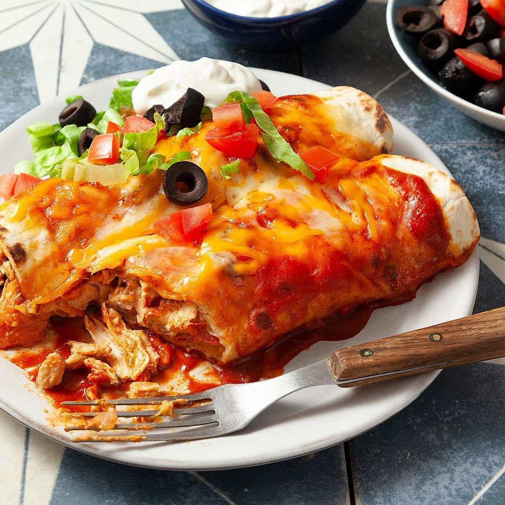

# Enchiladas

*Chicken enchiladas in a from-scratch four-chilli base sauce, rolled, smothered, and baked under cheddar and mozzarella until the top crisps.*

**Serves:** 4

**Prep Time:** 25 minutes

**Cook Time:** 1 hour 15 minutes

## Overview
A baked enchilada built on a from-scratch chilli base sauce that does most of the flavour heavy-lifting. Four kinds of dried Mexican chilli (guajillo, pasilla, ancho, arbol) are toasted, rehydrated, and blended with charred onion, garlic, tomato passata and stock into a deep, smoky pourable sauce. Chicken strips and bell peppers cook in part of the sauce with grated courgette for body; the lot rolls into tortillas, the rest of the sauce goes over the top, and a thick blanket of cheddar and mozzarella bakes to a crispy-edged finish.

## Ingredients

### Filling
- 500 g (3 fillets) chicken breast (long thick slices)
- 1 green bell pepper (sliced)
- 1 red bell pepper (sliced)
- 1 yellow bell pepper (sliced)
- 1 large red onion (sliced)
- 1 courgette (grated and squeezed dry)
- 1 mozzarella ball (grated)
- 200-300 g cheddar (grated)
- 1 tbsp paprika
- 1 tbsp cumin
- 350 ml chilli base sauce (from below)
- 350 ml hot water
- 4 large tortillas

### Chilli Base Sauce (makes far more than this recipe needs)
- 6 guajillo (Mexican dried red chilli, mild and sweet-tangy) dried chillies
- 4 pasilla dried chillies
- 3 ancho dried chillies
- 3 arbol dried chillies
- 1 red onion
- 4 garlic cloves
- 500 ml tomato passata
- 1 litre chicken & vegetable stock
- 1 tbsp ground coriander seed
- 2 tbsp paprika
- 2 limes (juiced)
- 1 tbsp Worcestershire sauce
- 1 tsp salt
- 1 tbsp brown sugar

### To Serve
- 1 spring onion (finely sliced)
- Fresh coriander (roughly chopped)
- 1 lime (quartered)
- Sour cream

## Method

### Stage 1 - Make the Chilli Base Sauce
1. Preheat a dry frying pan over low heat.
2. Chop the tops off the dried chillies, split them open and shake out the seeds.
3. Raise the pan to medium-high and toast the chillies for around 30 seconds per side, until fragrant; don't let them blacken.
4. Transfer the toasted chillies to a bowl of boiling water and leave for 20 minutes to rehydrate.
5. While the chillies soak, char the whole red onion in the same dry pan over medium-high heat until blackened in spots and softened, around 8-10 minutes. Add the garlic cloves for the last 1-2 minutes until fragrant.
6. Blend the rehydrated chillies, charred onion, garlic, ground coriander, paprika, and salt with a couple of ladles of stock to a loose paste.
7. Tip the paste into a saucepan and cook over medium heat for a few minutes to bloom the spices.
8. Add the tomato passata, bring to a boil, then simmer for 10 minutes.
9. Stir in the remaining stock, brown sugar, and Worcestershire sauce.
10. Reduce until the sauce coats the back of a spoon, then finish with the lime juice and salt to taste. Set aside.

### Stage 2 - Cook the Filling
1. Preheat the oven to 180°C (fan).
2. Heat a splash of oil in a large sauté pan over high heat and sear the chicken strips until coloured on the outside but not cooked through. Lift out and set aside.
3. Drop the heat to medium-high, add the red onion, and caramelise lightly, about 4-5 minutes.
4. Add the grated courgette and cook until the water has cooked off and the courgette has softened.
5. Add the bell peppers and stir-fry until they start to go floppy at the edges, 3-4 minutes.
6. In a jug, combine 350 ml of the chilli base sauce with 350 ml hot water, 1 tbsp cumin and 1 tbsp paprika.
7. Pour HALF of this cooking sauce into the pan, return the chicken with any resting juices, and stir to coat.
8. Reduce the heat and simmer until the filling thickens and the chicken is cooked through, 5-7 minutes.
9. Off the heat, stir in half the cheddar and half the mozzarella until the filling is gooey.

### Stage 3 - Build & Bake
1. Grease a deep baking dish.
2. Divide the filling evenly between the 4 tortillas, roll them up tight, and arrange seam-side down in the dish.
3. Pour the remaining cooking sauce evenly over the top so every roll is coated.
4. Scatter the remaining cheddar and mozzarella evenly across the top.
5. Bake for 15-20 minutes, until the cheese is melted, bubbling, and crisping at the edges.

### Stage 4 - Finish & Serve
1. Rest the dish for 2-3 minutes out of the oven so the filling sets.
2. Scatter spring onion and chopped coriander over the top.
3. Serve with lime wedges, sour cream, and any extra chilli base sauce in a jug on the side.

## Notes
- **Four-chilli blend:** Each dried chilli plays a role: guajillo is bright and earthy, pasilla raisiny, ancho sweet and smoky, arbol the heat. Substituting proportions is fine, but keep at least three of the four in the mix or the sauce flattens.
- **Toasting the chillies:** Toast just until fragrant, around 30 seconds per side. Push past that and they turn bitter; the sauce will taste burnt.
- **Squeezing the courgette:** Don't skip the squeeze-dry step. Grated courgette holds a surprising amount of water and a wet filling will make the tortillas collapse in the oven.
- **Half-and-half sauce split:** Keeping half the cooking sauce back for the topping is what gives the baked top its crusty edge while the rolled tortillas underneath stay tender.
- **Sauce make-ahead:** The chilli base sauce keeps 5 days refrigerated and freezes well. Make a double batch, portion into 350 ml lots, and the next round of enchiladas is a 30-minute job.

## Variations
- **Vegetarian:** Replace the chicken with 400 g black beans (drained) and 300 g roasted sweet potato cubes. Sear the sweet potato first for colour.
- **Verde:** Swap the red chilli base for a tomatillo salsa verde (200 g tomatillos charred with 1 jalapeño, 2 garlic cloves, ½ onion, blended with stock and coriander).
- **Beef:** Use 500 g flank or skirt steak, marinated in lime + cumin for an hour, then seared rare and sliced thin.

## Serving
- Serve with: Sour cream, lime wedges, chopped coriander, sliced spring onions, and a jug of the reserved chilli base sauce.
- Optional sides: Mexican rice, refried beans, a simple shredded cabbage slaw.

## Storage
- Baked enchiladas keep 3 days refrigerated; reheat covered at 160°C for 15-20 minutes
- Unbaked, assembled enchiladas freeze well up to 2 months (bake from frozen at 180°C for 45 minutes covered, then 10 uncovered)
- The chilli base sauce keeps 5 days refrigerated and 3 months frozen in 350 ml portions
- Best eaten the day they're baked; the tortillas soften further on day two
