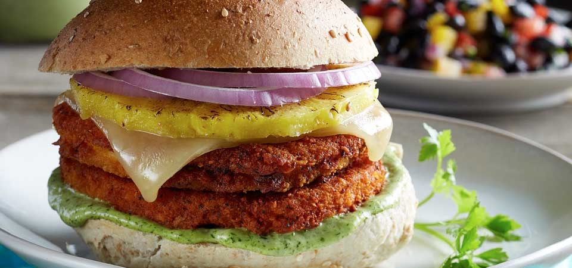

# Hamburguesa al Pastor

*Mexico's taco-flavoured burger: a pork-and-beef patty marinated in dried chiles, achiote and pineapple juice, grilled till caramelised, topped with charred pineapple, raw onion, coriander, smashed avocado and chipotle mayo.*

**Serves:** 4

**Prep Time:** 25 minutes (plus 1 hour marinade rest)

**Cook Time:** 15 minutes

## Overview
The hamburguesa al pastor is Mexico's burger answer to its most iconic taco filling: the al pastor pork (a Mexican-Lebanese hybrid born of Lebanese immigrants bringing shawarma technique to Mexico City and adapting it to pork on a vertical spit with the trompo's iconic pineapple on top) scaled into a burger patty. The patty is a 70/30 pork-and-beef mix seasoned with a blended marinade of dried guajillo and ancho chiles, achiote paste, white vinegar, pineapple juice, garlic, cumin, oregano, salt and a touch of cinnamon: the sweet-spice note no other Mexican meat preparation uses. Grilled hard till the sugar in the marinade caramelises, layered on a soft white bun with charred pineapple slices (essential: the pineapple-pork combo is what makes it al pastor and not just generic spiced burger), raw chopped white onion, fresh coriander, smashed ripe avocado and a chipotle mayonnaise.

## Ingredients

### Marinade and patty
- 500 g ground pork shoulder (20% fat)
- 300 g ground beef chuck (80/20)
- 3 dried guajillo chillies (stems and seeds removed)
- 2 dried ancho chillies (stems and seeds removed)
- 200 ml hot water (for soaking)
- 2 tablespoons achiote paste (Yucatecan recado rojo)
- 4 tablespoons pineapple juice
- 3 tablespoons white wine vinegar
- 6 garlic cloves
- 1 small white onion (chopped)
- 1 tablespoon ground cumin
- 1 tablespoon dried Mexican oregano
- 1 teaspoon ground coriander
- ½ teaspoon ground cinnamon
- ½ teaspoon ground cloves
- 1 ½ teaspoons fine sea salt
- 1 teaspoon ground black pepper
- 1 chipotle in adobo (chopped)

### Chipotle mayo
- 8 tablespoons mayonnaise
- 2 chipotles in adobo (finely chopped)
- 1 tablespoon adobo sauce from the tin
- Juice of 1 lime
- 1 small garlic clove (crushed)
- 1 teaspoon honey

### Toppings
- 1 small pineapple (peeled, cored, sliced into 1cm rings)
- 1 small white onion (finely chopped)
- 1 small bunch fresh coriander (chopped)
- 2 ripe avocados (smashed with a fork)
- Juice of 1 lime
- 1 teaspoon fine sea salt
- 4 soft white burger buns (or telera rolls split flat)
- 2 tablespoons butter (for toasting buns)

### To serve
- Plain corn chips with salsa roja
- Lime wedges
- Cold Mexican beer (Modelo, Pacifico) with lime and salt

## Method

### Stage 1 - Make marinade
1. Toast the guajillo and ancho chillies briefly in a dry pan till fragrant.
2. Pour the hot water over and soak 20 minutes till softened.
3. Drain (reserve some soaking liquid).
4. Blitz the soaked chillies with achiote paste, pineapple juice, vinegar, garlic, white onion, cumin, oregano, coriander, cinnamon, cloves, salt, pepper, chipotle, and 4 tablespoons of reserved chilli liquid till smooth.
5. The marinade should be a thick brick-red paste.

### Stage 2 - Mix the patties
1. In a wide bowl, combine pork, beef, and 4 tablespoons of the marinade (reserve the rest as a basting sauce).
2. Mix gently; don't overwork.
3. Form into 4 patties about 12 cm wide and 2 cm thick. Press a shallow dimple into each.
4. Refrigerate 1 hour for the marinade to penetrate.

### Stage 3 - Make chipotle mayo
1. Whisk mayonnaise, chopped chipotles, adobo sauce, lime juice, garlic, honey.
2. Refrigerate.

### Stage 4 - Make smashed avocado
1. Smash the avocados with a fork in a small bowl.
2. Stir in lime juice and salt.

### Stage 5 - Char the pineapple
1. Heat a grill pan or cast-iron pan to high.
2. Lay pineapple rings down; cook 2 minutes per side till deeply charred.
3. Set aside.

### Stage 6 - Cook the patties
1. In the same hot pan (or on a barbecue grill), cook the patties 3-4 minutes per side till deeply caramelised.
2. In the last minute, brush with reserved marinade.
3. Rest 3 minutes.

### Stage 7 - Toast the buns
1. Butter the bun cut sides; toast cut-side-down in a separate pan till golden.

### Stage 8 - Build the burgers
1. Spread chipotle mayo on both bun halves.
2. Smashed avocado on the bottom half.
3. The al pastor patty.
4. A ring of charred pineapple.
5. A scatter of chopped white onion.
6. Plenty of fresh coriander.
7. Close.

### Stage 9 - Serve
1. Cut diagonally.
2. Corn chips and salsa alongside.
3. A lime wedge for squeezing.
4. Cold Mexican beer.

## Notes
- **Marinade in the patty, not on top:** the achiote-and-chile flavour has to be through the meat.
- **Charred pineapple essential:** the pineapple-pork combo is what makes it al pastor.
- **White onion + coriander canonical:** these are the al pastor taco garnishes; the burger has to carry them.
- **Smashed avocado, not guacamole:** simpler, lets the pastor flavours dominate.

## Variations
**Lamb pastor:** swap pork for lamb (closer to the original Lebanese shawarma).
**Chicken al pastor:** swap pork for chicken thigh mince.
**With queso fresco:** crumble queso fresco on top.
**With tortilla bottom:** swap the bun for two warm corn tortillas, taco-burger style.
**Spicier:** add 2 chiles de árbol to the marinade.
**Without pineapple:** less al pastor; more "chile-spiced burger".

## Serving
At a Mexico City taquería that's gone burger-fusion. At a Los Angeles food truck. At home with corn chips, salsa, and Mexican beer.

## Storage
- Best fresh.
- Marinade keeps refrigerated 1 week; freezes 3 months.
- Raw patties freeze 2 months.
- Chipotle mayo keeps refrigerated 2 weeks.
