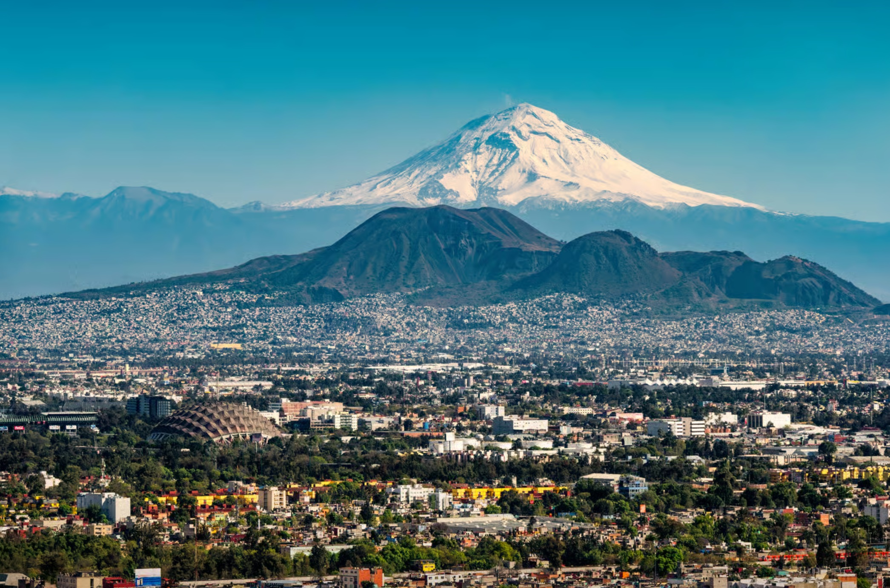

# Mexican Cuisine

A cuisine built on corn, beans and chillies (fresh, fermented and smoke-dried). Ancho, chipotle, lime, coriander and cumin work alongside tomatillo, avocado and crema. Comal-toasting of spices, slow-stewed adobos, charred salsas and griddled tortillas shape the table.
