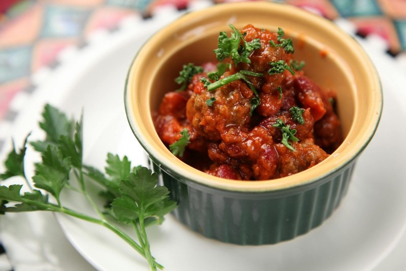

# Chilli con Carne

*A British home-cook chilli con carne: beef and pork mince with smoked pancetta, three kinds of beans, toasted whole spices, dark beer, espresso and chocolate for depth.*

**Serves:** 6
**Prep Time:** 15 minutes
**Cook Time:** 1 hour 20 minutes

## Overview
A Tex-Mex chilli pushed past its usual edges: beef and pork mince with smoked pancetta, three kinds of beans (kidney, baked, pinto), a heavy hand of toasted cumin, cloves, star anise and chilli, plus dark beer, espresso, dark chocolate and a few umami quiet players (marmite, soy, balsamic) that lift the depth without showing up. The kind of chilli you make on a Sunday afternoon for a full week of leftovers. Cumin and cloves dry-toast and grind fresh into the stock: that single step is what separates a great chilli from a flat one. Pancetta renders low and slow before the grated vegetables sweat down in the fat; the beef and pork brown hard in the same pan till the meat darkens. Beans, passata, a star anise, grated dark chocolate, espresso and half a can of dark beer braise it together over two hours, then uncovered to thicken. Eaten hot with rice, cornbread, sour cream, grated cheese, diced onion and coriander.

## Ingredients

### Aromatics & Vegetables
- 1 onion (large, chopped)
- 2 garlic cloves (minced)
- 1 celery stick (grated)
- 1 carrot (grated)
- 1 tablespoon oil

### Meat & Beans
- 680g minced beef
- 1 tin (400g) kidney beans (drained and rinsed)
- 1 tin (400g) [Baked Beans](../american/side-dishes/baked-beans.md) (drained and rinsed)

### Spices (Whole & Ground)
- 1 ½ tablespoons whole cumin seeds
- 2 whole cloves
- 1 star anise
- 1 ½ teaspoons ground coriander
- 1 teaspoon chilli powder
- salt
- pepper

### Sauce & Umami Base
- 125ml beef (or vegetable stock)
- 1 teaspoon marmite
- 2 teaspoons soy sauce
- 1 tablespoon balsamic vinegar
- 2 tablespoons tomato paste
- 1000ml bottles passata (Napolina preferred)

## Method

### Stage 1 - Toast & Prepare Spices
1. Heat a dry, heavy-bottomed frying pan over medium-high heat (no oil).
2. Add the cumin seeds and cloves directly to the hot pan.
3. Toast for 1-2 minutes, stirring constantly, until they begin to smoke and become fragrant.
4. Be careful not to burn them or they will become bitter.
5. Grind the toasted seeds and cloves in a pestle and mortar until finely ground.
6. Pour the stock into a bowl and stir in the ground spices, marmite, soy sauce, balsamic vinegar, chilli powder, coriander powder, and tomato paste until well combined. Set aside.

### Stage 2 - Sweat the Vegetables
1. Heat 1 tablespoon oil in a large, heavy-bottomed pan over medium-low heat.
2. Add the chopped onion, minced garlic, grated celery, and grated carrot.
3. Cover the pan with a lid and sweat for 15 minutes, stirring occasionally, until the vegetables are soft and translucent.
4. This low-heat sweating releases natural sugars and builds flavour without browning.

### Stage 3 - Brown the Meat
1. Increase the heat to medium.
2. Add the minced beef to the sweated vegetables.
3. Cook for 5-7 minutes, breaking up the meat with a wooden spoon, until completely browned.
4. Drain any excess fat if necessary.

### Stage 4 - Build the Chilli
1. Pour the prepared spice stock mixture into the pan with the browned meat and vegetables.
2. Add the kidney beans and baked beans.
3. Stir in the passata bottles until well combined.
4. Add the star anise.
5. Increase the heat until the mixture comes to a boil, then reduce to low heat.
6. Simmer uncovered for 45 minutes to 1 hour, stirring occasionally.
7. The chilli should thicken and darken as it cooks; flavours will deepen and meld.

### Stage 5 - Season & Finish
1. Remove the star anise.
2. Taste and adjust seasoning with salt and black pepper.
3. If the flavour seems flat, add a pinch more marmite or soy sauce.
4. If too bitter, add a touch of sugar.
5. Serve hot.

## Notes
- **Toasting spices:** Toasting cumin and cloves releases essential oils and deepens flavour dramatically, don't skip this step.
- **Umami layering:** Marmite and soy sauce add umami depth without making the dish salty. Start conservatively and taste as you go.
- **Slow cooking:** The long simmer allows flavours to meld and the sauce to thicken naturally without cornflour or thickening agents.
- **Bean choice:** Kidney beans and baked beans provide different textures and flavours; don't substitute one for the other.
- **Make-ahead:** This dish tastes better the next day as flavours develop further. Make it ahead and reheat gently.

## Variations
**Spicier:** Add 2-3 dried chillies (toasted with the cumin) or increase chilli powder to 2 teaspoons
**Extra meaty:** Use 900g beef instead of 680g for a meatier texture
**Vegetarian:** Replace beef with 400g lentils and use vegetable stock instead
**With chocolate:** Add a small square of dark chocolate (70%+) at the end for subtle depth
**Turkey alternative:** Use ground turkey instead of beef for a lighter version

## Serving
Serve with: Cooked rice, cornbread, sour cream, shredded cheese, diced onion, and fresh coriander

## Storage
- Keeps 4 days refrigerated
- Freezes well up to 3 months
- Flavour improves after 24 hours as spices meld
- Reheats gently on the stovetop, adding water if sauce thickens too much
