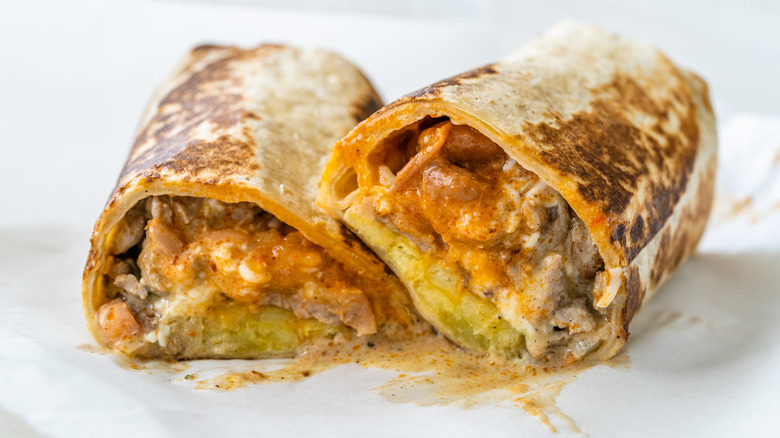

# LA-Style Burrito

*The Los Angeles burrito: a thick wrap of guisado, beans, salsa, chile and cheese stuffed into a tortilla until it's almost too big to hold, the truck-and-taqueria classic of Mexican Los Angeles.*

**Serves:** 4 burritos

**Prep Time:** 30 minutes

**Cook Time:** 1 hour 30 minutes

## Overview
The LA-style burrito grew up in Los Angeles taquerias and lunch trucks across East LA, Boyle Heights and the San Fernando Valley, the city's working-lunch answer to a one-handed plate of food. The fillings are generous and stacked: a guisado (slow-cooked beef, pork or chicken), stewed or refried beans, salsa, sliced chiles and a generous handful of melted cheese, all bundled into a large flour tortilla. The result is messier and denser than the Northern Mexican original but unmistakably Mexican in spirit. Eat with both hands, ideally outside a truck, with a Jarritos soda.

## Ingredients

### Guisado (or use leftover from any meat stew)
- 750 g chuck beef or pork shoulder, cubed
- 1 onion, finely chopped
- 3 garlic cloves, crushed
- 3 dried guajillo chiles (Mexican dried red chilli, mild and sweet-tangy), toasted and rehydrated
- 2 dried ancho chiles, toasted and rehydrated
- 1 tsp ground cumin
- 1 tsp Mexican oregano
- 1 tin (400 g) chopped tomatoes
- 400 ml beef stock
- 2 tbsp oil
- Salt to taste

### Refried Beans
- 1 tin (400 g) cooked pinto beans, drained
- 2 tbsp lard or oil
- 1/2 onion, chopped
- Pinch of salt

### To Assemble
- 4 large flour tortillas (30 cm)
- 200 g Monterey Jack or Chihuahua cheese, grated
- Pickled jalapeños
- Fresh salsa or salsa roja
- 1 fresh red chile, sliced
- Sour cream (optional)
- Fresh coriander (optional)

## Method

### Stage 1 - Build the guisado
1. Toast and rehydrate the dried chiles for 20 minutes in hot water.
2. Blend the rehydrated chiles with the tomatoes, garlic, cumin and oregano to a smooth paste.
3. Brown the beef hard in oil in a heavy pot; lift out.
4. Soften the onion in the pot; add the chile paste; cook 5 minutes until the oil separates.
5. Return the beef with the stock; cover and braise for 90 minutes until tender.
6. Shred the meat with two forks; return to the sauce; salt to taste.

### Stage 2 - Refry the beans
1. Heat the lard in a pan; soften the chopped onion.
2. Add the drained beans; mash and fry for 10 minutes until thick and dark.
3. Salt to taste.

### Stage 3 - Assemble
1. Warm a tortilla on a dry pan for 20 seconds per side.
2. Spread a generous layer of refried beans across the lower third.
3. Spoon shredded guisado on top.
4. Add salsa, sliced chile, a handful of grated cheese, optional sour cream and coriander.
5. Fold the bottom up, sides in, roll up tight.
6. Optional: brown the rolled burrito on a hot pan for 2 minutes per side to seal and melt the cheese inside.

## Notes
- **The size:** LA burritos are big, around 30 cm before folding. Smaller tortillas mean smaller burritos but more manageable wraps.
- **Multiple meats:** LA burrito trucks often offer a choice of meats. Use chicken, pork, beef or beans, depending on preference; the proportions stay the same.
- **The wrap discipline:** Fold tight or the contents will spill at the first bite. The fold is bottom-up, sides-in, then roll forward.

## Variations
- **Vegetarian:** Skip the meat, double the beans, add roasted vegetables (peppers, courgette, mushroom).
- **Spicy:** Add a generous spoonful of salsa habanero or chipotle in adobo.
- **Cheesy:** Add cheese both inside the burrito and grated on top after the final pan-sear.

## Serving
- Serve hot with a Jarritos or Mexican Coke, a side of guacamole, and extra salsa.

## Storage
- Guisado and refried beans both keep 4 days refrigerated; freeze separately for 2-3 months
- Assembled burritos eat best fresh; if making ahead, wrap in foil and reheat at 180°C for 15 minutes
- The pan-seared version stays crisp better than a soft-wrapped one
