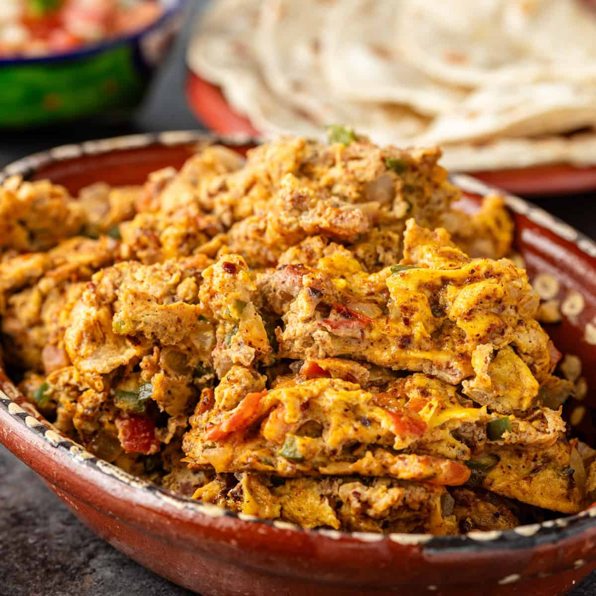

# Machaca con Huevo

*Northern Mexico's dried-beef-and-egg breakfast hash: shredded machaca sautéed with onion, jalapeño and tomato, then scrambled together with eggs and served with warm flour tortillas.*

**Serves:** 4

**Prep Time:** 15 minutes

**Cook Time:** 15 minutes

## Overview
Machaca con huevo is Northern Mexico's iconic breakfast hash and a signature dish of the Sonora-Chihuahua region, rooted in the cattle-ranching tradition where preserved meats were essential before refrigeration. Machaca itself is Mexican cured-and-dried beef: soaked in lime, dried, then shredded; close to South American charqui but with a slightly different process. It sautés in oil with onion, jalapeño, diced tomato and a touch of cumin, then beaten eggs go in at the end and scramble together with the hot beef and vegetables till just set but still slightly creamy. Don't pre-scramble the eggs separately: the trick is cooking them into the meat. Eat immediately with warm flour tortillas (the Northern Mexican preference; the wheat-growing region uses flour, not corn), refried beans, pico de gallo and sliced avocado. Outside Mexico, quality beef jerky shredded is the workable substitute, but commercial American jerky is too sweet: look for "machaca" specifically at Mexican markets.

## Ingredients

### Machaca
- 150 g machaca (or quality beef jerky, shredded and rehydrated in 150 ml warm water for 10 minutes if very dry)

### Cooking
- 4 tablespoons vegetable oil
- 1 large onion (finely chopped)
- 2 fresh jalapeño peppers (deseeded for milder; finely chopped)
- 1 medium green bell pepper (finely chopped; optional)
- 4 garlic cloves (crushed)
- 2 medium tomatoes (deseeded, finely chopped)
- 1 teaspoon ground cumin
- 1 teaspoon dried Mexican oregano
- 1 teaspoon fine sea salt (taste; the machaca is already salty)
- 1 teaspoon ground black pepper

### Eggs
- 8 large eggs (lightly whisked with a pinch of salt and pepper)

### To finish
- 1 small bunch fresh coriander (chopped)
- Spring onions (sliced)

### To serve
- Warm flour tortillas
- Refried beans (frijoles refritos; existing recipe)
- Pico de gallo (existing recipe)
- Sliced avocado
- Sour cream
- Mexican hot sauce
- Lime wedges

## Method

### Stage 1 - Rehydrate the machaca (if needed)
1. If the machaca is very dry, soak it briefly in warm water for 10 minutes; drain and pat dry.
2. If using freshly purchased moist machaca, skip this step.

### Stage 2 - Sauté the base
1. Heat the vegetable oil in a wide heavy pan over medium-high heat.
2. Add the chopped onion and jalapeños; cook 5-6 minutes till soft and starting to caramelise.
3. Add the crushed garlic; cook 30 seconds.
4. Add the diced tomatoes; cook 3-4 minutes till they break down.

### Stage 3 - Add the machaca
1. Add the machaca to the pan; stir to combine.
2. Add the cumin, oregano, salt and pepper.
3. Cook 3-4 minutes; the machaca should heat through and absorb the flavours.

### Stage 4 - Add the eggs
1. Pour the whisked eggs over the meat-and-vegetable mixture.
2. Don't stir immediately; let the eggs set briefly at the bottom (about 20 seconds).
3. Using a wooden spoon, gently fold the eggs through the machaca mixture.
4. Continue folding for 2-3 minutes till the eggs are just set but still slightly creamy.
5. Don't overcook; eggs continue cooking from residual heat.

### Stage 5 - Finish and serve
1. Take off the heat.
2. Stir in the chopped coriander.
3. Tip onto warm plates or a serving platter.
4. Scatter spring onions over.
5. Serve immediately with warm flour tortillas, refried beans, pico de gallo, avocado, sour cream and hot sauce.

## Notes
- **Real machaca or quality jerky:** look for "machaca" at Mexican markets; or use Western traditional jerky shredded fine.
- **Flour tortillas, not corn:** Northern Mexican preference.
- **Eggs go in last, gently folded:** scrambled separately doesn't work.
- **Don't overcook the eggs:** slightly creamy is right.
- **Adjust salt carefully:** machaca is salty.

## Variations
- **Machaca with potato (machaca con papas):** add 200 g of cubed cooked potato along with the meat; gives a heartier breakfast hash.
- **Machaca burrito:** roll the finished machaca con huevo in a large flour tortilla with refried beans and avocado; the traditional breakfast burrito.
- **Spicier:** double the jalapeño and add 1 chopped habanero; properly Northern Mexican fierce.
- **With chorizo:** add 100 g of crumbled chorizo cooked with the onion; gives extra spice.

## Serving
- On warm plates with all the traditional Northern Mexican accompaniments. Drink: hot Mexican coffee (café de olla), or fresh juice. Breakfast or brunch.

## Storage
- Best eaten immediately; eggs don't reheat well.
- Keeps refrigerated 2 days; reheat briefly in a hot pan.
- Don't freeze.
