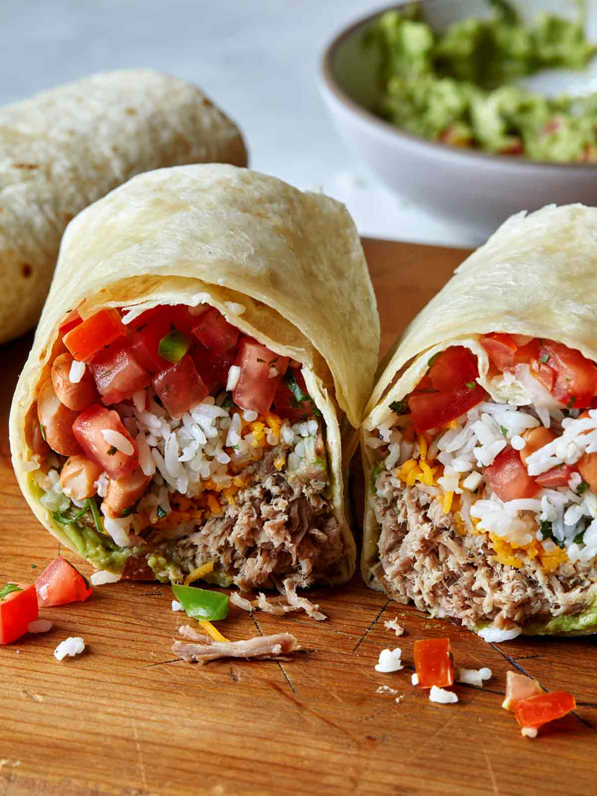

# Mexican Burritos

*The original Northern Mexican burrito: a thin flour tortilla wrapped around a slow-cooked guisado of meat and chile, eaten with one hand by ranchers and wage workers across Chihuahua, Sonora and Sinaloa for over a hundred years.*

**Serves:** 6 burritos

**Prep Time:** 30 minutes

**Cook Time:** 2 hours

## Overview
The original burrito is a Northern Mexican working-lunch dish from the late 19th century, named for the small donkey ("burrito" means little burro) that carried farmers and miners across the dry north of the country. The classic filling is a guisado: slow-cooked beef or pork stewed with onion, garlic, dried chiles, tomato and warm spices until the meat falls apart and the sauce reduces to a sticky glaze. The tortilla is thin and large, made fresh from flour rather than corn (the north's wheat tradition came from Spanish missionaries), and the wrap is tight, with no rice, no beans, no cheese, nothing but meat and sauce. Eat with your hands, standing or sitting; no fork required.

## Ingredients

### Guisado
- 1 kg beef chuck or pork shoulder, cut into 3 cm cubes
- 2 onions, finely chopped
- 4 garlic cloves, crushed
- 4 dried guajillo chiles (Mexican dried red chilli, mild and sweet-tangy), toasted and rehydrated
- 2 dried ancho chiles, toasted and rehydrated
- 1 tin (400 g) chopped tomatoes
- 2 tsp ground cumin
- 1 tsp Mexican oregano
- 1 tsp salt
- 500 ml beef stock
- 2 tbsp oil

### Wrap
- 6 large flour tortillas (30 cm wide)

## Method

### Stage 1 - Build the chile base
1. Toast the dried chiles in a dry pan over medium heat for 30 seconds per side until fragrant.
2. Transfer to a bowl of hot water and soak for 20 minutes to rehydrate.
3. Drain the chiles (reserve a ladle of the soaking liquid) and blend with the tomatoes, garlic, cumin and oregano into a smooth paste.

### Stage 2 - Cook the guisado
1. Season the beef cubes with salt; brown hard in oil in a heavy pot until each side has a deep crust. Lift out.
2. Soften the chopped onion in the same pot for 5 minutes until pale gold.
3. Add the chile paste; cook for 5 minutes until the oil separates at the edges (the sign it's properly cooked).
4. Return the beef with the stock and a ladle of the chile water; bring to a simmer.
5. Cover and braise on the lowest heat (or in a 150°C oven) for 2 hours until the meat shreds with a fork.
6. Uncover for the last 20 minutes so the sauce reduces to a thick glaze.

### Stage 3 - Wrap and serve
1. Warm the tortillas on a comal or dry pan for 20 seconds per side until pliable.
2. Spoon a generous portion of guisado onto the lower third of each tortilla.
3. Fold the bottom up over the filling, then fold the sides in, then roll up tight.
4. Eat hot, standing up if you can.

## Notes
- **The tortilla matters:** Northern Mexican flour tortillas are large, thin and stretchy. A small Mexican supermarket should stock them; mass-supermarket flour tortillas are smaller and thicker.
- **The chile blend:** Guajillo and ancho together give the deep red-brown colour and fruity-mild heat. Adjust the ratio to taste; never substitute powdered chilli (the flavour is different).
- **The cook time is the dish:** Rush this and the meat stays tough; the long braise is what gives the guisado its signature shred-and-glaze texture.

## Serving
- Serve hot, with a cold beer and a few pickled jalapeños on the side.

## Storage
- The guisado keeps 4 days refrigerated and freezes for 3 months
- Assembled burritos are best eaten the day they're made; the tortilla softens over time
- Reheat the guisado gently with a splash of stock; warm the tortillas on a comal at service
