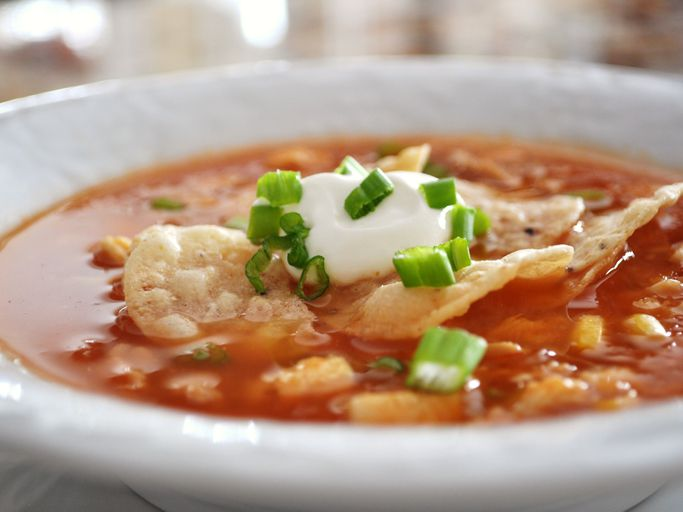

# Mexican Soup with Salsa

*A Mexican coastal seafood soup: halibut, prawns, scallops and clams in a smoky tomato broth with corn, topped with avocado salsa at the table.*

**Serves:** 4

**Prep Time:** 15 minutes

**Cook Time:** 30 minutes

## Overview
A coastal Mexican seafood soup, the kind of bowl you reach for when the fish counter is full of pieces too small for individual portions: halibut, prawns, scallops and clams in a smoky tomato broth with corn kernels and a fresh avocado salsa scattered on top at the table. Onion and celery soften in olive oil, then garlic, sliced red chilli, bay and oregano bloom for a minute before fish stock, tinned tomatoes and sugar simmer ten minutes. Blend smooth for the silky tomato broth. Corn kernels go in, then chunks of fish, then the prawns, scallops and clams under a lid for two or three minutes till the clams open (discard any that don't). A spoonful of cream stirred off the heat finishes the broth. The avocado salsa (diced avocado, coriander, lime zest and juice, finely chopped red onion) mixes just before serving and goes on top of each bowl at the table so it stays bright and cold against the hot soup.

## Ingredients

### Fat
- 3 tablespoons olive oil

### Vegetables
- 1 onion (large, chopped)
- 2 corn cobs (kernels removed)
- 800 grams tinned chopped tomatoes

### Aromatics
- 3 garlic cloves (crushed)
- 2 thin red chillies (thinly sliced)
- 2 bay leaves
- 1 teaspoon dried oregano

### Protein
- 500 grams halibut fillets
- 12 prawns
- 8 scallops (cleaned)
- 12 clams

### Seasonings
- 200 ml fish stock
- 1 teaspoon caster sugar
- 2 tablespoons coriander leaves (chopped)
- 2 limes (juice)
- 125 grams double cream

### Salsa
- ½ avocado
- 1 tablespoon coriander leaves (finely chopped)
- grated zest and juice of 1 lime
- ½ red onion (finely chopped)

## Method

### Stage 1 - Cook base
1. Wash the clams thoroughly, discarding any that have broken shells or fail to close when you tap them.
1. Heat the oil in a saucepan, add the onion and celery and cook over a medium heat for 10 minutes.
1. Add the garlic and chilli and cook for 1 minute, stirring continuously.
1. Add the fish stock and tomatoes, stir in the bay leaves, oregano and sugar.
1. Bring to the boil, and immediately reduce the heat to low and simmer for 10 minutes.
1. Remove the bay leaves, then tip the sauce into a food processor and purée until smooth.
1. Return the sauce to the pan and season.
1. Add the corn kernels and bring back to the boil.
1. Reduce the heat and simmer for 3 minutes.

### Stage 2 - Add seafood
1. Cut the fish into chunks.
1. Stir in the coriander and lime juice, add the fish, then simmer for 1 minute.
1. Add the prawns, scallops and clams.
1. Cover with a lid and cook for a further 2 - 3 minutes, discard any clams that have failed to open.

### Stage 3 - Make salsa and finish
1. To make the salsa, chop the avocado into cubes and mix with the coriander, the lime zest and juice, and red onion
1. Stir the cream into the soup and top with salsa.

## Notes
- **Seafood:** Use fresh seafood; cook just until done to avoid toughness.
- **Spice:** Adjust chillies for heat level.
- **Salsa:** Prepare just before serving to keep fresh.

## Serving
- Serve hot, topped with avocado salsa.

## Storage
- Best served immediately; refrigerate up to 1 day. Reheat gently.
