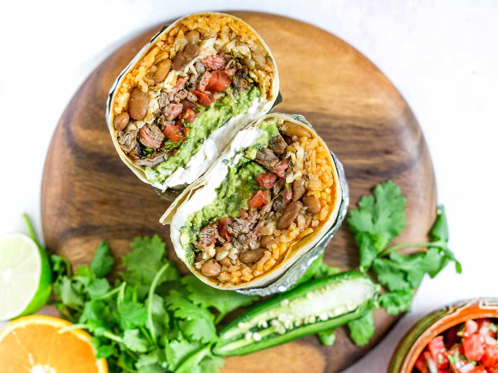

# Mission Burrito

*The San Francisco Mission District burrito: an oversized flour tortilla packed with meat, beans, rice, guacamole, salsa, cheese and sour cream, the dish that defines burritos in much of North America.*

**Serves:** 4 burritos

**Prep Time:** 45 minutes

**Cook Time:** 1 hour 30 minutes

## Overview
The Mission burrito was born in San Francisco's Mission District in the 1960s, where Mexican-American taqueros wrapped a full plate of food into a single oversized tortilla so customers could eat it standing up between shifts. The classic build is enormous: a 35 cm flour tortilla holding refried (or stewed) beans, Mexican rice, a meat (ground beef, carnitas, carne asada or grilled chicken), salsa, guacamole, pico de gallo, grated cheese and sour cream. The dish became the template for burrito chains across North America and a stand-in for "Mexican food" in much of the United States. Eat with both hands, slowly, with napkins.

## Ingredients

### Carne Asada (or substitute carnitas, ground beef, grilled chicken)
- 500 g flank or skirt steak
- 2 garlic cloves, crushed
- 2 limes, juiced
- 2 tbsp olive oil
- 1 tsp ground cumin
- 1 tsp salt
- Black pepper

### Rice
- 200 g long-grain rice
- 1 tbsp oil
- 1/2 onion, chopped
- 1 tbsp tomato paste
- 400 ml chicken stock
- Pinch of salt

### Refried Beans
- 1 tin (400 g) pinto beans, drained
- 2 tbsp lard or oil
- 1/2 onion, chopped

### To Assemble
- 4 extra-large flour tortillas (35 cm)
- 200 g Monterey Jack cheese, grated
- 1 ripe avocado, mashed (or 200 g guacamole)
- 200 g pico de gallo
- Sour cream
- Salsa verde
- Fresh coriander

## Method

### Stage 1 - Marinate and grill the steak
1. Combine the steak with garlic, lime juice, oil, cumin, salt and pepper; rest for at least 30 minutes (or overnight).
2. Grill or pan-sear the steak hard on each side; rest for 5 minutes; slice thin across the grain; chop into bite-sized pieces.

### Stage 2 - Cook the rice
1. Heat oil in a pot; soften the onion for 5 minutes.
2. Add the tomato paste; cook for 1 minute.
3. Stir in the rice to toast briefly; pour in the stock; bring to a boil.
4. Cover, drop the heat to lowest, cook for 18 minutes; rest 5 minutes; fluff.

### Stage 3 - Refry the beans
1. Heat lard in a pan; soften the chopped onion.
2. Add the drained beans; mash and cook for 10 minutes until thick.

### Stage 4 - Assemble
1. Warm a 35 cm tortilla on a dry pan for 30 seconds per side.
2. Layer across the lower third: rice, beans, meat, cheese, pico de gallo, guacamole, sour cream, salsa verde, coriander.
3. Fold the bottom up over the filling, fold the sides in tight, roll forward into a fat cylinder.
4. Wrap the bottom half in foil so it holds together as you eat.

## Notes
- **The tortilla size:** Mission burritos use extra-large tortillas (35 cm). Smaller tortillas just won't hold the contents.
- **Rice in the burrito:** A Mission-style choice; the rice absorbs sauce and stretches the filling. Northern Mexican burritos skip the rice.
- **Wrap discipline:** A Mission burrito is heavy. Wrap tight, in foil if you're taking it to go.

## Variations
**Super burrito:** Add extra sour cream, guacamole and an extra meat (Mission shorthand: "super" means more of everything).
**Vegetarian:** Skip the meat, double the beans and add grilled vegetables.
**Wet:** Smother with salsa roja or enchilada sauce and bake with cheese on top (crosses into Wet Burrito territory).

## Serving
Serve halved if eating at the table; wrap in foil and eat by the hand. Chips and salsa on the side.

## Storage
- The components keep separately for 3-4 days refrigerated; reheat individually
- Assembled burritos can be wrapped in foil and refrigerated 2 days; reheat at 180°C for 20 minutes
- Best eaten fresh
