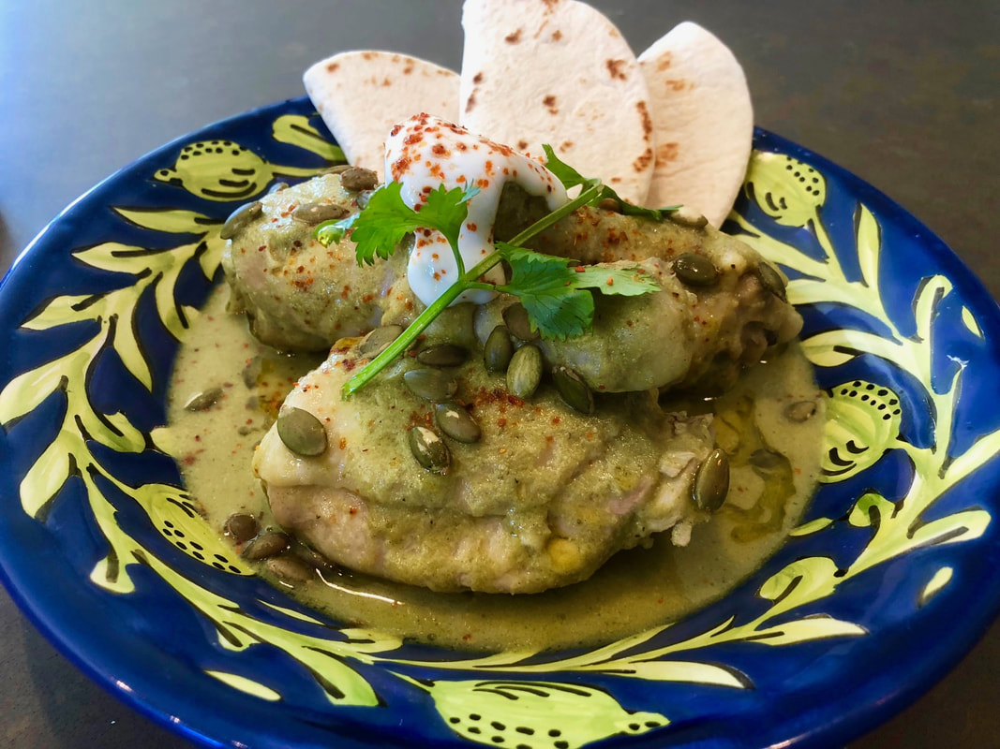

# Mole Verde (Pipián)

*Mexico's vibrant green mole: chicken or pork slow-cooked in a sauce of tomatillos, pumpkin seeds, jalapeños, green chillies, cilantro, parsley, epazote and warm spices, blended to a thick vivid green sauce. The lighter, brighter cousin of mole poblano, made from green ingredients across central and southern Mexico.*

**Serves:** 6

**Prep Time:** 30 minutes

**Cook Time:** 1 hour 10 minutes

## Overview
Mole verde (sometimes called pipián verde for the toasted pumpkin seeds at its base) is Mexico's vibrant green mole, lighter and brighter than the deep brown mole poblano. A vivid green sauce blended from tomatillos, toasted pepitas, fresh jalapeños and serranos, coriander, parsley, poblanos, green onions and fresh epazote, simmered with chicken broth and finished with a touch of cream. Chicken (typically) or pork slow-poaches in the sauce till tender. Tomatillos are essential; their tartness is the character of the sauce and ordinary tomatoes don't substitute (the canned ones from a Mexican grocer work fine). Toasting the pumpkin seeds is what brings out the nutty depth that gives the sauce its body, so don't skip the dry-pan stage. Epazote is the canonical Mexican herb (available dried at Mexican markets); without it the dish loses some of its identity. Served over Mexican rice with fresh tortillas, lime wedges, sliced avocado and crumbled queso fresco.

## Ingredients

### Chicken
- 1.2 kg bone-in chicken thighs and drumsticks (or whole chicken cut into 8)
- 1 ½ teaspoons fine sea salt
- 1 teaspoon ground black pepper

### Sauce
- 800 g tomatillos (husks removed, rinsed); or 2 tins (each 400 g) tomatillos
- 150 g raw pumpkin seeds (pepitas)
- 4 fresh poblano peppers (deseeded and roughly chopped)
- 6 fresh serrano or jalapeño peppers (deseeded for milder; seeds in for fierce)
- 1 large bunch fresh coriander (about 60 g; chopped)
- 1 small bunch fresh parsley
- 1 large white onion (chopped)
- 8 garlic cloves (whole)
- 4 spring onions (chopped)
- 2 tablespoons fresh epazote (or 1 tablespoon dried; or substitute with extra coriander)
- 1 tablespoon ground cumin
- 1 tablespoon dried Mexican oregano
- 1 teaspoon ground coriander seed
- 1 teaspoon ground cloves
- 1 teaspoon ground cinnamon
- 1.2 litres hot chicken stock

### Cooking
- 4 tablespoons vegetable oil
- 1 ½ teaspoons fine sea salt
- 1 teaspoon ground black pepper

### To finish
- 100 ml double cream (or sour cream; optional)
- 2 tablespoons fresh coriander (chopped)
- 4 tablespoons crumbled queso fresco
- Lime wedges

### To serve
- Plain white rice or Mexican rice (arroz rojo)
- Warm corn tortillas
- Sliced avocado
- Refried beans

## Method

### Stage 1 - Cook the chicken briefly
1. Season the chicken with salt and pepper.
2. In a large pot, cover the chicken with cold water; bring to a boil.
3. Reduce to a simmer; cook 25 minutes till the chicken is just cooked through.
4. Lift out; reserve the cooking liquid.

### Stage 2 - Toast the pumpkin seeds
1. Heat a dry pan over medium heat.
2. Add the pumpkin seeds; toast 3-4 minutes, stirring constantly, till they puff and turn golden.
3. Tip onto a plate; cool.

### Stage 3 - Blend the sauce
1. In a blender (or food processor), combine the tomatillos (with their juice if canned), toasted pumpkin seeds, chopped poblanos, serrano/jalapeño peppers, chopped coriander, parsley, chopped onion, garlic, spring onions and epazote.
2. Add the cumin, oregano, ground coriander seed, cloves and cinnamon.
3. Add about 500 ml of the chicken cooking liquid.
4. Blitz to a smooth-ish sauce; should still have some texture.

### Stage 4 - Cook the sauce
1. Heat the vegetable oil in a wide heavy pot over medium-high heat.
2. Carefully pour in the blended sauce (it may spit; the oil deepens the colour).
3. Cook 8-10 minutes, stirring, till the sauce darkens slightly and the colour deepens to a vivid green.
4. Add another 400 ml of the chicken cooking liquid to thin to a thick gravy consistency.
5. Add the salt and pepper.
6. Bring to a low simmer.

### Stage 5 - Return chicken and simmer
1. Add the cooked chicken back to the pot, nestling into the sauce.
2. Cook 20-25 more minutes till the chicken has absorbed the flavours.

### Stage 6 - Finish
1. Stir in the cream (if using); cook 2 minutes more.
2. Taste; adjust salt.

### Stage 7 - Serve
1. Spoon hot rice into deep plates.
2. Place a chicken portion over the rice.
3. Ladle generous mole verde over.
4. Scatter chopped coriander and crumbled queso fresco.
5. Sliced avocado, lime wedges, warm tortillas on the side.
6. Refried beans alongside.

## Notes
- **Tomatillos essential:** the Mexican husk tomato; substitute with green tomatoes + 1 extra tablespoon lime juice as approximation.
- **Toast the pumpkin seeds:** brings out nutty depth.
- **Epazote gives identity:** Mexican herb; substitute with extra coriander.
- **Cook the sauce in hot oil:** deepens colour and concentrates flavour; canonical mole technique.
- **Bright vibrant green:** if your sauce goes drab, you've overcooked.

## Variations
**Pork mole verde (pipián de cerdo):** swap chicken for pork shoulder cubed; cook 60 minutes for tenderness.
**Vegetarian mole verde (vegetables in pipián):** skip the chicken; use vegetable stock; add cubed vegetables (chayote, zucchini, mushrooms) cooked separately and combined with sauce.
**Mole pipián rojo:** swap green vegetables for red - red tomatoes, ancho chillies, dried red chillies - gives a related red pipián.
**Without cream:** the cream is optional; vegan-friendly without.

## Serving
On plates with rice underneath and the sauce ladled generously. Warm tortillas, avocado, lime, refried beans, queso fresco. Drink: cold Pacifico beer, agua de jamaica (hibiscus), or tequila with lime.

## Storage
- Keeps refrigerated 5 days; flavour deepens overnight.
- Reheat gently in a covered pan.
- Freezes 3 months.
- The sauce alone (without chicken) freezes well; cook fresh chicken in the reheated sauce.
