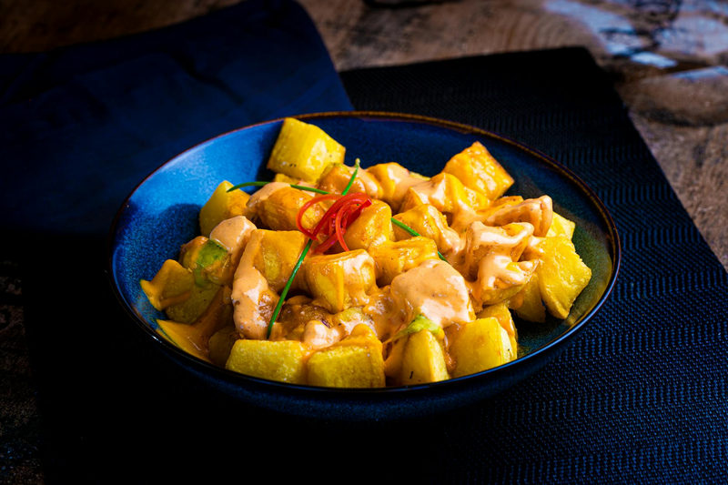

# Patatas Bravas

*Spain's most-ordered tapa: twice-fried potato cubes drenched in a smoky paprika-tomato sauce.*

**Serves:** 10-12 as a side
**Prep Time:** 15 minutes
**Cook Time:** 50 minutes

## Overview
Spain's most-ordered tapa and the dish that crossed over into Latin American kitchens through the Spanish colonial table: crispy roasted potato cubes drenched in a smoky paprika-tomato sauce, scattered with chopped parsley, eaten at room temperature with crusty bread and a glass of something cold. The sauce builds in ten minutes: onion and garlic softened in olive oil, then tinned tomatoes, tomato puree, sweet paprika, a pinch of chilli and a pinch of sugar simmered to a pulp till the kitchen smells of smoke. The potatoes are uniform 1-1½ cm cubes (uneven sizes give a mix of crisp and soft) patted bone-dry before tossing: wet potatoes steam instead of crisp. Roasted at 180 °C fan till crisp and golden on all sides. Plated warm with the sauce spooned generously over, scattered with parsley.

## Ingredients

### Tomato Sauce
- 3 tbsp olive oil
- 1 onion (small, chopped)
- 2 garlic cloves (chopped)
- 227g tin chopped tomatoes
- 1 tbsp tomato purée
- 2 tsp sweet paprika
- Good pinch chilli powder
- Pinch sugar
- Sea salt to taste

### Potatoes
- 900g potatoes (cut into small cubes, approximately 1-1 ½cm)
- 2 tbsp olive oil
- Sea salt and black pepper to taste

### Garnish
- Fresh parsley (chopped)

## Method

### Stage 1 - Make the Tomato Sauce
1. Heat 3 tbsp olive oil in a pan over medium heat.
2. Add the chopped onion and fry for approximately 5 minutes until softened and translucent.
3. Add the chopped garlic and cook for 1 minute until fragrant.
4. Stir in the chopped tomatoes, tomato purée, sweet paprika, chilli powder, sugar, and a pinch of sea salt.
5. Bring to the boil, stirring occasionally.
6. Lower the heat to a simmer and cook uncovered for 10 minutes until the mixture becomes pulpy and thickens.
7. Taste and adjust seasoning with salt and chilli powder as needed.
8. Set aside to cool slightly, or refrigerate until ready to serve.

### Stage 2 - Prepare & Roast the Potatoes
1. Preheat the oven to 180°C (fan).
2. Pat the potato cubes dry with kitchen paper (this is essential for crispiness).
3. Tip the dried potatoes into a roasting tin.
4. Toss with 2 tbsp olive oil and season generously with sea salt and black pepper.
5. Spread in a single layer.

### Stage 3 - Roast Until Golden
1. Roast for 40-50 minutes, stirring occasionally (every 15 minutes or so), until the potatoes are crisp and golden on all sides.
2. Check for doneness by piercing a cube with a fork, it should be tender inside with a crispy exterior.

### Stage 4 - Assemble & Serve
1. Tip the roasted potatoes into serving dishes.
2. Spoon the tomato sauce generously over the potatoes.
3. Sprinkle with fresh chopped parsley.
4. Serve warm or at room temperature.

## Notes
- **Potato size:** Cut potatoes into uniform small cubes so they cook evenly and develop crispy exteriors.
- **Drying potatoes:** Pat potatoes completely dry before roasting to ensure maximum crispiness.
- **Sauce make-ahead:** The tomato sauce can be made up to 24 hours ahead and refrigerated; reheat gently before serving or serve at room temperature.
- **Roasting technique:** Stir the potatoes occasionally during roasting to ensure even browning on all sides.
- **Texture contrast:** The appeal of patatas bravas is the contrast between crispy potatoes and creamy tomato sauce.

## Variations
**With mayo:** Drizzle with a light garlic or saffron aioli for extra richness
**Spicier version:** Increase chilli powder to 1 tsp and add a pinch of cayenne pepper
**With alioli sauce:** Serve potatoes with traditional Spanish alioli (garlic mayo) instead of or alongside the tomato sauce
**Loaded version:** Top with crumbled chorizo, crispy bacon, or fried onions for extra flavour

## Serving
Serve warm or at room temperature as a tapas, appetizer, or side dish. Pairs well with crusty bread, Spanish cured meats, and cold beverages.

## Storage
- Keeps 3 days refrigerated (store sauce and potatoes separately)
- Potatoes can be roasted up to 4 hours ahead; reheat at 160°C for 5 minutes to re-crisp
- Sauce keeps up to 4 days refrigerated
- Does not freeze well (potatoes become soggy)
