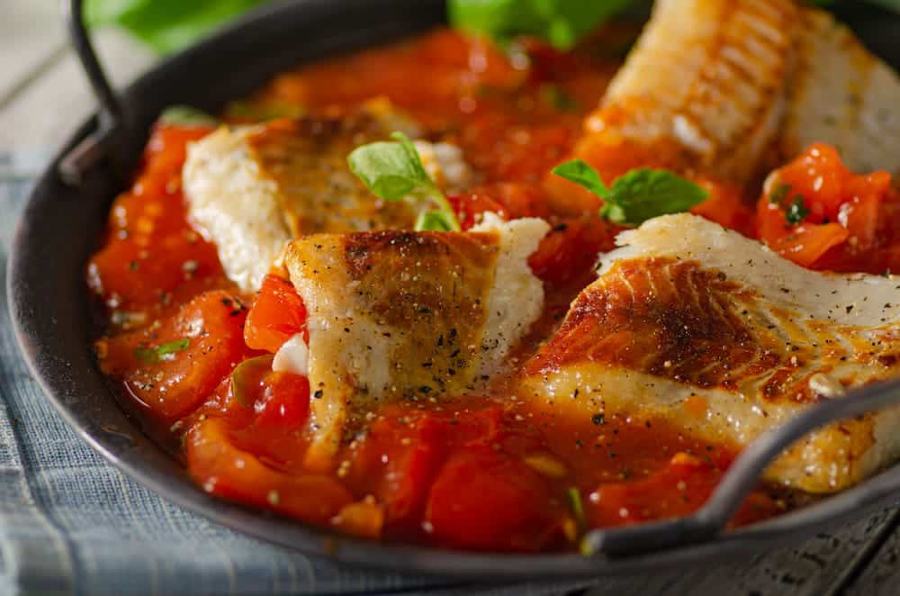

# Pescado a la Veracruzana

*Mexico's Gulf-coast tomato-fish: white fish fillets baked in a sauce of tomato, onion, olives, capers, pickled jalapeños and oregano, served over white rice with lime wedges.*

**Serves:** 4-6

**Prep Time:** 25 minutes

**Cook Time:** 35 minutes

## Overview
Pescado a la Veracruzana (literally "Veracruz-style fish") is one of Mexico's most beloved seafood dishes and a Gulf-coast classic that bridges Spanish-Mediterranean techniques with Mexican ingredients: the olive-caper-tomato sauce sits squarely in the Mediterranean tradition, but pickled jalapeños, Mexican oregano and corn-oil cooking pull the dish firmly back to Veracruz. Thick fillets of white fish (red snapper / huachinango is traditional; sea bass, grouper or any firm white fish work) bake straight in a fragrant sauce of sliced onions, garlic, tomato, green olives, capers, sliced pickled jalapeños, bay leaves, oregano and a splash of white wine till the fish is just cooked through and the sauce has reduced into a rich orange-red coating. The olive-caper-jalapeño triad is the Veracruz signature: brine from olives and capers, sweet heat from pickled jalapeños. Eat over plain white rice with lime wedges, sliced avocado and warm corn tortillas or bread.

## Ingredients

### Fish
- 4 white fish fillets (red snapper, sea bass, cod, or grouper; about 180 g each)
- 1 tablespoon fine sea salt
- 1 teaspoon ground black pepper
- Juice of 1 lime
- 1 tablespoon olive oil (for brushing)

### Sauce
- 4 tablespoons olive oil
- 2 large onions (sliced into thin half-moons)
- 8 garlic cloves (crushed)
- 6 medium ripe tomatoes (chopped); or 1 tin (400 g) chopped tomatoes + 200 g fresh tomato
- 4 tablespoons tomato paste
- 100 g pitted green olives (sliced)
- 4 tablespoons capers (drained)
- 4-6 pickled jalapeños (sliced)
- 200 ml dry white wine
- 200 ml fish stock (or chicken stock)
- 4 bay leaves
- 2 tablespoons dried Mexican oregano
- 1 tablespoon ground cumin
- 1 teaspoon ground cinnamon
- 1 ½ teaspoons fine sea salt (taste; olives and capers are salty)
- 1 teaspoon ground black pepper
- 1 small fresh chilli (sliced, optional)

### To finish
- 1 large bunch fresh parsley (chopped)
- 1 tablespoon fresh oregano (or extra dried)
- Lime wedges
- Sliced avocado

### To serve
- Plain white rice
- Warm corn tortillas (or French bread)
- Sliced avocado
- Fresh salad

## Method

### Stage 1 - Season the fish
1. Pat the fish fillets dry.
2. Sprinkle with salt, pepper and lime juice.
3. Brush with the tablespoon of olive oil.
4. Set aside.

### Stage 2 - Build the sauce
1. Heat the olive oil in a wide ovenproof pan (with a lid) over medium heat.
2. Add the sliced onions; cook 10 minutes till deeply soft and starting to caramelise.
3. Add the crushed garlic; cook 30 seconds.
4. Add the tomato paste; cook 2 minutes till deepened.
5. Add the chopped tomatoes; cook 8-10 minutes till they break down and the sauce thickens.

### Stage 3 - Add liquid and seasonings
1. Pour in the white wine; let bubble 2 minutes.
2. Add the fish stock.
3. Add the olives, capers, pickled jalapeños and bay leaves.
4. Stir in the oregano, cumin, cinnamon, salt and pepper.
5. Add the fresh chilli (if using).
6. Simmer 10 minutes till the sauce is thick and fragrant.

### Stage 4 - Add the fish
1. Preheat the oven to 180°C (350°F).
2. Lay the fish fillets gently into the simmering sauce, partially submerged.
3. Spoon some sauce over the tops of the fillets.

### Stage 5 - Bake
1. Cover the pan with the lid (or foil if not ovenproof; transfer to a baking dish if needed).
2. Transfer to the oven; bake 12-15 minutes till the fish is just cooked through (flesh flakes easily with a fork).

### Stage 6 - Finish
1. Take out of the oven.
2. Lift out the bay leaves.
3. Scatter chopped parsley and fresh oregano over.

### Stage 7 - Serve
1. Place a fillet on each plate over a portion of white rice; spoon plenty of sauce over.
2. Add sliced avocado and lime wedges.
3. Warm corn tortillas alongside.

## Notes
- **White fish that holds together:** red snapper is traditional; cod, sea bass, grouper work.
- **Olive-caper-jalapeño triad:** the Veracruz signature.
- **Fish baked in sauce:** not pan-seared then sauced.
- **Mexican oregano gives the proper profile:** distinguishes from Italian oregano.
- **Don't overcook:** 12-15 minutes at 180°C is right; flesh should just flake.

## Variations
- **Whole-fish version (huachinango entero a la Veracruzana):** use whole red snapper; score the skin; cook 25-30 minutes in the sauce. The traditional restaurant presentation.
- **Spicier:** double the pickled jalapeños and add 1 fresh habanero; properly fierce Veracruz.
- **With pine nuts:** add 50 g of pine nuts to the sauce; gives extra richness.
- **Coastal-vegetarian version (chayotes a la Veracruzana):** swap fish for cubed chayote squash; cook the same way; surprisingly excellent.

## Serving
- On wide plates over white rice with the sauce ladled over. Sliced avocado, lime wedges, warm corn tortillas. Drink: cold Corona or Pacifico beer, a Mexican white wine, or fresh agua de jamaica (hibiscus). As a Veracruz Sunday lunch.

## Storage
- Best eaten fresh; fish doesn't reheat well.
- The sauce keeps refrigerated 4 days; cook fresh fish in reheated sauce.
- Freezes the sauce 3 months; don't freeze with fish.
