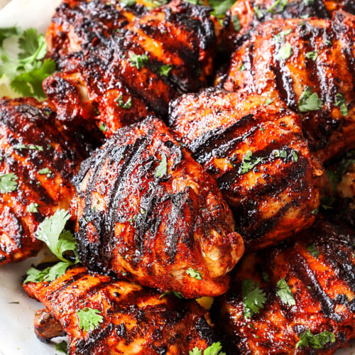

# Pollo Asado

*Northern Mexico's grilled chicken: bone-in pieces stained brick-red with achiote and bathed in bitter orange, lime, garlic and oregano, then charred.*

**Serves:** 4

**Prep Time:** 20 minutes (plus 4 hours marinating)

**Cook Time:** 30 minutes

## Overview
Pollo asado is the Mexican answer to grilled chicken, and the marinade is the entire point. Achiote paste (ground annatto seed with garlic, cumin, oregano and vinegar) provides both the dish's distinctive brick-orange colour and a subtle, almost peppery earthiness. Sour orange (naranja agria) is the traditional citrus, though a blend of orange and lime juice mimics it where bitter orange isn't available. The chicken is marinated for at least 4 hours, ideally overnight, so the acid tenderises the meat and the achiote stains right through to the bone. On the grill, the marinade caramelises into a deeply coloured crust while the meat underneath stays juicy thanks to the bone-in cuts. Regional differences matter: Yucatán-style pollo asado leans heavily on achiote and sour orange, drawing from pibil traditions; northern Mexican versions add more cumin and chilli; the version popular in Los Angeles and Texas often gets a touch of tomato paste in the marinade for extra colour. Difficulty for home cooks is low: it's grilled chicken with a confident marinade. The main pitfall is high direct heat scorching the achiote-stained skin before the meat cooks through; a two-zone fire fixes that. Served with charred spring onions, warm corn tortillas, lime wedges, and salsa or guacamole.

## Ingredients

### Chicken
- 1 ½ kg bone-in chicken pieces (mix of thighs, drumsticks, breast halves)

### Marinade
- 50 g achiote paste
- 120 ml fresh orange juice
- 60 ml lime juice
- 30 ml white vinegar
- 45 ml olive oil
- 6 garlic cloves (crushed)
- 5 g ground cumin
- 5 g dried Mexican oregano
- 3 g smoked paprika
- 8 g salt
- 2 g ground black pepper
- 1 chipotle in adobo (optional, finely chopped)

### To serve
- Warm corn tortillas
- Lime wedges
- Charred spring onions
- Salsa roja (or guacamole)

## Method

### Stage 1 - Marinade
1. Break the achiote paste into a blender or bowl.
1. Add orange juice, lime juice, vinegar, olive oil, garlic, cumin, oregano, paprika, salt, pepper and chipotle.
1. Blend or whisk until smooth and uniformly orange-red. The paste must fully dissolve.
1. Place chicken pieces in a large zip-top bag or non-reactive container.
1. Pour over the marinade; massage to coat every piece.
1. Refrigerate 4-12 hours.

### Stage 2 - Prepare the grill
1. Build a two-zone charcoal fire, or set a gas grill with half the burners on medium-high and half off.
1. Oil the grates well.
1. Remove chicken from marinade; let excess drip off but don't wipe it clean.

### Stage 3 - Grill
1. Lay the chicken skin-side down over the hot side. Grill 4-5 minutes to mark and colour the skin.
1. Turn once; cook another 4-5 minutes on the second side.
1. Move all pieces to the cool side, skin-side up. Cover with the lid or a foil tent.
1. Cook 15-20 minutes more, turning once halfway, until breast reads 72°C and thigh 75°C at the bone.
1. In the final 2 minutes, return briefly to the hot side to crisp the skin if needed.

### Stage 4 - Rest and serve
1. Transfer chicken to a board; rest 5-8 minutes loosely tented with foil.
1. While resting, char a few whole spring onions on the hot side until blistered.
1. Serve the chicken with warm corn tortillas, lime wedges, charred spring onions and salsa.

## Notes
- **Achiote paste:** sold in small bricks in Mexican and Latin American shops, sometimes labelled "recado rojo". Soften with a splash of warm water if it's hard.
- **Sour orange substitute:** equal parts orange juice and lime juice with a splash of grapefruit juice closely mimics naranja agria.
- **Two-zone fire is non-negotiable:** the marinade burns black on direct high heat before the chicken cooks. Sear, then finish indirect.
- **Don't skip the rest:** 5-8 minutes lets the juices redistribute; cutting straight away loses them to the board.

## Storage
- Refrigerate up to 3 days in a sealed container.
- Leftover meat pulled off the bone is excellent in tacos, tortas or quesadillas.
- Reheat gently in a covered pan with a splash of water or stock to keep the meat tender.
