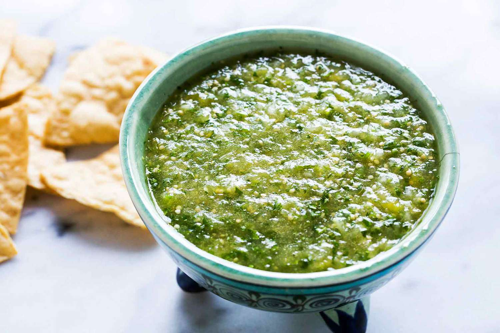

# Salsa Verde

*The Mexican green salsa: tomatillos charred or boiled, blitzed with green chillies, white onion, garlic, coriander and lime. Bright, tangy, vegetal. The everyday salsa for tacos, enchiladas, chilaquiles and eggs.*

**Serves:** 6-8 (makes about 500 ml)

**Prep Time:** 10 minutes

**Cook Time:** 8 minutes

## Overview
Mexican salsa verde is a tomatillo-based green sauce that shows up across the whole Mexican menu: poured over enchiladas verdes, ladled onto chilaquiles for breakfast, served warm with carnitas or chicharrón, spooned over a fried egg, stirred into rice. It is one of the workhorses of the Mexican kitchen.

The base ingredient is the **tomatillo**: a small green fruit in a papery husk, slightly tart and faintly herbal. It is not a green tomato. Tomatillos are sold fresh in Mexican grocers and increasingly in larger supermarkets, and tinned tomatillos are an acceptable substitute (drain them first). The traditional method is to char them over an open flame or under a grill until blistered, which gives the sauce its smoky depth; the boiled version is faster and lighter.

This recipe gives the charred version, which is the cantina default. A boiled-tomatillo variant follows in the notes.

Do not confuse with [Italian salsa verde](../italian/side-dishes/salsa-verde.md), which is an entirely different sauce (parsley-and-capers-based).

## Ingredients
- 500 g fresh tomatillos (about 12 medium; husks removed, rinsed)
- 2 jalapeños (or 1 jalapeño + 1 serrano for more heat; stems removed, halved)
- ½ small white onion (peeled, halved)
- 3 garlic cloves (unpeeled)
- 1 large bunch fresh coriander (about 30 g, leaves and tender stems)
- 1 tsp salt (or to taste)
- 1 tbsp fresh lime juice
- 1 tsp granulated sugar (optional, balances if the tomatillos are very tart)

## Method

### Stage 1 - Char the vegetables
1. Heat a dry heavy frying pan (cast iron or carbon steel) over high heat until smoking.
1. Lay the tomatillos, jalapeño halves (cut-side down), onion halves and unpeeled garlic cloves in the pan. Cook 6-8 minutes, turning occasionally, until everything is charred in spots and the tomatillos have started to soften and weep their juice. The garlic skins should be deeply browned.
1. Off the heat. Peel the garlic cloves once cool enough to handle.

(Alternative method: spread on a foil-lined tray and grill under a hot broiler for 5-6 minutes, turning once.)

### Stage 2 - Blend
1. Tip the charred tomatillos, jalapeños, onion and peeled garlic into a blender or food processor.
1. Add the fresh coriander, salt, lime juice and sugar (if using).
1. Blend until smooth but with some texture remaining; do not over-blend or the sauce becomes foamy. About 15-20 seconds.
1. Taste. The sauce should be tart, faintly smoky, herbaceous and warm with chilli heat. Adjust salt and lime.

## Notes
- **Tomatillos, not green tomatoes.** Green tomatoes are unripe; tomatillos are a different species (Physalis philadelphica). The flavour is completely different. Substituting unripe green tomatoes gives a sour, less complex sauce. Look for tomatillos in a paper husk; many supermarkets carry them now.
- **Tinned tomatillos work.** Drain a 400 g tin, skip the charring, blend with the rest. Faster but milder; add an extra jalapeño to compensate.
- **Char gives depth.** The blistered skin and slightly burnt edges produce the smoky background that defines a cantina salsa verde. Boiled tomatillos give a brighter, lighter sauce (see variation below).
- **Coriander stems are fine.** They have more flavour than the leaves. Trim only the very tough bottom inch.
- **Heat level is in the jalapeños.** Two jalapeños with seeds gives medium heat. For mild, deseed; for serious heat, add a serrano and leave all seeds in.
- **The sugar is a safety net.** Tomatillos vary in tartness. If yours are very sour, a teaspoon of sugar rounds the edges. If they taste balanced, skip.

## Variations
- **Salsa verde cruda (boiled / raw):** simmer the tomatillos in boiling water for 5 minutes until they turn olive-green and softened. Drain, blend with raw onion, garlic, chilli, coriander, salt and lime. Brighter, fresher, less smoky.
- **Salsa verde con aguacate:** add half a ripe avocado to the blender at stage 2. The sauce becomes creamy and more dressing-like; the chilaquiles version of choice.
- **Salsa verde rostizada:** char the vegetables aggressively (some bits properly black) for a smokier, fuller-bodied sauce.

## Serving
- **Enchiladas verdes**: tortillas filled with chicken or cheese, rolled, smothered in warm salsa verde, baked with crema and queso fresco.
- **Chilaquiles verdes**: tortilla chips simmered briefly in warm salsa verde, topped with a fried egg, queso fresco and crema. The classic Mexican breakfast.
- **Carnitas tacos**: pulled pork in a warm corn tortilla, topped with raw onion, coriander and a generous spoonful of salsa verde.
- **Huevos divorciados**: two eggs side by side, one topped with red salsa, one with green.
- **Pollo en salsa verde**: chicken thighs simmered in the sauce until tender, served over rice.

## Storage
- Refrigerates 5 days in a sealed jar.
- Freezes 2 months in portions; thaws perfectly.
- Tastes better on day two as the flavours mellow and integrate.
