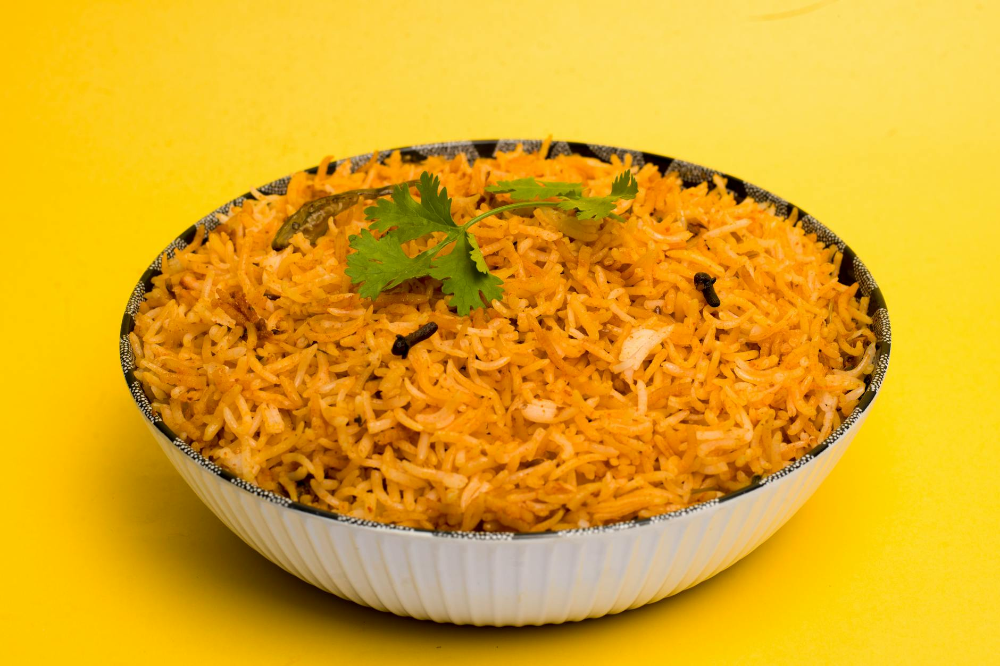

# Arroz Amarillo

*Yellow rice coloured with achiote and finished with sweetcorn and peas. The Yucatecan answer to red Mexican rice; pairs beautifully with cochinita pibil and pollo asado.*

**Serves:** 4-6

**Prep Time:** 10 minutes

**Cook Time:** 25 minutes

## Overview
The Yucatecan answer to red Mexican rice: long-grain coloured deep yellow with bloomed achiote, finished with sweetcorn and peas. Pairs especially well with cochinita pibil and pollo asado, both of which lean on achiote in their marinades. Bloom achiote seeds in warm oil two or three minutes till the oil turns deep yellow-orange (slow and steady; smoking oil turns brown and bitter), then strain so only the tinted oil remains. Soften onion and carrot in the achiote oil, then garlic, then add rinsed rice with cumin and toast till the grains turn opaque and smell nutty. Pour in stock, bay and salt, boil, then drop to the lowest heat with a tight lid for fourteen minutes; sweetcorn and peas scatter across the top in the last three. Off the heat, rest covered another ten minutes for the separated grains. Fluff with a fork, scatter chopped coriander, serve.

## Ingredients
- 2 tablespoons olive oil
- 2 teaspoons annatto (achiote) seeds (or 1 teaspoon achiote powder, or ¼ teaspoon ground turmeric)
- 1 onion (small, finely diced)
- 3 garlic cloves (finely chopped)
- 1 carrot (small, finely diced)
- 300 g long-grain white rice (rinsed until the water runs clear, drained)
- 500 ml chicken stock (or vegetable stock)
- 1 teaspoon ground cumin
- 1 bay leaf
- 1 teaspoon salt (to taste)
- 80 g sweetcorn kernels (fresh or frozen)
- 80 g peas (frozen)
- A handful of coriander (chopped, to finish)

## Method

### Stage 1 - Bloom the achiote
1. Heat the olive oil in a saucepan with a tight-fitting lid over medium-low heat.
1. Add the annatto seeds.
1. Warm for 2-3 minutes, swirling occasionally, until the oil turns a deep yellow-orange (it goes from pale to bronze; don't let it smoke).
1. Strain the oil back into the pan; discard the seeds.

### Stage 2 - Soften the base
1. Add the onion and diced carrot to the achiote oil over medium heat.
1. Cook for 5 minutes until the onion is soft.
1. Stir in the chopped garlic and cook for 30 seconds.

### Stage 3 - Toast the rice
1. Add the rinsed, drained rice and the cumin.
1. Toast for 2-3 minutes, stirring, until the grains turn opaque and smell nutty (the rice will also turn a richer yellow as it absorbs the oil).

### Stage 4 - Steam
1. Pour in the stock, add the bay leaf and salt and bring to a boil.
1. Reduce to the lowest heat.
1. Cover with a tight-fitting lid and cook for 14 minutes.
1. Scatter the sweetcorn and peas on top in the final 3 minutes.

### Stage 5 - Rest and serve
1. Pull from the heat and rest, still covered, for 10 minutes.
1. Discard the bay leaf and fluff with a fork.
1. Scatter the coriander and serve.

## Notes
- **Achiote seeds:** Hard, brick-red seeds sold in Latin American grocers as annatto or achiote. They're the colour and a mild peppery-earthy flavour; turmeric is a colour-only substitute.
- **Don't burn the seeds:** Achiote oil should warm slowly. If the oil smokes, the colour turns brown rather than yellow-orange, and the flavour is bitter.
- **Carrot and corn:** The dish is yellow before they go in; they make it visually layered as well as sweetening it.

## Storage
- Refrigerate up to 3 days; reheat covered with a splash of water.
- Freezes well in portions for 2 months.
