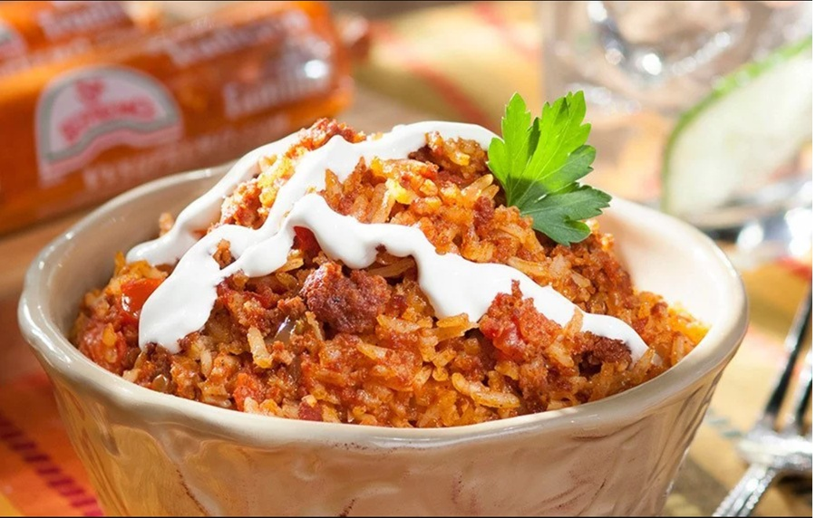

# Arroz Rojo Con Chorizo

*Tomato-stained rice cooked with Mexican chorizo, onion and garlic. A heartier turn on the classic red rice; eats as a side or a meal on its own with a fried egg on top.*

**Serves:** 4-6

**Prep Time:** 10 minutes

**Cook Time:** 30 minutes

## Overview
Mexican chorizo is rendered in the pan to release its red, paprika-laden oil. Onion and garlic soften in the oil, then long-grain rice is toasted before tomato puree and stock are poured in to colour and cook the grains. The result is rice the colour of terracotta with a slightly smoky, slightly spicy chorizo backbone running through every bite.

## Ingredients
- 200 g Mexican chorizo (or Spanish chorizo, diced or crumbled from casing)
- 1 tablespoon olive oil (only if Spanish chorizo, which releases less fat)
- 1 onion (small, finely diced)
- 3 garlic cloves (finely chopped)
- 300 g long-grain white rice (rinsed until the water runs clear, drained)
- 2 tablespoons tomato paste
- 200 g tinned chopped tomatoes (blended smooth)
- 500 ml chicken stock
- 1 teaspoon ground cumin
- 1 teaspoon dried Mexican oregano
- 1 teaspoon salt (to taste)
- 80 g peas (frozen, optional)
- A handful of coriander (chopped, to finish)

## Method

### Stage 1 - Render the chorizo
1. Heat a saucepan with a tight-fitting lid over medium heat.
1. Add the chorizo (and a splash of olive oil if using Spanish-style).
1. Cook for 5-6 minutes, breaking it up with a spoon, until it crisps and releases its red oil.
1. Lift two-thirds of the chorizo out with a slotted spoon and reserve, leaving the oil and a third of the chorizo in the pan.

### Stage 2 - Soften the base
1. Add the onion to the pan and cook for 4-5 minutes until soft and tinted red by the chorizo oil.
1. Stir in the chopped garlic and cook for 30 seconds.

### Stage 3 - Toast the rice
1. Add the rinsed, drained rice and stir for 2-3 minutes, until the grains turn opaque and smell nutty.

### Stage 4 - Steam
1. Stir in the tomato paste and cook for 30 seconds.
1. Pour in the blended tinned tomatoes, chicken stock, cumin, oregano and salt.
1. Bring to a boil, then reduce to the lowest heat.
1. Cover with a tight-fitting lid and cook for 16-18 minutes (don't lift the lid).
1. Scatter the peas (if using) and the reserved chorizo on top in the final 3 minutes.

### Stage 5 - Rest and serve
1. Pull from the heat and rest, still covered, for 10 minutes.
1. Fluff with a fork; the chorizo and peas will mix through.
1. Scatter the coriander and serve.

## Notes
- **Toasting the rice is non-negotiable:** Spanish and Mexican rice methods both depend on it. The toasted grains stay separate; untoasted rice gets gummy.
- **Mexican chorizo vs Spanish:** Mexican is soft, fresh, paprika-red; Spanish is cured. Both work here, but the dish is named for the Mexican kind. With Spanish chorizo, dice it small and add a splash of paprika to compensate.
- **Don't peek:** Even one lift of the lid will leave the rice unevenly cooked. Trust the timer.

## Storage
- Refrigerate up to 3 days; reheat covered with a splash of water.
- Freezes well in portions for 2 months.
