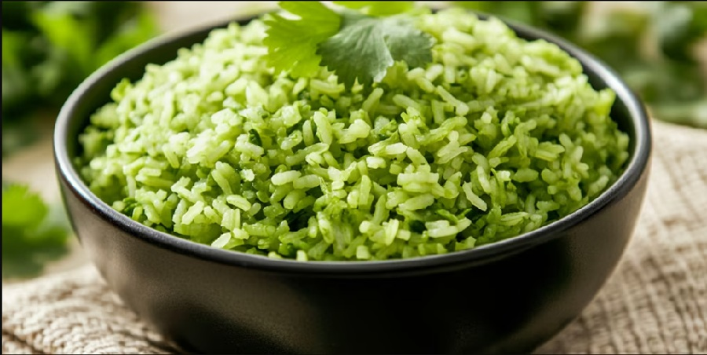

# Arroz Verde

*Green rice: long-grain rice cooked in stock blended with poblano, spinach and coriander. The herbal cousin of red Mexican rice; goes with everything from chicken to grilled fish.*

**Serves:** 4-6

**Prep Time:** 15 minutes

**Cook Time:** 25 minutes

## Overview
Spinach, coriander, parsley and a charred poblano are blended with chicken stock to make a vivid green cooking liquor. Long-grain rice is rinsed and toasted in oil with onion and garlic, then the green stock is poured in and the rice covered to steam. The grains finish the colour of fresh basil with a clean herbal flavour that pairs with anything off the grill.

## Ingredients

### Green broth
- 1 poblano pepper (charred, peeled, deseeded; or 1 green bell pepper)
- 75 g baby spinach
- A large handful of fresh coriander (stems included)
- A small handful of flat-leaf parsley
- 2 garlic cloves
- 500 ml chicken stock (or vegetable stock)
- 1 teaspoon salt

### Rice
- 2 tablespoons olive oil
- 1 onion (small, finely diced)
- 2 garlic cloves (finely chopped)
- 300 g long-grain white rice (rinsed until the water runs clear, drained well)
- ½ teaspoon ground cumin

## Method

### Stage 1 - Make the green broth
1. Char the poblano directly over a gas flame (or under a hot grill) for 6-8 minutes, turning, until the skin is blackened.
1. Steam under cling film for 10 minutes, then rub off the skin and remove the stem and seeds.
1. Blend the poblano, spinach, coriander, parsley, garlic, chicken stock and salt until completely smooth.

### Stage 2 - Toast the rice
1. Heat the olive oil in a saucepan with a tight-fitting lid over medium heat.
1. Add the onion and a pinch of salt; cook for 4-5 minutes until soft.
1. Stir in the chopped garlic and cook for 30 seconds.
1. Add the rinsed, drained rice and the cumin.
1. Toast the rice for 2-3 minutes, stirring, until the grains turn opaque and smell nutty (a key step; without it the rice steams to a mushy texture).

### Stage 3 - Steam
1. Pour the green broth over the rice.
1. Bring to a boil, then reduce to the lowest possible heat.
1. Cover with a tight-fitting lid and cook for 18 minutes (don't lift the lid).
1. Pull from the heat and rest, still covered, for 10 minutes.

### Stage 4 - Fluff and serve
1. Lift the lid and fluff the rice with a fork.
1. Taste and adjust salt.

## Notes
- **Rinse the rice:** Excess surface starch makes the rice claggy. Rinse until the water runs clear and drain well before toasting.
- **Toast in the pan:** Mexican rice technique. The toasted grains hold their shape during cooking.
- **No peeking:** Lifting the lid releases steam and the rice ends up unevenly cooked. Trust the timer.

## Storage
- Refrigerate up to 3 days; reheat covered with a splash of water to bring back the steam.
- Freezes well in portions for 2 months.
