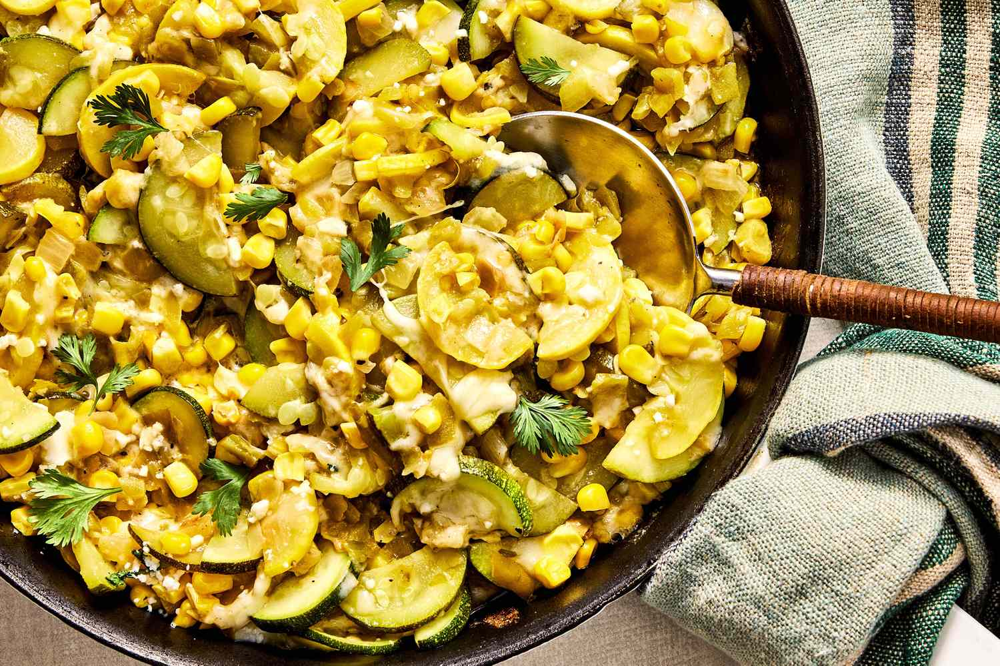

# Calabacitas

*Mexican summer-squash sauté with sweetcorn, tomato and poblano. A bright vegetable side that holds its own next to grilled meat, often finished with crumbled queso fresco.*

**Serves:** 4

**Prep Time:** 15 minutes

**Cook Time:** 20 minutes

## Overview
Courgettes are diced and cooked with onion, garlic and roasted poblano until just tender, then sweetcorn and tomato are added to break down briefly. The dish is finished with crumbled queso fresco and coriander. Cumin and Mexican oregano sit underneath; the courgette stays just shy of mushy.

## Ingredients
- 1 poblano pepper (or green bell pepper if unavailable)
- 2 tablespoons olive oil
- 1 onion (finely diced)
- 3 garlic cloves (finely chopped)
- 600 g courgettes (or Mexican calabacita, diced into 1 ½ cm pieces)
- 200 g sweetcorn kernels (fresh from 2 cobs, or frozen)
- 2 tomatoes (chopped)
- 1 teaspoon ground cumin
- 1 teaspoon dried Mexican oregano
- 1 teaspoon salt (to taste)
- ¼ teaspoon black pepper

### To finish
- 80 g queso fresco (or feta cheese, crumbled)
- A handful of coriander (chopped)
- 1 lime (cut into wedges)

## Method

### Stage 1 - Char the poblano
1. Char the poblano directly over a gas flame (or under a hot grill) for 6-8 minutes, turning, until the skin is blackened on all sides.
1. Place in a bowl and cover with cling film for 10 minutes to steam.
1. Rub the blackened skin off, remove the stem and seeds, and chop the flesh.

### Stage 2 - Soften the base
1. Heat the olive oil in a wide pan over medium heat.
1. Add the onion with a pinch of salt and cook for 5 minutes until soft.
1. Add the chopped garlic and cook for 1 minute.

### Stage 3 - Cook the squash
1. Add the diced courgette and chopped poblano.
1. Increase the heat slightly and cook for 6-8 minutes, stirring occasionally, until the courgette is tender but still holds its shape.

### Stage 4 - Add corn and tomato
1. Stir in the sweetcorn, chopped tomato, cumin, oregano, salt and pepper.
1. Cook for 4-5 minutes, until the tomatoes have broken down into the dish and the corn is hot through.
1. Taste and adjust salt.

### Stage 5 - Finish
1. Transfer to a serving bowl and crumble the queso fresco over the top.
1. Scatter the coriander and serve with lime wedges.

## Notes
- **Don't overcook the courgette:** Pull from the heat when there's still a little bite. Calabacitas should sit between vegetable and stew, not collapse into one.
- **Poblano is the soul:** Skip it and you lose the smoky backbone. A green bell is the second-best stand-in (no heat, but the right family).
- **Queso fresco is unsalted:** If using feta as a substitute, taste the dish before salting the pan finishing it; feta will season the bowl on its own.

## Storage
- Refrigerate up to 3 days; eat warm or at room temperature.
- Doesn't freeze well (the courgette goes watery).
