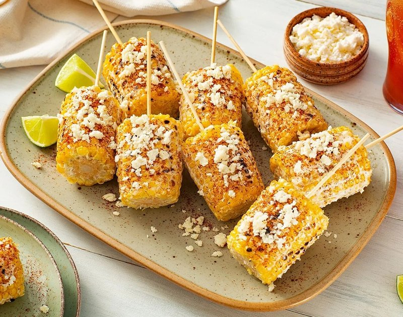

# Elote

*Mexico's street-cart corn: charred corn cobs slathered in mayo-and-crema, dusted with crumbled cotija, chilli powder and finished with a lime wedge.*

**Serves:** 4

**Prep Time:** 10 minutes

**Cook Time:** 12 minutes

## Overview
Fresh sweetcorn ears are husked (or partially husked, with the leaves pulled back as a handle). Grilled over hot charcoal (or a smoking-hot griddle, or under a domestic grill / broiler) for 8-12 minutes, turning, until charred in patches and bright yellow at the kernels. While the corn grills, a sauce of Mexican crema (or sour cream + lime juice), mayonnaise, a small splash of milk and a clove of crushed garlic whisks together. The hot grilled corn is brushed all over with the sauce, then rolled in finely crumbled cotija cheese (or a Tajín-cotija mix), dusted with chilli powder and chopped coriander, served with a lime wedge.*

## Ingredients

- 4 corn cobs (the freshest you can find - corn off the cob loses sugar within hours of picking)
- 1 tablespoon vegetable oil (for the cobs, if grilling)

### Crema sauce
- 4 tablespoons Mexican crema (or sour cream + 1 teaspoon lime juice)
- 4 tablespoons mayonnaise (a good one - Hellmann's or Mexican brand)
- 1 tablespoon whole milk (to loosen)
- 1 garlic clove (crushed to a paste with a pinch of salt)
- ½ teaspoon ground cumin
- ¼ teaspoon salt

### Toppings
- 80 g cotija cheese (finely crumbled - or feta, or pecorino as substitutes)
- 1 teaspoon ancho chilli powder (or a mix of chilli powder + smoked paprika)
- 1 teaspoon Tajín (the chilli-lime-salt seasoning - sold at Mexican shops; optional but classic)
- 3 tablespoons fresh coriander (chopped fine)
- 2 limes (cut into wedges)
- 4 wooden skewers OR the husks of the cobs (for handles)

## Method

### Stage 1 - Prep the corn
1. **Option A (husks as handle)**: Pull the husks back from the cob, but don't tear them off - they become the handle. Remove all the silk threads. Tie the husks back with a piece of kitchen string if needed.
1. **Option B (no husks)**: Pull all the husks off; if serving on a stick, insert a wooden skewer firmly into one end of each cob.

### Stage 2 - Make the crema sauce
1. In a wide shallow bowl, whisk crema, mayonnaise, milk, garlic-salt paste, cumin and ¼ teaspoon salt to a smooth pourable sauce.

### Stage 3 - Grill the corn
1. **Charcoal grill (best)**: Build a hot fire; grill the cobs directly on the grate 8-10 minutes, turning every 2 minutes, until charred in patches all around.
1. **Grill / griddle pan**: Heat a heavy ridged griddle over high heat 3 minutes. Brush cobs lightly with oil. Grill 3 minutes per side (4 sides) - total 12 minutes.
1. **Broiler**: Place cobs on a foil-lined tray under a hot grill (broiler) 4 minutes per side, turning twice.

### Stage 4 - Coat
1. Roll each hot grilled cob in the crema sauce - use a brush, or roll the cob through the sauce bowl.
1. Make sure every kernel is coated.

### Stage 5 - Top
1. Hold each sauced cob over a plate of crumbled cotija and roll it through the cheese, pressing slightly so the crumbs stick.
1. Dust with ancho chilli powder and a sprinkle of Tajín (if using).
1. Scatter fresh coriander.

### Stage 6 - Serve
1. Plate with a lime wedge.
1. Eat by hand, holding the husk handle or the skewer.
1. Squeeze the lime over before each bite.

## Notes
- **Fresh corn matters:** The sugars in sweetcorn start converting to starch within hours of picking. Same-day-bought corn is dramatically sweeter than week-old corn. If your only option is older corn, brush each cob with a teaspoon of melted butter before grilling.
- **Crema vs sour cream:** Mexican crema is thinner, slightly tangy, and richer than sour cream. Sour cream + a squeeze of lime is the closest substitute; thin with milk to the right consistency.
- **Cotija vs feta:** Cotija is dry-ish, salty, slightly funky aged cow's-milk cheese. Feta is a fine substitute (similar saltiness) - crumble small. Pecorino works in a pinch.

## Storage
- Eat immediately. Elote doesn't keep - the sauce melts into the corn and goes soggy within an hour.
- The crema sauce alone keeps refrigerated 4 days; it's also excellent on grilled fish, tacos, or as a salad dressing.
