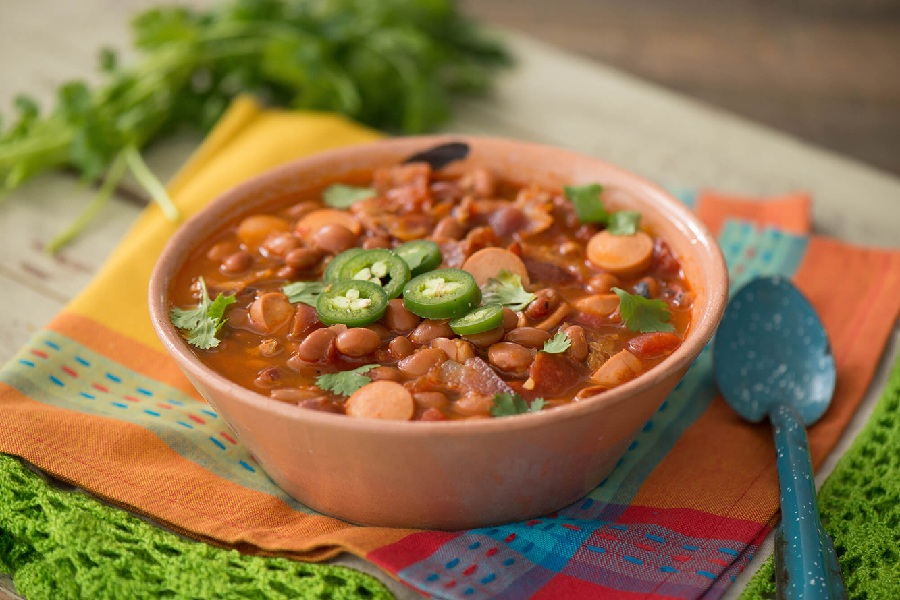

# Frijoles Charros

*Cowboy beans: pinto beans cooked in a pork-and-tomato broth with bacon, chorizo, jalapeño and tomato. Hearty enough to be its own meal, but built to sit beside grilled meat.*

**Serves:** 6

**Prep Time:** 10 minutes (plus overnight soak)

**Cook Time:** 1 hour 45 minutes

## Overview
The cowboy beans of northern Mexico, the pot of pinto beans that turns up at every cookout and barbecue from Monterrey to Tucson: simmered in a pork-and-tomato broth with bacon, chorizo, jalapeño and lager beer. Hearty enough to be a meal on its own, but built to sit beside grilled meat. You soak pinto beans overnight (the quick-soak compromise is boil 2 minutes then rest an hour), then simmer with halved onion, whole garlic and bay till tender (an hour to an hour 15, with salt added only in the last 10 minutes; salting earlier toughens the bean skins). In a wide pan, render diced smoked bacon till crisp, brown the chorizo to release its red oil, soften finely diced onion in the fat, then jalapeño, garlic, chopped tomato, cumin and Mexican oregano till the tomatoes break down. Tip the bean pot in with its cooking liquor, pour in a bottle of lager for the traditional finish, simmer uncovered 20 minutes for the broth to thicken slightly and the flavours to meld. Stir most of the chopped coriander through, ladle into bowls, top with the rest and a lime wedge.

## Ingredients

### Beans
- 500 g dried pinto beans (soaked overnight in cold water)
- 1 onion (halved)
- 4 garlic cloves (whole)
- 2 bay leaves
- 1 teaspoon salt (added late)
- Water to cover

### Base
- 200 g smoked streaky bacon (diced)
- 200 g Mexican (or Spanish) chorizo (diced or removed from casing)
- 1 onion (finely diced)
- 2 jalapeños (seeded and finely chopped)
- 4 garlic cloves (finely chopped)
- 2 tomatoes (chopped)
- 1 teaspoon ground cumin
- 1 teaspoon dried Mexican oregano
- 250 ml lager beer (optional, but traditional)
- salt
- pepper

### To finish
- A large handful of coriander (chopped)
- 1 lime (cut into wedges)

## Method

### Stage 1 - Cook the beans
1. Drain the soaked beans and rinse.
1. Place in a large pot with the halved onion, whole garlic and bay.
1. Cover with 2 cm of water above the beans.
1. Bring to a boil, then reduce to a gentle simmer and skim any foam.
1. Cover partially and cook for 1 hour to 1 hour 15 minutes, until the beans are tender but holding their shape.
1. Add 1 teaspoon salt in the last 10 minutes (salting earlier toughens the skins).
1. Discard the onion halves, garlic and bay.

### Stage 2 - Build the base
1. In a wide pan, render the bacon over medium heat until crisp.
1. Add the chorizo and cook for 4-5 minutes until it releases its red oil.
1. Add the diced onion and cook for 5 minutes until soft.
1. Stir in the jalapeño and chopped garlic and cook for 1 minute.
1. Add the chopped tomatoes, cumin and oregano.
1. Cook for 5 minutes until the tomatoes break down.

### Stage 3 - Combine and simmer
1. Tip the bean pot and its cooking liquor into the bacon-chorizo pan.
1. Pour in the beer if using.
1. Bring to a gentle simmer and cook uncovered for 20 minutes for the flavours to combine and the broth to thicken slightly.
1. Taste and adjust salt and pepper.

### Stage 4 - Finish and serve
1. Stir in most of the chopped coriander.
1. Ladle into bowls and top with the remaining coriander and a wedge of lime on the side.

## Notes
- **Don't skip the soak:** Dried pintos cook in half the time and to an even texture after an overnight soak. A quick-soak (boil 2 minutes, rest 1 hour) is the compromise.
- **Salt timing:** Adding salt to dried beans before they're tender fights the softening; the skins stay leathery. Wait until the last 10 minutes.
- **Mexican chorizo:** Soft and crumbly, paprika-red, paprika-flavoured. Spanish chorizo (cured, sliced) is a serviceable substitute; just expect a slightly drier dish.

## Storage
- Refrigerate up to 4 days. The beans drink the broth as they sit, so loosen with stock or water when reheating.
- Freezes well for 2 months.
