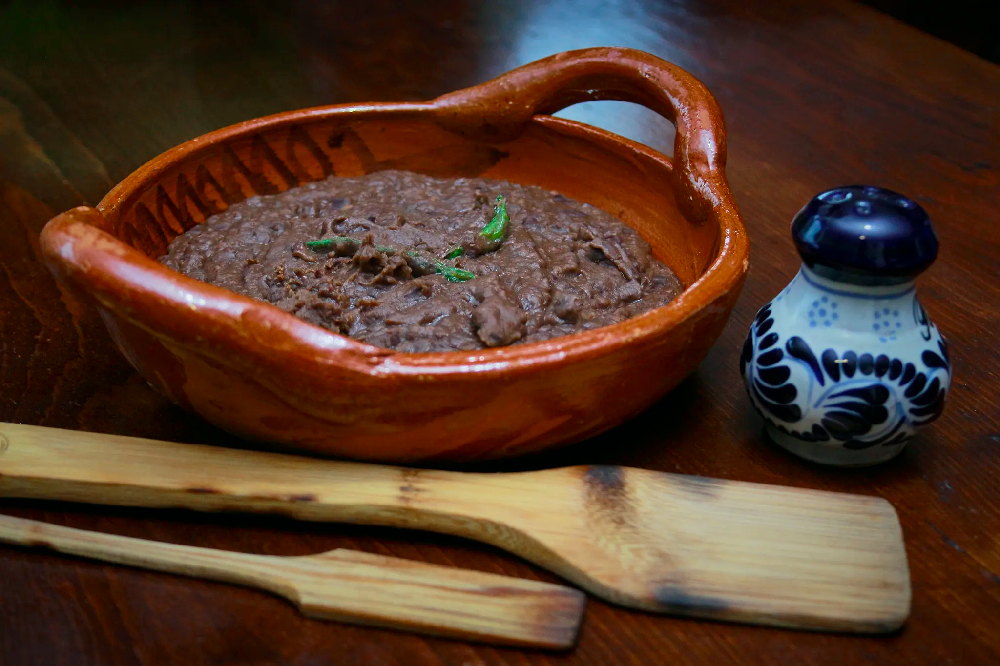

# Frijoles Negros Mexicanos

*Mexico's black beans: dried black beans slow-cooked with epazote, onion, garlic, jalapeño, cumin and a small amount of lard till the beans are tender and the broth thickens to a deep mahogany. The Mexican vegetarian staple, the traditional bean dish that accompanies every meal.*

**Serves:** 6

**Prep Time:** 15 minutes (plus overnight soaking)

**Cook Time:** 2 hours

## Overview
Frijoles negros Mexicanos is the traditional Mexican black-bean dish, distinct from but related to the Cuban version (the Mexican one emphasises epazote and uses a less assertive aromatic base). Dried black beans soak overnight, then slow-cook with chopped white onion, garlic, a whole fresh jalapeño, fresh epazote, cumin, dried oregano, and a small amount of lard for richness till the beans are tender and the broth has thickened naturally to a deep mahogany. The Mexican kitchen's foundational protein, served alongside Mexican rice, tacos and tortillas at almost every meal. Epazote is the traditional Mexican herb (available dried at Mexican markets); skip if you can't find it, but the dish loses some of its identity. The aromatic base is restrained compared to the Cuban approach: the beans speak for themselves with just onion, garlic and herbs. A small amount of lard at the end gives the proper Mexican character (vegetable oil works for a vegetarian version).

## Ingredients

- 500 g dried black beans (turtle beans)
- 3 litres cold water for cooking
- 2 medium white onions (1 quartered for cooking; 1 finely chopped for serving)
- 8 garlic cloves (whole)
- 2 fresh jalapeño peppers (whole, with stems removed)
- 2 large bay leaves
- 2 tablespoons fresh epazote (or 1 tablespoon dried; or 2 sprigs fresh + extra coriander)
- 1 tablespoon ground cumin
- 1 tablespoon dried Mexican oregano
- 2 teaspoons fine sea salt
- 1 teaspoon ground black pepper
- 2 tablespoons lard (or vegetable oil; added at end)

### To finish
- 1 small bunch fresh coriander (chopped)
- 2 tablespoons chopped fresh epazote (if available)
- Lime wedges

### To serve
- Mexican rice
- Corn tortillas
- Sliced raw red onion
- Crumbled queso fresco
- Sliced avocado
- Hot sauce

## Method

### Stage 1 - Soak the beans (overnight)
1. Place beans in a wide bowl; cover with cold water by 5 cm.
2. Soak 12 hours.
3. Drain; rinse.

### Stage 2 - Cook the beans
1. Place beans in a large pot with the 3 litres of cold water.
2. Add the quartered onion, garlic cloves, jalapeños, bay leaves and epazote.
3. Bring to a boil; skim any foam.
4. Reduce to a low simmer.
5. Cook 90 minutes, partially covered.

### Stage 3 - Add seasonings
1. After 90 minutes, add the cumin, oregano, salt and pepper.
2. Continue cooking 30 more minutes till the beans are properly tender and the broth has thickened naturally.
3. The beans should be soft but not mushy; the broth should be thick and rich, not watery.
4. If too thick, add hot water; if too thin, mash some beans against the side and simmer 10 more minutes.

### Stage 4 - Finish with fat
1. Stir in the lard (or vegetable oil).
2. Taste; adjust salt.

### Stage 5 - Serve
1. Ladle into bowls or alongside rice on plates.
2. Top with the finely chopped raw white onion (the traditional Mexican topping).
3. Scatter coriander, epazote, and crumbled queso fresco.
4. Sliced avocado on the side.
5. Lime wedges and hot sauce.

## Notes
- **Epazote is the Mexican touch:** the traditional herb; substitute with extra coriander if unavailable.
- **Simpler aromatic base than Cuban:** Mexican black beans aren't a sofrito-style cooking; the beans dominate.
- **Lard at the end:** gives proper Mexican richness; oil for vegetarian.
- **Raw onion on top:** traditional Mexican garnish.

## Variations
- **With chorizo:** crisp 100 g of sliced chorizo separately; spoon over the finished beans.
- **Frijoles refritos (refried):** mash the cooked beans; fry in lard or oil till thickened to a paste; the related traditional Mexican refried beans.
- **Spicier:** add 2 fresh chillies + more dried oregano.
- **With chipotle:** add 2 chipotles in adobo while cooking; gives a smoky depth.

## Serving
- Alongside any Mexican main, or with rice and tortillas as a light vegetarian meal.

## Storage
- Keeps refrigerated 5 days; flavour deepens.
- Freezes 6 months in portions.
- Day-old beans are excellent for refried beans or huevos rancheros.
