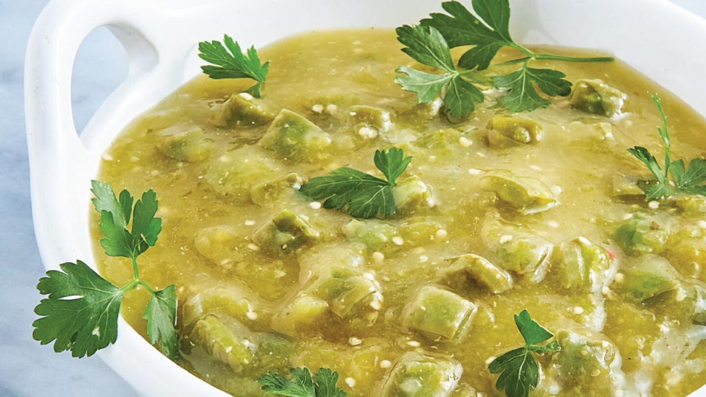

# Nopalitos en Salsa Verde

*Mexico's cactus salad: cooked nopales (prickly-pear pads) chopped and tossed with a fresh tomatillo-jalapeño salsa verde, diced onion, cilantro and crumbled queso fresco.*

**Serves:** 4

**Prep Time:** 15 minutes (plus 20 minutes cooking nopales)

**Cook Time:** 5 minutes

## Overview
Nopalitos en salsa verde is one of Mexico's everyday vegetarian sides and a fundamental part of central Mexican home cooking. Nopales are the flat green pads of the prickly pear cactus, available canned or jarred at Mexican markets and fresh in some specialty grocers. Fresh nopales carry a slight mucilage that can be off-putting; simmering them with a slice of onion (and changing the water once) removes most of it. Canned nopales come already cooked and skip the step. The chopped tender nopales toss with a fresh tomatillo-jalapeño salsa verde, finely diced raw onion, chopped cilantro, lime juice and salt. Crumbled queso fresco scatters across the top: the canonical Mexican finishing touch. Eaten as a side alongside rich Mexican mains (tacos al pastor, carnitas, mole) or as a light vegetarian lunch with corn tortillas.

## Ingredients

### Nopales
- 500 g cooked nopales (jarred or canned; rinsed and drained); OR 600 g fresh nopal pads (thorns scraped off, sliced into thin strips, cooked with onion in salted water for 20 minutes)
- 1 small white onion (finely diced)

### Salsa verde
- 400 g tomatillos (husks removed); OR 1 tin (400 g) tomatillos
- 4 garlic cloves
- 2 fresh jalapeños (deseeded for milder)
- 1 small white onion (chopped)
- 1 large bunch fresh coriander (chopped)
- Juice of 1 lime
- 1 teaspoon ground cumin
- 1 teaspoon fine sea salt
- ½ teaspoon ground black pepper

### To finish
- 80 g queso fresco (crumbled; or feta as substitute)
- 1 small bunch fresh coriander (extra; for garnish)
- 1 fresh chilli (sliced)
- Sliced avocado (optional)
- Lime wedges

## Method

### Stage 1 - Make the salsa verde
1. Place the tomatillos in a saucepan; cover with water; bring to a boil.
2. Cook 8-10 minutes till the tomatillos turn olive-green.
3. Drain.
4. Transfer to a blender with the garlic, chillies, chopped onion, coriander, lime juice, cumin, salt and pepper.
5. Blitz to a coarse salsa with some texture.

### Stage 2 - Combine
1. Tip the cooked nopales into a wide bowl.
2. Add the salsa verde and finely diced onion.
3. Toss to combine thoroughly.

### Stage 3 - Rest
1. Let stand 10 minutes for the flavours to marry.

### Stage 4 - Serve
1. Tip onto a serving plate.
2. Scatter crumbled queso fresco generously over.
3. Add chopped coriander, sliced chilli and avocado (if using).
4. Lime wedges on the side.

## Notes
- **Pre-cooked nopales:** if using fresh, simmer with onion 20 minutes to remove sliminess.
- **Tomatillo salsa:** essential Mexican green sauce.
- **Queso fresco on top:** canonical Mexican finish.
- **Serve at room temperature or slightly chilled.**

## Variations
**Nopalitos with onion only (simpler):** skip the salsa verde; just toss with diced onion, lime, cumin, salt and coriander.
**Nopalitos with shrimp:** add cooked shrimp; turns into a main.
**Spicier:** double the jalapeños.
**With charred nopales:** grill fresh nopal pads on a hot griddle before chopping; gives smoky depth.

## Serving
As a side with mexican mains; or as a light lunch with corn tortillas.

## Storage
- Keeps refrigerated 3 days.
- Don't freeze; texture suffers.
