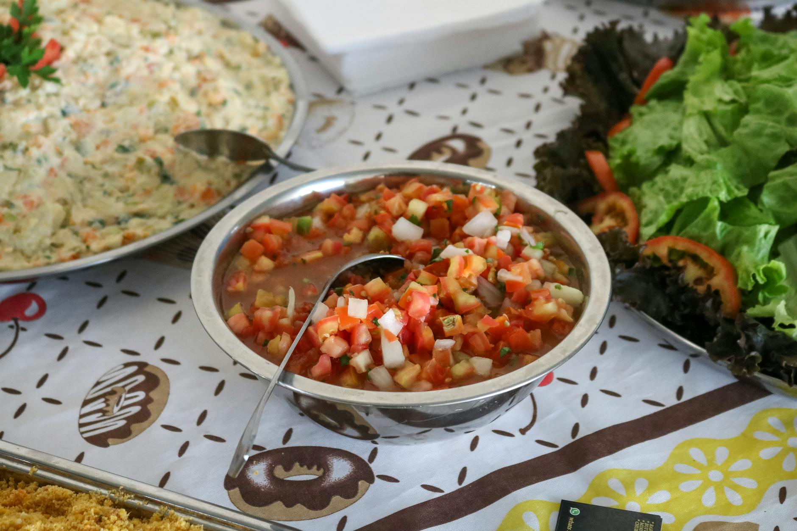

# Pico de Gallo

*Fresh tomato salsa, also called salsa fresca. Chopped tomato, white onion, jalapeño, coriander and lime; salted and rested so the juices come together. The fresh end of the salsa spectrum.*

**Serves:** 6 (as a side)

**Prep Time:** 15 minutes (plus 30 minutes rest)

**Cook Time:** 0 minutes

## Overview
Ripe tomato, white onion, jalapeño and coriander are chopped fine and tossed with lime and salt, then left to rest for ½ hour for the juices to draw out and the flavours to combine. Texture matters: each bite should have all four colours. A staple alongside grilled meat, tacos and chips.

## Ingredients
- 4 ripe tomatoes (about 500 g, deseeded and finely diced)
- 1 white onion (small, finely diced)
- 1-2 jalapeños (seeded and finely chopped)
- A large handful of fresh coriander (chopped, stems included)
- 2 limes (juice)
- 1 teaspoon salt (to taste)
- ¼ teaspoon black pepper

## Method

### Stage 1 - Prep the onion
1. Place the diced white onion in a sieve and rinse briefly under cold water for 10 seconds.
1. Drain well (this knocks the raw sulphur back without losing the bite).

### Stage 2 - Combine
1. In a bowl, combine the diced tomato, drained onion, jalapeño and coriander.
1. Add the lime juice, salt and pepper.
1. Toss gently to combine.

### Stage 3 - Rest and serve
1. Cover and rest at room temperature for 30 minutes for the juices to draw out and the flavours to combine.
1. Taste and adjust salt and lime; the salt usually needs another pinch after the rest.
1. Serve at room temperature; do not chill (cold dulls the tomato).

## Notes
- **Deseed the tomatoes:** Tomato seeds and jelly turn pico watery. Halve, scoop the seeds out with a thumb or spoon, then dice.
- **Cut size matters:** All four ingredients should be roughly 4-5 mm dice; even sizes give even bites.
- **White onion, not red:** Red onion is sweeter and tints the salsa pink as it sits. White onion is the traditional choice and keeps the colour clean.

## Storage
- Best within 4 hours of making.
- Refrigerate up to 2 days; the texture softens and the herbs blacken, but the flavour holds.
