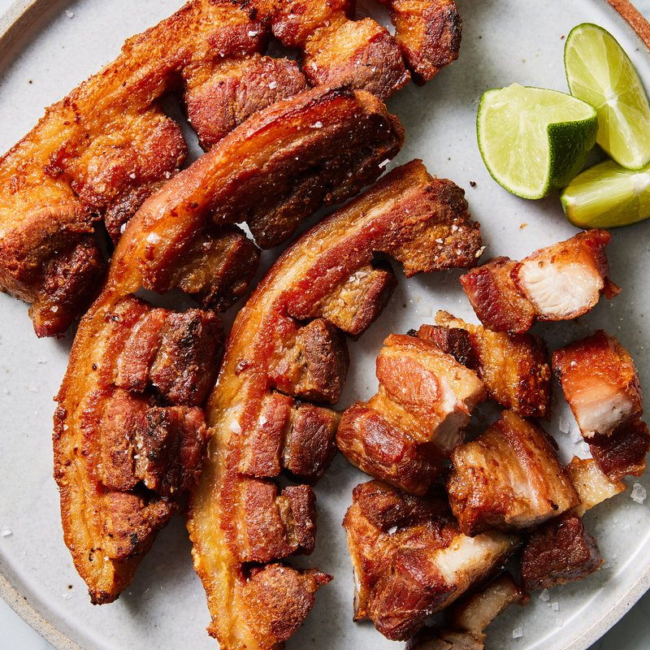

# Chicharrones

*Mexico's pork crackling: dried pork skin plunged into hot oil until it puffs into shattering, salty, weightless clouds.*

**Serves:** 6 (as a snack - makes ~150 g cooked chicharrones from 400 g raw skin)

**Prep Time:** 30 minutes

**Total Time:** 1-2 days (drying time, low-temp render, then fry)

## Overview
Pork skin (the back-fat skin sold at butchers, or any thick skin from a fresh pork side) is scraped clean of all subcutaneous fat, this is the critical step; remaining fat prevents puffing. The clean skin then dries: either oven-dry at low heat for several hours, or air-dry in the fridge for 1-2 days, until completely brittle and almost translucent. The dried skin is then plunged into hot oil (200°C) where it puffs dramatically in 5-10 seconds into the characteristic crackling clouds. The pork is drained, seasoned with salt and chilli salt, and eaten warm. Some Mexican versions add a final spritz of lime juice + chilli powder + Tajín after frying.

## Ingredients

- 400 g raw pork back skin (fresh; ask the butcher for skin with thick subcutaneous fat - yes, both layers; you'll trim the fat)

### Seasoning
- 1 teaspoon flaky sea salt
- ½ teaspoon Tajín or chilli salt
- ½ teaspoon smoked paprika
- ¼ teaspoon ground cumin

### For frying
- 1 litre vegetable oil or pork lard (lard gives a more authentic flavour but oil works)

### To serve
- Lime wedges
- Hot sauce (Cholula, Valentina, or any Mexican brand)
- Salsa verde or red salsa (optional)

## Method

### Stage 1 - Scrape the skin
1. Lay the skin flat on a board, fat-side up.
1. With a sharp knife held almost flat to the skin, scrape away all the white fat layer. Take your time - the goal is to leave only the thin grey-pink skin behind, with no white fat visible.
1. This takes 15-20 minutes. Rinse the skin under cold water; pat dry.

### Stage 2 - Dry (this is the critical multi-day step)
1. **Method A - air-dry in the fridge (best texture)**:
   - Lay the scraped skin on a rack over a tray.
   - Refrigerate uncovered for 24-48 hours, flipping once.
   - The skin should be completely dry, brittle, almost translucent, and lighter in weight by half.
1. **Method B - low-oven dry**:
   - Heat oven to 100°C (80°C fan).
   - Place skin on a rack over a tray.
   - Dry 3-4 hours, until brittle and dry.

### Stage 3 - Break into pieces
1. Snap the dried skin into 4-6 cm pieces (it's brittle and breaks easily).

### Stage 4 - Heat the oil
1. In a deep heavy pot, heat 1 litre of oil to 200°C (with a thermometer; or test with a small pinch of dried skin which should puff in 5 seconds).

### Stage 5 - Fry
1. Drop in 2-3 pieces of dried skin at a time.
1. They puff dramatically in 5-15 seconds into 3-4x their original size, with a bubbly cratered surface.
1. Lift out with a slotted spoon onto kitchen paper.
1. Continue until all pieces are puffed.

### Stage 6 - Season
1. While still warm and slightly oily, sprinkle generously with the seasoning mix (salt, Tajín, paprika, cumin).
1. Toss in a wide bowl to coat.

### Stage 7 - Serve
1. Pile into a bowl.
1. Lime wedges on the side; hot sauce in a small dish.
1. Eat warm, with the fingers.

### Optional stewed version (chicharrón en salsa verde)
1. Make a salsa verde from 500 g tomatillos + onion + jalapeño + garlic blended with chicken stock.
1. Simmer 10 minutes.
1. Add 100 g of the chicharrones; they soften and absorb the salsa, becoming chewy-tender (very different from the crisp version - both are good).
1. Eat with rice and tortillas as a meal.

## Notes
- **Drying is non-negotiable:** Wet skin doesn't puff. The 24-48 hour fridge dry (or 3-4 hour low-oven dry) is what produces the characteristic airy puff. Skip this step and you get tough, leathery, fatty bits.
- **Scrape ALL the fat off:** Any remaining subcutaneous fat prevents the skin from puffing fully and gives greasy chicharrones. Use a sharp boning knife and be patient.
- **Lard vs oil:** Pure pork lard gives the most authentic flavour and a slightly more golden colour. Sunflower or vegetable oil works fine and is more practical for most kitchens. Avoid olive oil (smoke point too low, wrong flavour).

## Storage
- Best within 4 hours of frying - they soften quickly in humid air.
- Store in a sealed jar with silica gel packets at room temperature for 2-3 days.
- Re-crisp soft chicharrones at 180°C oven for 4 minutes.
- Stewed chicharrón en salsa verde: refrigerate 3 days; reheats well.
