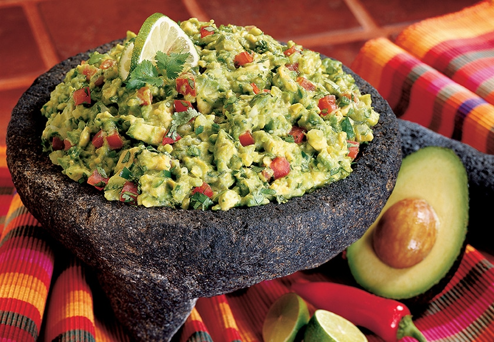

# Guacamole

*Mexican avocado dip: ripe avocados mashed with lime, salt, white onion, fresh chilli and coriander. The pure version has no tomato, no cumin, no sour cream, no extras. The simpler version is the better one.*

**Serves:** 4-6 (as a dip)

**Prep Time:** 10 minutes

**Cook Time:** 0 minutes

## Overview
Mexico's avocado dip in its purest form: ripe avocados mashed with lime, salt, finely chopped white onion, fresh chilli and coriander. No tomato, no cumin, no sour cream, no extras; the simpler version is the better one. The whole dish hangs on ripe avocados (hard ones give pale bland guacamole) and assertive seasoning. You halve ripe avocados, scoop the flesh into a bowl, mash with a fork to chunky (not smooth; texture matters and a blender turns it brown faster). Stir in finely chopped white onion, deseeded jalapeño or serrano, chopped coriander, lime juice and flaky salt. The lime should be assertive and the salt present; under-salted guacamole tastes flat, so be generous. Taste and adjust both. Pile into a small bowl, top with a few extra coriander leaves and a final squeeze of lime, serve immediately with tortilla chips, on tacos, or beside grilled meat. If you must store, press cling film flat onto the surface with no air gap; the brown layer that forms is just oxidised and mixes back in.

## Ingredients

- 3 ripe avocados (yields readily to gentle pressure)
- 1 white onion (small, very finely chopped)
- 1 jalapeño (or serrano chilli, seeds removed for less heat; finely chopped)
- A small bunch of fresh coriander (chopped)
- 1 lime (plus more to taste, juice)
- 1 teaspoon flaky sea salt (plus more to taste)

### Optional
- 1 ripe tomato (small, seeded, finely diced, for the salsa-style version)

## Method

### Stage 1 - Avocados
1. Halve the avocados; remove the stones; scoop the flesh into a bowl.

### Stage 2 - Mash
1. Mash with a fork to your preferred texture; chunky is traditional, smooth is fine. Don't blitz, it goes brown faster.

### Stage 3 - Mix
1. Add the onion, chilli, coriander, lime juice and salt.
1. Stir to combine; don't overwork.

### Stage 4 - Taste and adjust
1. The lime should be assertive; the salt should be present. If either feels muted, add more.

### Stage 5 - Serve
1. Pile into a small bowl.
1. Top with extra coriander leaves and a final squeeze of lime.
1. Serve with tortilla chips, on tacos, or beside grilled meat.

## Notes
- **Ripe avocados only:** Hard avocados give pale, bland guacamole. Wait until they yield to a thumb press.
- **Salt is structural:** Under-salted guacamole tastes flat. Be generous; flaky salt is best.
- **Press cling film flat:** If you must store, smooth the surface and press cling film directly onto it (no air gap). The brown layer is just oxidised; mix it back in.

## Storage
- Best fresh. Keeps 1 day refrigerated under cling film pressed onto the surface.
- Don't freeze.
