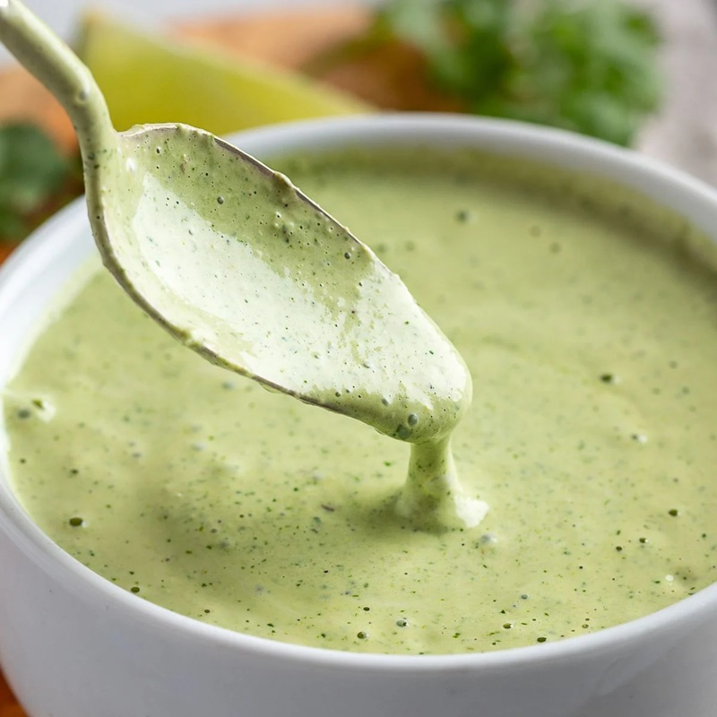

# Creamy Jalapeño Sauce

*The Mexican-food drizzle. Pickled jalapeños, sour cream, mayo and a fistful of coriander blitzed smooth with a garlic clove and a squeeze of lime. Bright, tangy, mildly spicy. Cures any taco that needs a sauce.*

**Serves:** Makes 1 cup (16-20 tacos worth, or 3-4 burritos)

**Prep Time:** 10 minutes

**Cook Time:** None

## Overview
A no-cook blender sauce. Pickled jalapeños bring brine and a manageable heat that the sour-cream-and-mayo base absorbs without going incendiary. Fresh coriander gives the green colour and aromatic bite. A small garlic clove, lime juice and salt finish it. Stir in the sour cream at the end (not blended) for a slightly chunky texture that still drizzles. Better the next day, after the flavours have married.

## Ingredients

- ⅓ cup pickled jalapeños (drained), OR 3-4 tablespoons fresh jalapeños (chopped, seeds and membrane removed)
- ⅓ cup full-fat sour cream
- ⅓ cup whole-egg mayonnaise (Kewpie is excellent here)
- ⅓ cup fresh coriander leaves (tightly packed)
- 1 small garlic clove
- 2 teaspoons lime juice
- ¼ teaspoon fine sea salt (plus more to taste)

## Method

### Stage 1 - Blend
1. Combine everything EXCEPT the sour cream in a tall jug or blender beaker: pickled jalapeños, mayonnaise, coriander, garlic, lime juice and salt.
2. Blend with an immersion blender (or in a small food processor) until completely smooth, about 30 seconds. The sauce should be pale green and uniform.

### Stage 2 - Finish
1. Stir in the sour cream by hand with a spoon (don't blend it in, keeps a slightly thicker, chunkier feel).
2. Taste. Add more salt or another teaspoon of lime juice if it tastes flat. For more heat, blend in another tablespoon of pickled jalapeños.

### Stage 3 - Rest
1. Transfer to a jar or container with a tight-fitting lid. Refrigerate for at least 1 hour before serving, the flavours marry and the heat mellows slightly.

## Notes
- **Pickled vs fresh jalapeños**: pickled bring a briny-tangy depth that complements Mexican food brilliantly. Fresh give a cleaner, sharper heat. Pickled is the better default; fresh is the rebel pick.
- **Greek yogurt swap**: replace the sour cream with thick Greek yogurt for a lighter, tangier version. The sauce thins slightly; compensate with another half-spoon of mayo if you want it to coat.
- **Vegan version**: use cashew-cream (1/3 cup soaked cashews blended with water) for the sour cream and vegan mayo. The herb-jalapeño-lime profile carries it.

## Serving
- Drizzled over tacos al pastor, carnitas, chicken tinga, fish tacos. Smeared inside burritos. Spooned over a steak quesadilla. As a dip with tortilla chips. Anywhere you'd use a sour-cream-based crema.

## Storage
In a sealed jar in the fridge for up to 3 days. Better on day 2. Don't freeze, sour cream weeps on thawing.
