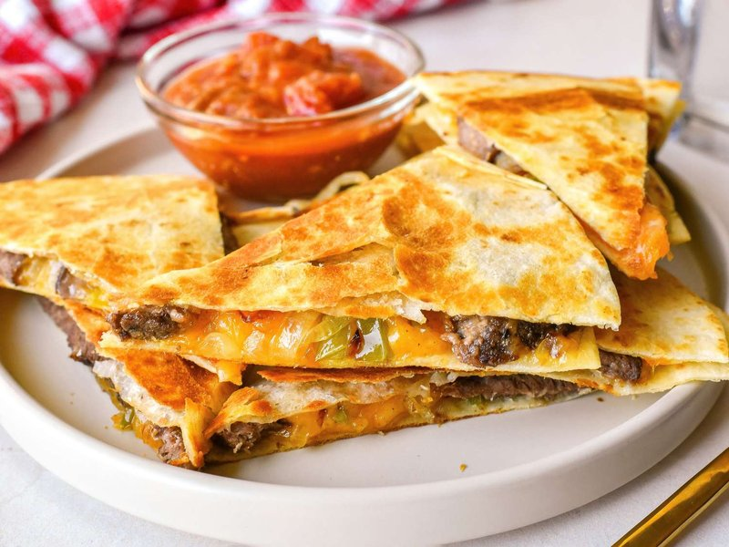

# Quesadillas

*Mexico's simplest snack: a tortilla folded around melted cheese (and any extras), griddled till crisp-spotted outside and gooey inside.*

**Serves:** 4 (makes 4 large quesadillas, halved for sharing)

**Prep Time:** 10 minutes

**Cook Time:** 12 minutes

## Overview
Pre-cook any "wet" filling (mushrooms, chorizo, peppers) and cool. Cheese is grated. A dry, hot griddle or non-stick pan heats over medium heat. A tortilla goes on; cheese scatters over half; filling (if any) over the cheese; folded in half. Pressed gently with a spatula; cooked for 90 seconds until the underside is gold-spotted; flipped; cooked for 90 seconds more. The cheese should be fully melted and just starting to ooze at the edges. Sliced into 3 wedges; served with salsa, guacamole, sour cream, lime.

## Ingredients

### Per quesadilla
- 1 flour tortilla (large, 20-25 cm) OR 2 corn tortillas overlapped
- 80 g melting cheese (Oaxacan string cheese / queso Oaxaca, monterey jack, mild cheddar, or low-moisture mozzarella - grated)
- Optional filling (any combination, 2-3 tablespoons total):
  - Sautéed mushrooms with garlic and thyme
  - Cooked chorizo (sliced or crumbled)
  - Diced cooked chicken (leftover, with chilli powder)
  - Sliced grilled poblano peppers
  - Refried beans
  - Spinach (wilted)
  - Huitlacoche (the prized Mexican corn fungus, sold tinned at specialist shops)

### Optional fold-ins
- 1 jalapeño (small, sliced thin)
- 2 tablespoons chopped fresh coriander
- 1 spring onion (small, sliced)
- 1 teaspoon chilli powder (sprinkled on the cheese)

### For cooking
- 2 teaspoons vegetable oil OR butter (light brushing of the pan)

### To serve
- Salsa verde (or roja)
- Guacamole
- Mexican crema (or sour cream)
- Lime wedges
- Pickled jalapeños

## Method

### Stage 1 - Pre-cook fillings
1. Any wet or raw filling needs to be cooked and cooled before going into the quesadilla:
   - Mushrooms: sauté with butter and garlic 5 minutes until water has evaporated.
   - Chorizo: fry 4 minutes until crisp; drain on paper.
   - Peppers: char on a flame or under a broiler 5 minutes, peel, slice.
1. Cool fillings to warm - hot filling makes the cheese sweat and the tortilla goes soggy.

### Stage 2 - Heat the pan
1. Place a wide non-stick frying pan, comal or flat griddle over medium heat.
1. Once hot, brush very lightly with oil or rub with a small piece of butter - quesadillas need only a sheen of fat.

### Stage 3 - Assemble (in the pan, or pre-folded)
1. **In-pan method (recommended for flour tortillas)**: Place a tortilla flat in the pan. Scatter half the cheese over one half. Add filling. Scatter remaining cheese. Sprinkle herbs / chilli / jalapeño if using. Fold the empty half over the topped half.
1. **Pre-folded method (for corn tortillas)**: Assemble outside the pan; transfer carefully with a spatula.

### Stage 4 - Cook
1. Press the folded quesadilla gently with a spatula.
1. Cook 90 seconds - the underside should be golden with darker spots.
1. Flip carefully (slide the spatula fully under and use your free hand to support the top).
1. Cook 90 seconds on the second side.
1. The cheese should be fully melted and just starting to ooze at the edges. If the cheese isn't fully melted, lower the heat slightly and continue 30 seconds more.

### Stage 5 - Rest and slice
1. Lift onto a board.
1. Rest 1 minute (the cheese sets slightly so the filling doesn't spill).
1. Slice with a sharp knife or pizza wheel into 3 wedges.

### Stage 6 - Serve
1. Plate with small bowls of salsa, guacamole, crema and pickled jalapeños.
1. Lime wedge alongside.
1. Eat hot, with the fingers, dipping each bite.

## Notes
- **Cheese matters most:** The cheese has to melt smoothly. Hard cheeses (pecorino, aged cheddar) don't stretch; pre-grated supermarket cheese (coated in anti-caking starch) doesn't melt cleanly. Good options: Oaxacan string cheese (best), low-moisture mozzarella, monterey jack, mild cheddar, or a mix.
- **Corn vs flour tortilla:** Flour tortillas fold easily and give a softer chewier shell. Corn tortillas are traditional and give a more authentic Mexican flavour but break if folded sharply - better to use two corn tortillas overlapped, with filling between, like a sandwich.
- **Don't overload:** A pile of filling makes the cheese unable to bind everything together; the quesadilla falls apart when sliced. A light handful of cheese + 2 tablespoons of filling is right.

## Storage
- Best eaten within 10 minutes of cooking.
- Cooked quesadillas reheat 1 day; re-crisp in a dry hot pan 90 seconds per side (microwave makes them soggy).
- Pre-cooked fillings keep separately 3 days refrigerated.
