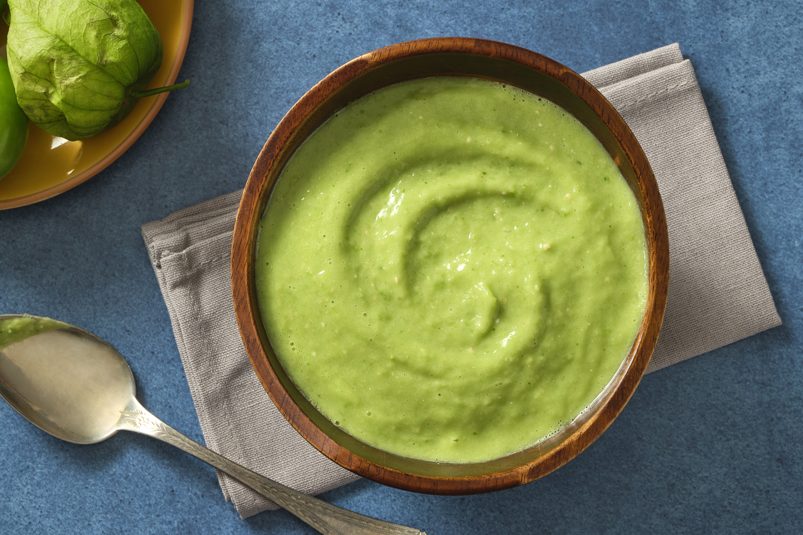

# Salsa de Aguacate

*Mexico's creamy avocado-tomatillo salsa: ripe avocados blitzed with tomatillos, jalapeños, garlic, coriander and lime into a creamy bright-green sauce. The lush Mexican table condiment, the avocado-leaning cousin of salsa verde - pour over tacos, drizzle on eggs, dip with chips.*

**Serves:** Makes about 500 ml

**Prep Time:** 15 minutes

**Cook Time:** 0 minutes

## Overview
Salsa de aguacate is one of Mexico's most beloved creamy salsas, sitting deliciously between guacamole (which is chunky-mashed) and salsa verde (which has no avocado): ripe avocados blitzed with tomatillos (the canonical Mexican husk-tomato), fresh jalapeños or serrano peppers, garlic, chopped onion, lime juice, fresh coriander, ground cumin and salt - the result is a smooth creamy bright-green sauce, neither as chunky as guacamole nor as thin as salsa verde. The dish is what every Mexican taqueria has in a squeeze bottle on the table for drizzling over tacos, what every Mexican cook makes to dip with tortilla chips, what goes on every scrambled-egg breakfast as a luxurious upgrade. The avocados must be properly ripe (yield to gentle pressure); under-ripe gives bland salsa, over-ripe gives off-flavours. Tomatillos (the Mexican husk-tomato) are essential to the character; canned green tomatillos substitute outside Mexico. Avocado oxidises quickly, so the salsa is best within 24 hours of making.

## Ingredients

- 2 large ripe avocados (peeled and pitted)
- 300 g tomatillos (husks removed); OR 1 tin (400 g) tomatillos
- 2-4 fresh jalapeño peppers (deseed for milder)
- 4 garlic cloves
- 1 small white onion (chopped)
- 1 large bunch fresh coriander (chopped)
- Juice of 2 limes
- 1 tablespoon ground cumin
- 1 teaspoon ground coriander seed
- 1 ½ teaspoons fine sea salt
- 1 teaspoon ground black pepper
- 100 ml water (to thin)

### Optional
- 2 spring onions (finely sliced; for extra fresh)
- 1 tablespoon olive oil

## Method

### Stage 1 - Cook the tomatillos (if fresh)
1. If using fresh tomatillos: place in a saucepan; cover with water; bring to a boil.
2. Cook 8 minutes till olive-green.
3. Drain.
4. If using canned, skip this step.

### Stage 2 - Blend
1. Place the avocados, tomatillos, chillies, garlic, chopped onion, coriander, lime juice, cumin, ground coriander seed, salt and pepper in a blender.
2. Add 100 ml of water (start with less).
3. Blitz till smooth and creamy.
4. Add more water if needed to reach a thick pourable consistency (like double cream).

### Stage 3 - Adjust
1. Taste; adjust salt and lime.
2. If too tart, add a tiny pinch of sugar.
3. If too thick, add more water.

### Stage 4 - Serve
1. Transfer to a serving bowl or squeeze bottle.
2. Scatter spring onions if using.
3. Drizzle with olive oil for shine.

## Notes
- **Ripe avocados:** properly ripe is essential.
- **Tomatillos:** Mexican husk-tomato.
- **Fresh within 24 hours:** avocado oxidises.
- **Thick or thin to taste:** adjust water for consistency.

## Variations
**Spicier:** double the chillies.
**With sour cream:** add 100 ml of crema; gives a creamier richer version.
**Cilantro-heavy:** double the coriander; gives a herbier brighter version.
**Roasted version:** char the tomatillos and chillies first; gives smoky depth.

## Serving
Drizzle on tacos, eggs, beans, rice; dip with chips; spoon over grilled meats.

## Storage
- Keeps refrigerated 1 day; oxidises after that.
- Press cling film directly on the surface to slow oxidation.
- Don't freeze.
