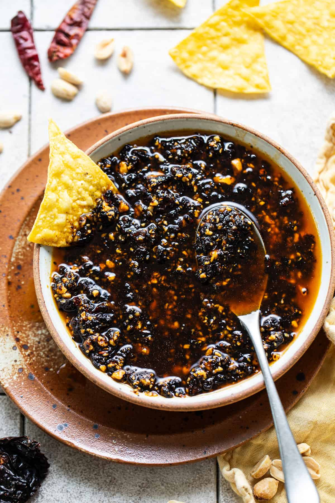

# Salsa Macha

*Mexico's chilli oil with crunch: a fragrant oil infused with toasted dried chillies, garlic, peanuts, sesame seeds and Mexican oregano, with crunchy bits suspended in deep red-orange oil.*

**Serves:** Makes about 500 ml

**Prep Time:** 15 minutes

**Cook Time:** 15 minutes

## Overview
Salsa macha is one of Mexico's most distinctive condiments and a Veracruz-coast specialty that has spread across the country and become a darling of modern Mexican-American cooking. The chilli mix is the traditional multi-layered heat: guajillo for sweetness, ancho for depth, chile de árbol for heat, chipotle for smoke: briefly toasted with crushed garlic, raw peanuts, sesame seeds and Mexican oregano in vegetable oil, then pulsed coarse (not smooth: the visible bits of chilli, peanut and seed are the point) and rested for the flavours to infuse the oil. The result is closely related to Chinese chilli crisp (lao gan ma) and Italian peperoncino oil but has its own distinct Mexican character: a fragrant chilli oil with crunchy bits suspended throughout, adding heat, crunch and deep umami all at once. Drizzled over tacos, scrambled eggs, grilled fish, roasted vegetables, soups, beans: even vanilla ice cream, where it works better than it has any right to.

## Ingredients

- 4 dried guajillo chillies (Mexican dried red chilli, mild and sweet-tangy; stems and seeds removed)
- 3 dried ancho chillies (stems and seeds removed)
- 6 dried chiles de árbol (small dried red chillies; stems removed)
- 2 dried chipotle peppers (or 2 chipotles in adobo, drained)
- 8 garlic cloves (peeled, whole)
- 100 g raw peanuts (unsalted)
- 3 tablespoons sesame seeds (white, raw)
- 2 tablespoons Mexican oregano (dried)
- 1 teaspoon cumin seeds
- 2 teaspoons fine sea salt
- 2 tablespoons brown sugar (optional; balances heat)
- 1 tablespoon white wine vinegar
- 350 ml vegetable oil (or a mix of vegetable and olive oil)

### Optional additions
- 1 tablespoon toasted nori (crushed)
- 30 g toasted almonds or pine nuts

## Method

### Stage 1 - Toast the chillies (carefully)
1. Heat a wide heavy frying pan over medium heat (no oil yet).
2. Add the dried chillies (all four types); toast 30-60 seconds per side, pressing with a spatula, till slightly puffed and fragrant.
3. Don't let them burn, burnt chillies make bitter salsa.
4. Transfer to a plate.

### Stage 2 - Heat the oil and infuse
1. Pour the vegetable oil into the same pan.
2. Heat over medium heat till shimmering (about 130°C / 265°F; don't let it smoke).
3. Add the peanuts; cook 3-4 minutes till deeply golden.
4. Add the garlic cloves; cook 2-3 minutes till lightly golden (don't burn).
5. Add the sesame seeds and cumin seeds; toast 30 seconds.
6. Add the toasted chillies; cook 30 seconds (they re-soften slightly in the oil).
7. Take off the heat.

### Stage 3 - Blend
1. Let the mixture cool 5 minutes (so the blender doesn't crack from heat shock).
2. Transfer to a food processor (or use an immersion blender).
3. Add the Mexican oregano, salt, sugar (if using) and vinegar.
4. Pulse 8-10 times to a coarse texture; don't go to a smooth paste.
5. The salsa should have visible bits of chilli, peanut and sesame suspended in the orange-red oil.

### Stage 4 - Cool and store
1. Tip into a clean glass jar (or several smaller jars).
2. Cool to room temperature.
3. The oil rises to the top with the crunchy bits at the bottom; stir before each use.

### Stage 5 - Use
1. Drizzle over tacos, eggs, grilled meats, fish, soups, beans, roasted vegetables, popcorn, ice cream (really), even pizza.

## Notes
- **Multiple chilli types:** layered heat is the point.
- **Don't burn the chillies:** bitter ruined.
- **Don't blend smooth:** coarse texture is the point.
- **Heat oil to 130°C, not smoking:** infusion not frying.
- **Resting in the jar deepens flavour:** improves over 24-48 hours.

## Variations
- **Spicier (Mariscos-Macha):** add more chiles de árbol and 2 fresh habaneros (dried); properly fierce coastal version.
- **With pumpkin seeds:** swap peanuts for raw pumpkin seeds (pepitas).
- **Smokier:** double the chipotle.
- **With orange zest:** add zest of 2 oranges with the chillies; gives a fruity coastal-Veracruz dimension.

## Serving
- Drizzle on tacos, eggs, grilled fish, beans, rice. Stir into mayonnaise for a salsa-macha aioli. Stir into yogurt for a dip. Drizzle on ice cream for a sweet-spicy modern Mexican dessert.

## Storage
- Keeps refrigerated 1 month in a sealed jar (the oil keeps the salsa stable).
- Keeps at room temperature 2 weeks (if used regularly).
- Don't freeze; the oil separates.
- The salsa improves over the first 48 hours as flavours marry.
